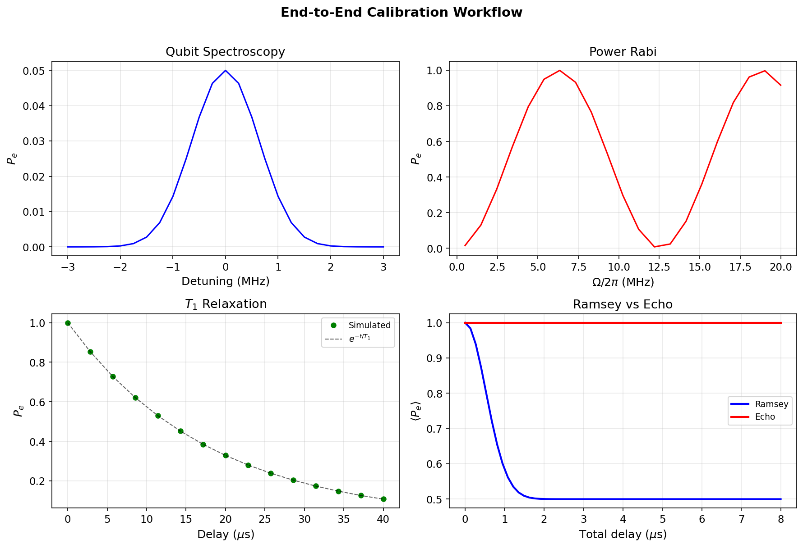

# Tutorial: Calibration Workflow

Run a complete virtual calibration loop — qubit spectroscopy, Rabi calibration, T1/T2 characterization, and dispersive-readout optimization — all within the simulator.

**Notebooks:**

- `tutorials/23_calibration_fitting.ipynb` — fitting Rabi, T1, Ramsey data
- `tutorials/25_end_to_end_calibration_loop.ipynb` — full workflow tying all pieces together

---

## Physics Background

In a real lab, calibration proceeds through a chain of experiments:

1. **Spectroscopy** — locate $\omega_{ge}$ and $\omega_r$
2. **Rabi calibration** — determine the $\pi$-pulse amplitude $\Omega_\pi$
3. **T1 measurement** — exponential decay of $P_e$ after preparing $|e\rangle$
4. **Ramsey / T2\*** — dephasing fringe envelope
5. **Dispersive readout** — optimize the measurement drive for IQ separation

Each step depends on the previous one. `cqed_sim` can execute this entire chain as a virtual calibration, validating that the simulated system behaves consistently with its parameters.

---

## Step 1: Rabi Calibration

```python
import numpy as np
from cqed_sim.core import (
    DispersiveTransmonCavityModel, FrameSpec,
    StatePreparationSpec, qubit_state, fock_state, prepare_state,
)
from cqed_sim.sim import SimulationConfig, simulate_sequence, reduced_qubit_state
from cqed_sim.sequence import SequenceCompiler
from cqed_sim.pulses import Pulse
from cqed_sim.pulses.envelopes import square_envelope

model = DispersiveTransmonCavityModel(
    omega_c=2*np.pi*5e9, omega_q=2*np.pi*6e9,
    alpha=2*np.pi*(-220e6), chi=2*np.pi*(-2.5e6),
    kerr=2*np.pi*(-2e3), n_cav=4, n_tr=3,
)
frame = FrameSpec(omega_c_frame=model.omega_c, omega_q_frame=model.omega_q)

psi0 = prepare_state(model, StatePreparationSpec(
    qubit=qubit_state("g"), storage=fock_state(0),
))
config = SimulationConfig(frame=frame)
compiler = SequenceCompiler(dt=2e-9)

# Amplitude sweep
amplitudes = np.linspace(0, 2*np.pi*50e6, 30)
dur = 20e-9
pe_rabi = []

for amp in amplitudes:
    pulse = Pulse(channel="qubit", t0=0.0, duration=dur,
                  envelope=square_envelope, carrier=0.0, amp=amp, phase=0.0)
    compiled = compiler.compile([pulse])
    result = simulate_sequence(model, compiled, psi0, {}, config=config)
    rho_q = reduced_qubit_state(result.final_state)
    pe_rabi.append(float(np.real(rho_q[1, 1])))
```

---

## Step 2: T1 Measurement

```python
from cqed_sim.sim import NoiseSpec

psi_e = prepare_state(model, StatePreparationSpec(
    qubit=qubit_state("e"), storage=fock_state(0),
))
noise = NoiseSpec(t1=18e-6)

delays = np.linspace(0, 40e-6, 25)
pe_t1 = []
for d in delays:
    compiled = compiler.compile([], t_end=max(d, 4e-9))
    result = simulate_sequence(model, compiled, psi_e, {},
                               config=config, noise=noise)
    rho_q = reduced_qubit_state(result.final_state)
    pe_t1.append(float(np.real(rho_q[1, 1])))
```

---

## Step 3: Fitting

After collecting sweep data, fit the results to extract physical parameters:

```python
from scipy.optimize import curve_fit

# Fit T1 decay
def t1_model(t, a, T1, c):
    return a * np.exp(-t / T1) + c

popt, _ = curve_fit(t1_model, delays, pe_t1, p0=[1.0, 18e-6, 0.0])
print(f"Fitted T1 = {popt[1]*1e6:.2f} µs")

# Fit Rabi oscillation
def rabi_model(amp, a, omega_rabi, phi, c):
    return a * np.sin(omega_rabi * amp + phi)**2 + c

popt_rabi, _ = curve_fit(rabi_model, amplitudes, pe_rabi,
                          p0=[1.0, dur, 0.0, 0.0])
pi_amp = np.pi / (2 * popt_rabi[1] * dur) if popt_rabi[1] != 0 else 0
print(f"Fitted π-pulse amplitude = {pi_amp/(2*np.pi*1e6):.2f} MHz")
```

---

## Results



The summary plot shows the three calibration steps side by side:

- **Left (Rabi):** $P_e$ vs drive amplitude — sinusoidal Rabi oscillation. The first maximum identifies $\Omega_\pi$.
- **Center (T1):** $P_e$ vs delay time — exponential decay from 1 to 0. Fit gives $T_1 \approx 18\,\mu$s.
- **Right (Ramsey):** $P_e$ vs delay — oscillating with a decaying envelope ($T_2^*$).

These three measurements form the core of any transmon calibration loop.

---

## Key Parameters

| Calibration Step | Extracted Parameter | Expected Value |
|---|---|---|
| Rabi | $\Omega_\pi$ | 20–50 MHz |
| T1 | $T_1$ | 10–100 $\mu$s |
| Ramsey | $T_2^*$, detuning $\Delta$ | 1–20 $\mu$s, $\leq 1$ MHz |
| Echo | $T_2$ | $\leq 2T_1$ |

---

## See Also

- [Qubit Drive & Rabi](qubit_drive_rabi.md) — detailed Rabi physics
- [Open System Dynamics](open_system_dynamics.md) — T1, Ramsey, echo simulations
- [Sequence Building](sequence_building.md) — how pulses are compiled
- [Readout Resonator](readout_resonator.md) — dispersive measurement
