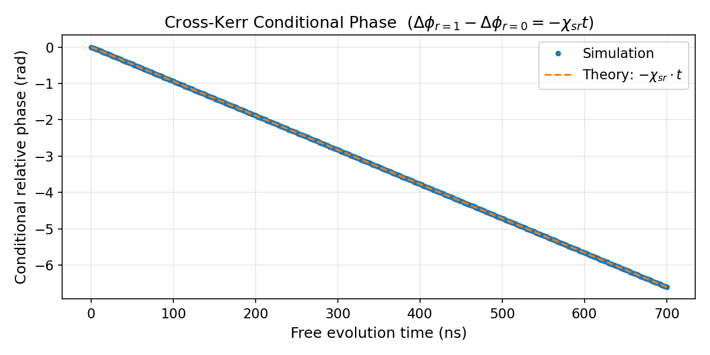

# Cross-Kerr Interaction and Conditional Phase

This tutorial covers the cross-Kerr interaction between two bosonic modes: a purely number-conserving interaction that accumulates a phase only when both modes are occupied.

Workflow notebook:

- `tutorials/30_advanced_protocols/01_multimode_crosskerr.ipynb`

Foundational notebook:

- `tutorials/15_cross_kerr_and_conditional_phase_accumulation.ipynb`

---

## Physics Background

### Self-Kerr vs. Cross-Kerr

The Kerr family of interactions describes photon-number-dependent phase shifts generated by the weak anharmonicity inherited from a Josephson element.

For one mode, the self-Kerr term is

$$H_K = \frac{K}{2}(a^\dagger)^2 a^2 = \frac{K}{2}\hat{n}(\hat{n}-1).$$

For two modes, the cross-Kerr term is

$$H_{\chi} = \chi_{sr} a_s^\dagger a_s a_r^\dagger a_r = \chi_{sr} \hat{n}_s \hat{n}_r,$$

where `s` is the storage mode and `r` is the readout mode. This Hamiltonian commutes with both number operators, so it does not exchange photons between modes. It only changes phases.

### Conditional Phase Accumulation

Under $H_\chi$ alone,

$$U(t) = e^{-i \chi_{sr} \hat{n}_s \hat{n}_r t}.$$

For a number state $|n_s, n_r\rangle$, the dynamical phase is therefore

$$\phi(t) = -\chi_{sr} n_s n_r t.$$

The phase is conditional: it is nonzero only when both modes are occupied.

### Physical Origin

In a storage-readout-transmon system, the storage-readout cross-Kerr arises from virtual transmon-mediated processes. In the dispersive regime, both bosonic modes inherit a weak nonlinearity from the same Josephson element, which produces an effective interaction of the form $\chi_{sr}\hat{n}_s \hat{n}_r$.

### Observable Used In The Public Plot

The public tutorial figure does not plot the phase of a single branch in isolation. Instead, it plots the storage relative phase in the readout-occupied branch minus the storage relative phase in the readout-empty branch:

$$
\Delta \phi_{\mathrm{cond}}(t)
=
\arg\!\left(\frac{\langle g,1_s,1_r|\psi(t)\rangle}{\langle g,0_s,1_r|\psi(t)\rangle}\right)
-
\arg\!\left(\frac{\langle g,1_s,0_r|\psi(t)\rangle}{\langle g,0_s,0_r|\psi(t)\rangle}\right).
$$

Because the $n_r=0$ branch has no cross-Kerr phase, this conditional observable isolates the storage-readout interaction and should satisfy

$$\Delta \phi_{\mathrm{cond}}(t) = -\chi_{sr} t.$$

That signed relation matches the runtime convention verified in `tests/test_56_tutorial_physics_validation.py`.

---

## Setup: Three-Mode Model

```python
import numpy as np
from cqed_sim.core import DispersiveReadoutTransmonStorageModel, FrameSpec

model = DispersiveReadoutTransmonStorageModel(
    omega_s   = 2 * np.pi * 5.0e9,
    omega_r   = 2 * np.pi * 7.5e9,
    omega_q   = 2 * np.pi * 6.0e9,
    alpha     = 2 * np.pi * (-200e6),
    chi_sr    = 2 * np.pi * 1.5e6,
    chi_s     = 0.0,
    chi_r     = 0.0,
    n_storage = 4,
    n_readout = 4,
    n_tr      = 2,
)

frame = FrameSpec(
    omega_c_frame = model.omega_s,
    omega_q_frame = model.omega_q,
    omega_r_frame = model.omega_r,
)
```

---

## Simulating Conditional Phase Accumulation

```python
import numpy as np

from cqed_sim.sequence import SequenceCompiler
from cqed_sim.sim import SimulationConfig, simulate_sequence

# Readout-empty storage superposition
s0r0 = model.basis_state(0, 0, 0)
s1r0 = model.basis_state(0, 1, 0)
initial_r0 = (s0r0 + s1r0).unit()

# Readout-occupied storage superposition
s0r1 = model.basis_state(0, 0, 1)
s1r1 = model.basis_state(0, 1, 1)
initial_r1 = (s0r1 + s1r1).unit()

times_ns = np.linspace(0.0, 700.0, 50)
conditional_phase = []

def relative_storage_phase(state, reference, shifted):
    amp_ref = complex(reference.overlap(state))
    amp_shifted = complex(shifted.overlap(state))
    return float(np.angle(amp_shifted / amp_ref))

for t_ns in times_ns:
    t_s = t_ns * 1e-9
    compiled = SequenceCompiler(dt=2e-9).compile([], t_end=t_s)

    result_r0 = simulate_sequence(
        model, compiled, initial_r0, {},
        config=SimulationConfig(frame=frame),
    )
    result_r1 = simulate_sequence(
        model, compiled, initial_r1, {},
        config=SimulationConfig(frame=frame),
    )

    phase_r0 = relative_storage_phase(result_r0.final_state, s0r0, s1r0)
    phase_r1 = relative_storage_phase(result_r1.final_state, s0r1, s1r1)
    conditional_phase.append(phase_r1 - phase_r0)
```

---

## Expected Results

The conditional phase should grow linearly with the signed slope set by the storage-readout cross-Kerr:

$$\Delta\phi_{\mathrm{cond}}(t) = -\chi_{sr} t.$$

For $\chi_{sr}/2\pi = 1.5$ MHz, the phase wraps by $2\pi$ after about $667$ ns in magnitude.

```python
import matplotlib.pyplot as plt

theory_times_ns = np.linspace(0.0, 700.0, 200)
theory_phase = -2 * np.pi * 1.5e6 * (theory_times_ns * 1e-9)

plt.figure(figsize=(8, 4))
plt.plot(times_ns, conditional_phase, "o", ms=5, label="Simulation")
plt.plot(
    theory_times_ns,
    (theory_phase + np.pi) % (2 * np.pi) - np.pi,
    "--",
    linewidth=1.5,
    label=r"Theory: $-\chi_{sr} t$",
)
plt.xlabel("Free evolution time (ns)")
plt.ylabel("Conditional phase (rad)")
plt.title(r"Cross-Kerr Conditional Phase: $\Delta\phi_{\mathrm{cond}} = -\chi_{sr} t$")
plt.legend()
plt.tight_layout()
```

The public figure is regenerated by `tools/generate_tutorial_plots.py` and the associated regression in `tests/test_61_public_tutorial_plot_validation.py` checks that the fitted slope agrees with $\chi_{sr}/2\pi = 1.5$ MHz and that the maximum simulation-theory phase error stays small.

### Generated Plot



The blue markers are the simulated conditional phase, and the dashed orange line is the analytic prediction $\Delta\phi_{\mathrm{cond}} = -\chi_{sr} t$.

---

## Conditional Phase Gate

Free evolution under the cross-Kerr Hamiltonian implements

$$U_\chi(t) = \mathrm{diag}(1, 1, 1, e^{-i\chi_{sr} t})$$

on the ordered storage-readout basis
$\{|0_s,0_r\rangle, |0_s,1_r\rangle, |1_s,0_r\rangle, |1_s,1_r\rangle\}$.

The runtime phase applied to $|1_s,1_r\rangle$ is therefore

$$\phi_{\mathrm{runtime}}(t) = -\chi_{sr} t \pmod{2\pi}.$$

For a `CZ(pi)` gate, the required duration is

$$t_\pi = \frac{\pi}{|\chi_{sr}|} = \frac{1}{2 f_{\chi_{sr}}}.$$

For $\chi_{sr}/2\pi = 1.5$ MHz, this gives $t_\pi \approx 333$ ns.

---

## Multi-Mode Cross-Kerr

In the full three-mode system, the effective dispersive Hamiltonian can contain multiple self-Kerr and cross-Kerr terms:

$$H = \sum_j \omega_j a_j^\dagger a_j + \sum_{j < k} \chi_{jk} \hat{n}_j \hat{n}_k + \sum_j \frac{K_j}{2} \hat{n}_j(\hat{n}_j - 1).$$

The multimode workflow notebook explores how these phase accumulations appear simultaneously and how they can be exploited or refocused in gate-style protocols.

---

## Physical Significance

Cross-Kerr interactions are central to several cQED tasks:

- dispersive measurement and pointer-state separation
- conditional phase gates between bosonic modes
- QND photon-number sensing
- entangling evolutions from initially separable superpositions

---

## Related Notebooks

- `tutorials/30_advanced_protocols/01_multimode_crosskerr.ipynb`
- `tutorials/15_cross_kerr_and_conditional_phase_accumulation.ipynb`
- `tutorials/16_storage_cavity_coherent_state_dynamics.ipynb`

## References

[1] Alexandre Blais, Arne L. Grimsmo, S. M. Girvin, and Andreas Wallraff, "Circuit quantum electrodynamics," Reviews of Modern Physics 93, 025005 (2021). DOI: [10.1103/RevModPhys.93.025005](https://doi.org/10.1103/RevModPhys.93.025005)

[2] Alexandre Blais, Ren-Shou Huang, Andreas Wallraff, S. M. Girvin, and R. J. Schoelkopf, "Cavity quantum electrodynamics for superconducting electrical circuits: An architecture for quantum computation," Physical Review A 69, 062320 (2004). DOI: [10.1103/PhysRevA.69.062320](https://doi.org/10.1103/PhysRevA.69.062320)

## See Also

- [Kerr Free Evolution](kerr_free_evolution.md)
- [Sideband Swap](sideband_swap.md)
- [Physics & Conventions](../physics_conventions.md)
