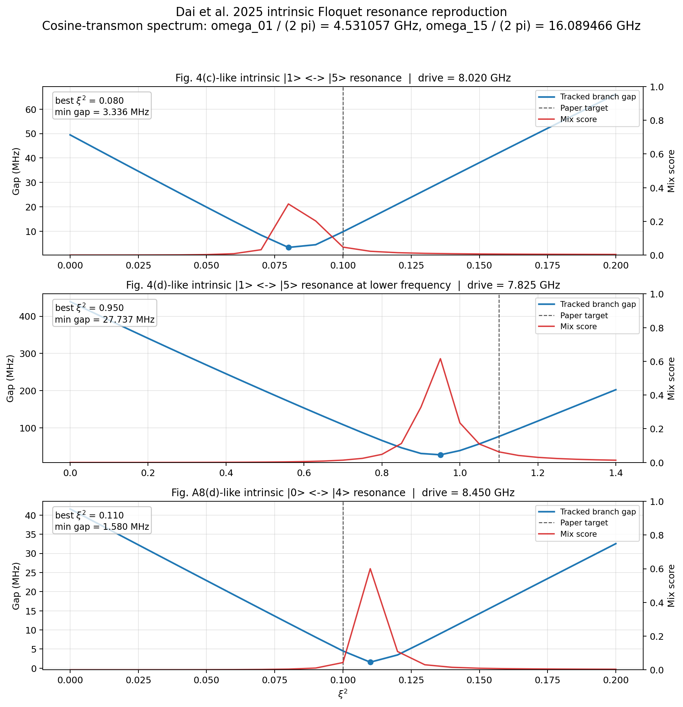

# Dai 2025 Intrinsic Multiphoton Resonances

This tutorial records a literature-backed Floquet reproduction of the intrinsic mechanism-B avoided crossings from Dai et al., "Characterization of drive-induced unwanted state transitions in superconducting circuits". The goal is not to model every DUST channel in the paper. It is to show that `cqed_sim.floquet` can reproduce the closed-system transmon-only branch physics when supplied with the paper's cosine-transmon Hamiltonian and charge-drive operator.

## Code Path

- Validation and figure-generation workflow: `test_against_papers/dai_et_al_2025_intrinsic_multiphoton_floquet_resonances.py`
- Paper summary note: `paper_summary/dai_hazra_weiss_et_al_2025_characterization_of_drive_induced_unwanted_state_transitions_in_superconducting_circuits.md`

This page points to `test_against_papers/` rather than `examples/` because the workflow is paper-specific literature validation, not a generic reusable demo.

## What Is Reproduced

- The undriven transmon spectrum from the paper-fit parameters $E_J / h = 16.2856$ GHz and $E_C / h = 0.17013$ GHz.
- The low-power intrinsic $|1\rangle \leftrightarrow |5\rangle$ avoided crossing near $\omega_d / 2\pi = 8.02$ GHz from Fig. 4(c).
- The same intrinsic $|1\rangle \leftrightarrow |5\rangle$ crossing shifted to larger drive power near $\omega_d / 2\pi = 7.825$ GHz from Fig. 4(d).
- The low-power intrinsic $|0\rangle \leftrightarrow |4\rangle$ avoided crossing near $\omega_d / 2\pi = 8.45$ GHz from Fig. A8(d).

## Regenerate the Results

Run the paper-validation workflow from the repository root:

```bash
python test_against_papers/dai_et_al_2025_intrinsic_multiphoton_floquet_resonances.py --plot-output documentations/assets/images/tutorials/dai_2025_intrinsic_multiphoton_resonances.png
```

The script prints the reproduced spectrum and resonance markers, applies the same validation thresholds used in the paper-check pass, and writes the summary figure below.

## Model and Assumptions

- Static Hamiltonian: transmon-only cosine model in a finite charge basis, projected into a truncated eigenbasis before the Floquet solve.
- Drive operator: charge drive with the paper's Eq. (C5) calibration from $\xi^2$ to $E_d$.
- Units: internal Hamiltonian coefficients remain in rad/s, with quoted frequencies reported in GHz by dividing by $2\pi$.
- Offset charge: fixed at $n_g = 0$ for this pass.
- Resonance marker: minimum tracked quasienergy gap plus bare-state mixing score.
- Out of scope: TLS-assisted transitions, parasitic electromagnetic modes, dissipative inelastic scattering, and the paper's full offset-charge averaging or ideal-displaced-state hybridization parameter $\Theta_j$.

## Reproduced Spectrum

| Quantity | Reproduced | Paper | Difference |
|---|---:|---:|---:|
| $\omega_{01} / 2\pi$ | 4.531057 GHz | 4.528500 GHz | +2.557 MHz |
| $\omega_{15} / 2\pi$ | 16.089466 GHz | 16.084000 GHz | +5.466 MHz |
| $\omega_{04} / 2\pi$ | 16.941597 GHz | not quoted directly | half-frequency 8.470799 GHz |

The first two transitions land within a few MHz of the paper-fit targets, which is accurate enough for the branch-tracking study used here.

## Representative Intrinsic Resonances

| Case | Drive frequency | Crossing | Best $\xi^2$ | Paper target $\xi^2$ | Minimum tracked gap | Mix score |
|---|---:|---|---:|---:|---:|---:|
| Fig. 4(c)-like | 8.020000 GHz | $|1\rangle \leftrightarrow |5\rangle$ | 0.080 | 0.100 | 3.336 MHz | 0.303 |
| Fig. 4(d)-like | 7.825000 GHz | $|1\rangle \leftrightarrow |5\rangle$ | 0.950 | 1.100 | 27.737 MHz | 0.616 |
| Fig. A8(d)-like | 8.450000 GHz | $|0\rangle \leftrightarrow |4\rangle$ | 0.110 | 0.100 | 1.580 MHz | 0.600 |

The gap minima and overlap-based mix scores show the same qualitative story as the paper: the intrinsic avoided crossings occur at the quoted drive frequencies, and the lower-frequency $|1\rangle \leftrightarrow |5\rangle$ feature moves to a substantially larger drive power.

## Generated Evidence

The figure below was generated by the same paper-validation script.



Each panel plots the tracked branch gap against $\xi^2$ for one literature target, together with the overlap-based mix score used to confirm that the minimum is a genuine hybridization point rather than a bookkeeping artifact.

## Why This Matters for `cqed_sim`

This reproduction is a useful boundary test for the Floquet tooling because it uses the generic `FloquetProblem` entry point instead of a prepackaged Duffing-style runtime model. It demonstrates that the solver stack is already flexible enough to handle paper-faithful periodically driven Hamiltonians when the user supplies the static Hamiltonian and periodic operator explicitly.

## References

[1] W. Dai, S. Hazra, D. K. Weiss, P. D. Kurilovich, T. Connolly, H. K. Babla, S. Singh, V. R. Joshi, A. Z. Ding, P. D. Parakh, J. Venkatraman, X. Xiao, L. Frunzio, and M. H. Devoret, "Characterization of drive-induced unwanted state transitions in superconducting circuits," arXiv:2506.24070, 2025. DOI: 10.48550/arXiv.2506.24070.