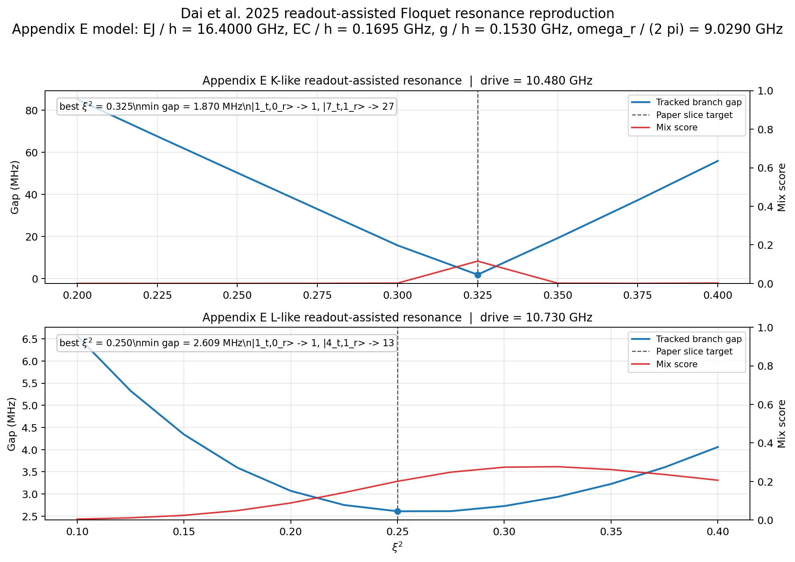

# Dai 2025 Readout-Assisted Floquet Resonances

This tutorial records a literature-backed Floquet reproduction of the readout-mode-assisted Appendix E branch slices from Dai et al., "Characterization of drive-induced unwanted state transitions in superconducting circuits". The goal is not to model every extrinsic DUST channel in the paper. It is to show that `cqed_sim.floquet` can reproduce the coupled transmon-readout avoided crossings for the K-like and L-like features when supplied with the paper's explicit cosine-transmon plus readout Hamiltonian.

## Code Path

- Validation and figure-generation workflow: `test_against_papers/dai_et_al_2025_readout_assisted_floquet_resonances.py`
- Paper summary note: `paper_summary/dai_hazra_weiss_et_al_2025_characterization_of_drive_induced_unwanted_state_transitions_in_superconducting_circuits.md`

This page points to `test_against_papers/` rather than `examples/` because the workflow is paper-specific literature validation, not a generic reusable demo.

## What Is Reproduced

- The Appendix E undriven coupled transmon-readout model with paper-fit parameters $E_J / h = 16.40$ GHz, $E_C / h = 0.1695$ GHz, $g / h = 0.153$ GHz, and $\omega_r / 2\pi = 9.029$ GHz.
- The K-like readout-assisted branch slice from Fig. A5 at $\omega_d / 2\pi = 10.48$ GHz, where the relevant dressed branches connect to $|1_t,0_r\rangle$ and $|7_t,1_r\rangle$.
- The L-like readout-assisted branch slice from Fig. A5 at $\omega_d / 2\pi = 10.73$ GHz, where the relevant dressed branches connect to $|1_t,0_r\rangle$ and $|4_t,1_r\rangle$.

## Regenerate the Results

Run the paper-validation workflow from the repository root:

```bash
python test_against_papers/dai_et_al_2025_readout_assisted_floquet_resonances.py --plot-output documentations/assets/images/tutorials/dai_2025_readout_assisted_floquet_resonances.png
```

The script prints the dressed-state label matches, evaluates the two fixed-frequency Appendix E slices, applies the same validation thresholds used in the paper-check pass, and writes the summary figure below.

## Model and Assumptions

- Static Hamiltonian: the Appendix E coupled cosine-transmon and readout-mode Hamiltonian, projected into a truncated transmon eigenbasis and then into the undriven dressed basis before the Floquet solve.
- Drive operator: charge drive with the paper's Eq. (C5) calibration from $\xi^2$ to $E_d$.
- Units: internal Hamiltonian coefficients remain in rad/s, with quoted frequencies reported in GHz by dividing by $2\pi$.
- Truncation: charge cutoff 35, 25 transmon eigenstates, and 5 readout Fock states.
- Resonance marker: minimum tracked quasienergy gap plus dressed-state mixing score, rather than the paper's exact branch-number plotting convention.
- Out of scope: TLS-assisted transitions, parasitic package modes, dissipative inelastic scattering, offset-charge averaging, and the paper's full ideal-displaced-state hybridization parameter $\Theta_j$.

## Dressed-State Identification

The undriven coupled Hamiltonian produces clean matches for the three Appendix E labels needed in the two validation slices:

| Product-state label | Matched dressed index | Overlap |
|---|---:|---:|
| $|1_t,0_r\rangle$ | 1 | 0.997644 |
| $|4_t,1_r\rangle$ | 13 | 0.980327 |
| $|7_t,1_r\rangle$ | 27 | 0.976359 |

Those overlaps are high enough that the branch-tracking study can be phrased in the undriven dressed basis without ambiguity.

## Representative Readout-Assisted Resonances

| Case | Drive frequency | Crossing | Best $\xi^2$ | Paper slice target $\xi^2$ | Minimum tracked gap | Mix score |
|---|---:|---|---:|---:|---:|---:|
| K-like Fig. A5 slice | 10.480000 GHz | $|1_t,0_r\rangle \leftrightarrow |7_t,1_r\rangle$ | 0.325 | 0.325 | 1.870 MHz | 0.116 |
| L-like Fig. A5 slice | 10.730000 GHz | $|1_t,0_r\rangle \leftrightarrow |4_t,1_r\rangle$ | 0.250 | 0.250 | 2.609 MHz | 0.201 |

The K-like slice is weaker than the L-like slice in this finite-truncation reproduction, but both show clear gap minima at the same fixed frequencies used in the paper's Appendix E branch analysis.

## Generated Evidence

The figure below was generated by the same paper-validation script.



Each panel plots the tracked branch gap against $\xi^2$ for one Appendix E slice, together with the dressed-state mix score used to verify that the minimum is a genuine hybridization point rather than a branch-labeling artifact.

## Why This Matters for `cqed_sim`

This reproduction extends the earlier intrinsic Dai validation into an extrinsic, mode-assisted setting without needing new public solver APIs. It demonstrates that the generic `FloquetProblem` entry point is flexible enough to support a coupled transmon-resonator Hamiltonian written directly from the paper, provided the user supplies the explicit static Hamiltonian and periodic operator.

## References

[1] W. Dai, S. Hazra, D. K. Weiss, P. D. Kurilovich, T. Connolly, H. K. Babla, S. Singh, V. R. Joshi, A. Z. Ding, P. D. Parakh, J. Venkatraman, X. Xiao, L. Frunzio, and M. H. Devoret, "Characterization of drive-induced unwanted state transitions in superconducting circuits," arXiv:2506.24070, 2025. DOI: 10.48550/arXiv.2506.24070.