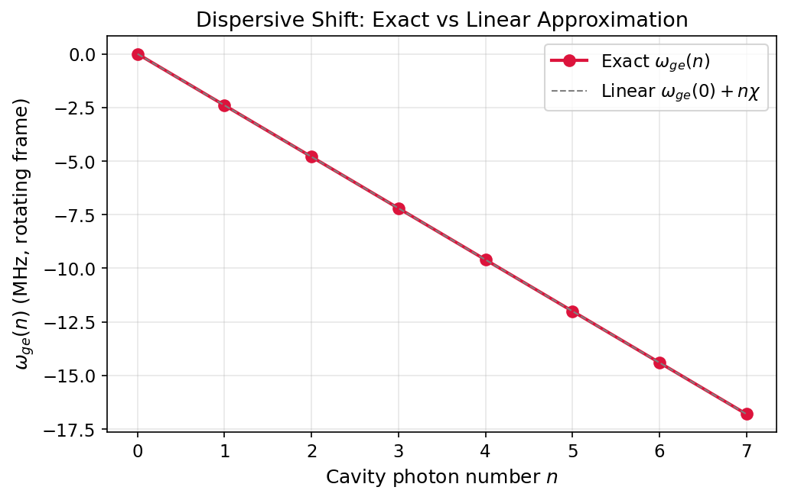

# Tutorial: Dispersive Shift & Dressed Frequencies

Connect the dispersive Hamiltonian to the dressed energy spectrum and validate the photon-number-dependent qubit transition using exact diagonalisation.

**Notebook:** `tutorials/08_dispersive_shift_and_dressed_frequencies.ipynb`

---

## Physics Background

### From Hamiltonian to Spectrum

The dispersive Hamiltonian predicts a linear shift of the qubit frequency with cavity photon number:

$$\omega_{ge}(n) = \omega_{ge}(0) + n\chi$$

However, exact diagonalisation of the full Jaynes-Cummings Hamiltonian reveals corrections beyond the linear approximation. The cavity self-Kerr $K$ introduces a small **curvature** in $\omega_{ge}(n)$:

$$\omega_{ge}(n) \approx \omega_{ge}(0) + n\chi + \mathcal{O}(n^2)$$

For typical parameters ($K/2\pi \sim$ kHz, $\chi/2\pi \sim$ MHz), the curvature is small but measurable at high photon numbers.

---

## Verifying the Spectrum

```python
import numpy as np
from cqed_sim.core import (
    DispersiveTransmonCavityModel, FrameSpec,
    compute_energy_spectrum, manifold_transition_frequency,
)

model = DispersiveTransmonCavityModel(
    omega_c=2*np.pi*5.15e9, omega_q=2*np.pi*6.35e9,
    alpha=2*np.pi*(-220e6), chi=2*np.pi*(-2.4e6),
    kerr=2*np.pi*(-2e3), n_cav=10, n_tr=2,
)
frame = FrameSpec(omega_c_frame=model.omega_c, omega_q_frame=model.omega_q)

# Exact transition frequencies vs linear approximation
for n in range(8):
    exact = manifold_transition_frequency(model, n=n, frame=frame) / (2*np.pi*1e6)
    linear = manifold_transition_frequency(model, n=0, frame=frame) / (2*np.pi*1e6) + \
             n * model.chi / (2*np.pi*1e6)
    print(f"  n={n}: exact={exact:.3f} MHz, linear={linear:.3f} MHz, diff={exact-linear:.4f} MHz")
```

---

## Results



The red circles show the exact qubit transition frequency $\omega_{ge}(n)$ from Hamiltonian diagonalisation. The dashed gray line shows the linear prediction $\omega_{ge}(0) + n\chi$. At low photon numbers the two agree, but slight Kerr-induced curvature becomes visible at higher $n$.

| Observable | Expected |
|---|---|
| Linear slope | $\chi/2\pi = -2.4$ MHz per photon |
| Curvature correction | $\mathcal{O}(K)$, visible for $n \gtrsim 5$ |
| $\omega_{ge}(0)$ | $\approx 0$ MHz in the matched rotating frame |

---

## See Also

- [Minimal Dispersive Model](minimal_dispersive_model.md) — basic model construction
- [Displacement & Spectroscopy](displacement_spectroscopy.md) — measuring the spectrum experimentally
- [Number Splitting](number_splitting.md) — resolving individual photon-number peaks
