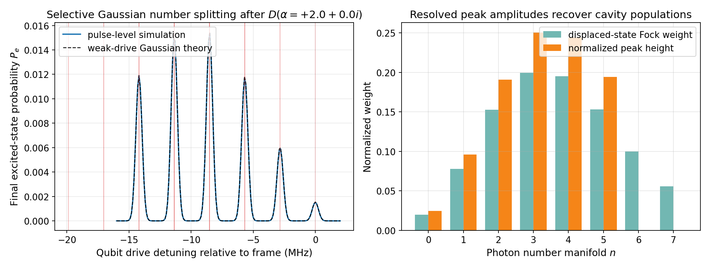

# Tutorial: Displacement & Qubit Spectroscopy

The primary guided notebook path for this topic now lives in the workflow tutorial suite:

- `tutorials/10_core_workflows/01_displacement_then_qubit_spectroscopy.ipynb`
- `tutorials/10_core_workflows/04_selective_gaussian_number_splitting.ipynb`

The earlier foundations material is still useful for background:

- `tutorials/03_cavity_displacement_basics.ipynb`
- `tutorials/06_qubit_spectroscopy.ipynb`
- `tutorials/07_cavity_conditioned_qubit_spectroscopy_number_splitting.ipynb`

This page remains as a compact topical summary of the same physics.

---

## Physics Background

In a dispersive qubit-cavity system, the qubit transition frequency shifts with cavity photon number:

$$\omega_{ge}(n) = \omega_{ge}(0) + \chi \cdot n$$

By displacing the cavity into a coherent state and then sweeping a weak selective qubit drive frequency, one can resolve individual photon-number peaks in the spectroscopy signal. In the weak-drive limit, the line amplitudes are proportional to the displaced cavity's photon-number weights.

---

## Setup

```python
import numpy as np
from cqed_sim.core import DispersiveTransmonCavityModel, FrameSpec

model = DispersiveTransmonCavityModel(
    omega_c=2 * np.pi * 5.0e9,
    omega_q=2 * np.pi * 6.0e9,
    alpha=2 * np.pi * (-200e6),
    chi=2 * np.pi * (-2.84e6),
    kerr=2 * np.pi * (-2e3),
    n_cav=15,
    n_tr=2,
)

frame = FrameSpec(
    omega_c_frame=model.omega_c,
    omega_q_frame=model.omega_q,
)
```

---

## Step 1: Displace the Cavity

Create a coherent state by applying a displacement pulse:

```python
from cqed_sim.io import DisplacementGate
from cqed_sim.pulses import build_displacement_pulse

gate = DisplacementGate(index=0, name="displace", re=2.0, im=0.0)
disp_pulses, disp_ops, _ = build_displacement_pulse(
    gate,
    {"duration_displacement_s": 120e-9},
)
```

---

## Step 2: Sweep Qubit Drive Frequency

After displacing, apply a long weak Gaussian qubit probe at different frequencies and measure the qubit excitation probability:

```python
from cqed_sim.core import carrier_for_transition_frequency
from cqed_sim.pulses import Pulse
from cqed_sim.pulses.envelopes import gaussian_envelope
from cqed_sim.sequence import SequenceCompiler
from cqed_sim.sim import SimulationConfig, simulate_sequence
from cqed_sim.sim import reduced_qubit_state
from functools import partial

# Sweep detunings around the dressed qubit line in the matched rotating frame
detunings_hz = np.linspace(-16e6, 2e6, 181)
pe_values = []

for det_hz in detunings_hz:
    omega_probe = 2 * np.pi * det_hz  # Detuning in rotating frame
    carrier = carrier_for_transition_frequency(omega_probe)

    probe_pulse = Pulse(
        "q", 160e-9, 2.5e-6,
        partial(gaussian_envelope, sigma=0.18),
        carrier=carrier,
        amp=2 * np.pi * 0.04e6,
    )

    all_pulses = disp_pulses + [probe_pulse]
    drive_ops = {**disp_ops, "q": "qubit"}

    compiled = SequenceCompiler(dt=2e-9).compile(all_pulses, t_end=2.7e-6)

    result = simulate_sequence(
        model, compiled, model.basis_state(0, 0), drive_ops,
        config=SimulationConfig(frame=frame),
    )

    rho_q = reduced_qubit_state(result.final_state)
    pe = rho_q[1, 1].real
    pe_values.append(pe)
```

---

## Step 3: Analyze the Spectrum

The spectrum shows peaks at each photon-number manifold, separated by $\chi$:

```python
import matplotlib.pyplot as plt

plt.figure(figsize=(10, 4))
plt.plot(detunings_hz / 1e6, pe_values)
plt.xlabel("Qubit drive detuning (MHz)")
plt.ylabel("P(e)")
plt.title("Displacement + Qubit Spectroscopy")
plt.grid(True, alpha=0.3)
plt.show()
```

Running this sweep produces the following spectrum:



For a coherent state $|\alpha=2\rangle$, you should see peaks at:

- $\delta = 0$ (n=0 manifold)
- $\delta = \chi / (2\pi)$ (n=1 manifold)
- $\delta = 2\chi / (2\pi)$ (n=2 manifold)
- etc.

with amplitudes that closely follow the displaced-state photon-number weights. For an ideal coherent state this is the Poisson distribution

$$
P(n) = e^{-|\alpha|^2} \frac{|\alpha|^{2n}}{n!}.
$$

The workflow notebook overlays the pulse-level spectrum with a weak-drive Gaussian theory curve and compares the normalized resolved peak heights against the simulated cavity Fock weights.

---

## Related Repo Assets

- Guided notebooks: `tutorials/10_core_workflows/01_displacement_then_qubit_spectroscopy.ipynb`, `tutorials/10_core_workflows/04_selective_gaussian_number_splitting.ipynb`, `tutorials/03_cavity_displacement_basics.ipynb`, `tutorials/07_cavity_conditioned_qubit_spectroscopy_number_splitting.ipynb`
- Standalone script: `examples/displacement_qubit_spectroscopy.py`

Use the numbered notebooks when you want the full teaching flow and the standalone script when you want one compact executable example.
