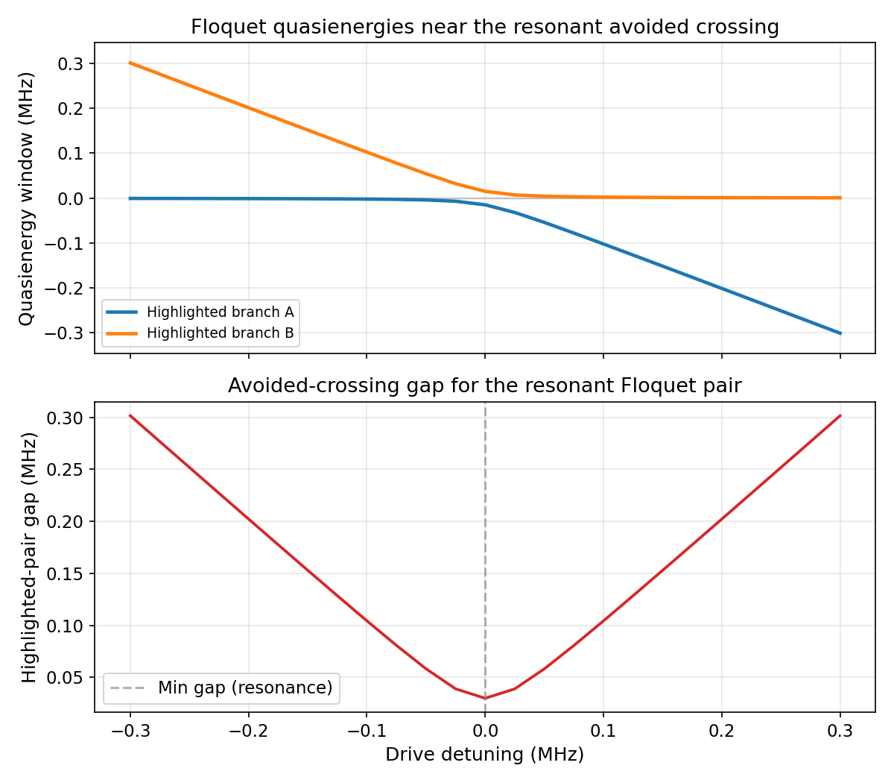

# Floquet Driven Systems

The Floquet tutorial set treats a periodically driven Hamiltonian as an eigenproblem in an extended Hilbert space, rather than as a static model with a small perturbation.

Workflow notebooks:

- `tutorials/50_floquet_driven_systems/01_sideband_quasienergy_scan.ipynb`
- `tutorials/50_floquet_driven_systems/02_branch_tracking_and_multiphoton_resonances.ipynb`

---

## Physics Background

### Floquet Theorem

For a time-periodic Hamiltonian $H(t) = H(t + T)$ with period $T = 2\pi/\Omega$, Floquet theory states that solutions of the Schrodinger equation can be written as

$$|\psi_n(t)\rangle = e^{-i\varepsilon_n t} |\phi_n(t)\rangle,$$

where $|\phi_n(t + T)\rangle = |\phi_n(t)\rangle$ is periodic and $\varepsilon_n$ is the quasienergy.

Key consequences:

- quasienergies are defined modulo $\Omega$
- Floquet states can be expanded in Fourier harmonics
- near resonance, the drive hybridizes bare states and reorganizes the spectrum

### Floquet Hamiltonian

In the harmonic-space construction, the quasienergy problem becomes

$$[H_F]_{nm} = H_{n-m} + m\Omega \delta_{nm},$$

where $H_k$ are the Fourier components of the periodic Hamiltonian.

### Avoided Crossings And Resonances

When two bare states satisfy an $n$-photon resonance condition

$$E_a - E_b \approx n\Omega,$$

their Floquet branches hybridize and form an avoided crossing. The minimum gap of that avoided crossing sets the effective resonant coupling scale.

---

## Included Notebooks

### `50_floquet_driven_systems/01_sideband_quasienergy_scan.ipynb`

This notebook builds a transmon-storage sideband drive, sweeps the drive frequency across the red-sideband condition, and tracks the resulting quasienergy branches.

What it teaches:

- how to build a `FloquetProblem` from a physical model plus periodic drive
- how `run_floquet_sweep(...)` preserves branch identity across a scan
- how to extract the relevant avoided crossing from the tracked branches

### Setup

```python
import numpy as np

from cqed_sim.core import DispersiveTransmonCavityModel, FrameSpec
from cqed_sim.floquet import FloquetProblem, FloquetConfig, run_floquet_sweep

model = DispersiveTransmonCavityModel(
    omega_c = 2 * np.pi * 5.05e9,
    omega_q = 2 * np.pi * 6.25e9,
    alpha   = 2 * np.pi * (-250e6),
    chi     = 2 * np.pi * (-15e6),
    n_cav   = 6,
    n_tr    = 3,
)
frame = FrameSpec(omega_c_frame=model.omega_c, omega_q_frame=model.omega_q)
```

### Running The Frequency Sweep

```python
from cqed_sim.floquet import build_target_drive_term

scan_detunings_mhz = np.linspace(-0.30, 0.30, 61)
problems = []
for det_mhz in scan_detunings_mhz:
    freq_hz = model.sideband_transition_frequency(
        cavity_level=0,
        lower_level=0,
        upper_level=2,
        sideband="red",
        frame=frame,
    ) / (2 * np.pi) + det_mhz * 1e6

    drive = build_target_drive_term(
        model,
        sideband_spec,
        amplitude=2 * np.pi * 0.03e6,
        frequency=2 * np.pi * freq_hz,
        waveform="cos",
    )
    problems.append(
        FloquetProblem(
            model=model,
            frame=frame,
            periodic_terms=(drive,),
            period=1.0 / abs(freq_hz),
        )
    )

sweep = run_floquet_sweep(
    problems,
    parameter_values=scan_detunings_mhz,
    config=FloquetConfig(n_time_samples=96),
)
```

### Expected Output

The public figure now highlights the resonant pair selected by strongest hybridization at the center of the sweep, rather than plotting a global "minimum adjacent gap" diagnostic over every tracked branch. That change matters because duplicate or weakly relevant branches can otherwise make the public gap trace look artificially flat even when a real avoided crossing is present.

The sweep produces two panels:

1. quasienergy branches versus detuning, with the resonant pair highlighted
2. the gap of that highlighted pair, which reaches its minimum near the sideband resonance

### Generated Plot

The figure below is regenerated by `tools/generate_tutorial_plots.py`. The corresponding regression in `tests/test_61_public_tutorial_plot_validation.py` checks that the highlighted pair is strongly hybridized near zero detuning and that its minimum gap is finite and localized.



In this public plot:

- the upper panel is a local quasienergy window around the resonant pair
- faint gray traces provide nearby branch context inside that local window
- blue and orange traces mark the pair selected by strongest mixing at the scan center
- the lower panel shows the gap of that highlighted pair, which gives the physically relevant avoided-crossing scale for this tutorial configuration

---

### `50_floquet_driven_systems/02_branch_tracking_and_multiphoton_resonances.ipynb`

This notebook solves one driven problem and identifies which bare energy gaps satisfy integer-harmonic resonance conditions.

What it teaches:

- how to solve one driven Hamiltonian with `solve_floquet(...)`
- how to inspect folded quasienergies
- how `identify_multiphoton_resonances(...)` reports relevant harmonic processes

```python
from cqed_sim.floquet import identify_multiphoton_resonances, solve_floquet

result = solve_floquet(
    problem,
    config=FloquetConfig(n_fourier_modes=3, n_time_samples=96),
)

eps = result.quasienergies_mhz

resonances = identify_multiphoton_resonances(
    result,
    model=model,
    max_order=4,
    gap_tolerance_mhz=0.5,
)
for r in resonances:
    print(
        f"{r.lower_label} -> {r.upper_label}: "
        f"{r.order}-photon resonance at {r.drive_frequency_mhz:.2f} MHz"
    )
```

---

## Why This Set Exists

Many cQED control problems are genuinely periodic-drive problems. Static dressed-state intuition is often not enough once a drive is strong enough to reorganize the spectrum. These notebooks provide a direct route from a physical model to quasienergies, branch tracking, and multiphoton resonance diagnostics.

They also connect directly to the repository's sideband tooling, so they bridge the standard time-domain workflow and the Floquet API.

## References

[1] J. H. Shirley, "Solution of the Schrodinger Equation with a Hamiltonian Periodic in Time," Physical Review 138, B979-B987 (1965). DOI: [10.1103/PhysRev.138.B979](https://doi.org/10.1103/PhysRev.138.B979)

[2] Hideo Sambe, "Steady States and Quasienergies of a Quantum-Mechanical System in an Oscillating Field," Physical Review A 7, 2203-2213 (1973). DOI: [10.1103/PhysRevA.7.2203](https://doi.org/10.1103/PhysRevA.7.2203)

[3] M. Silveri, J. Tuorila, E. Thuneberg, and G. Paraoanu, "Quantum systems under frequency modulation," Reports on Progress in Physics 80, 056002 (2017). DOI: [10.1088/1361-6633/aa5170](https://doi.org/10.1088/1361-6633/aa5170)

## Related References

- [Floquet Analysis API](../api/floquet.md)
- [User Guide: Floquet Analysis](../user_guides/floquet_analysis.md)
- [Dai 2025 Intrinsic Resonances](dai_2025_intrinsic_multiphoton_resonances.md)
- [Dai 2025 Readout-Assisted Resonances](dai_2025_readout_assisted_floquet_resonances.md)
- [Sideband Swap](sideband_swap.md)
