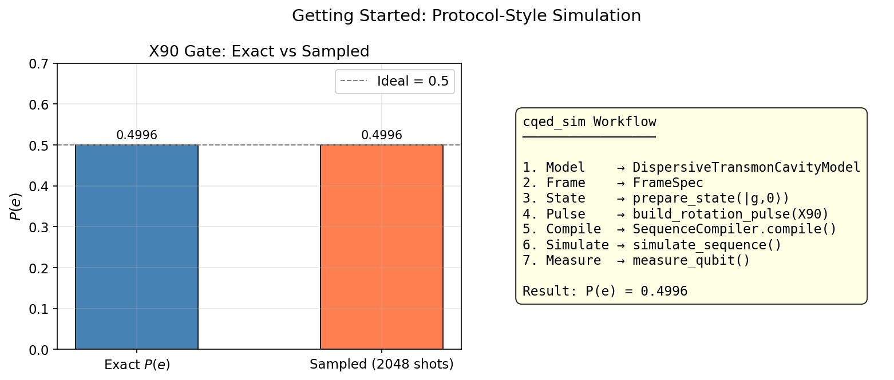

# Getting Started: Protocol-Style Simulation

This tutorial walks through the complete `cqed_sim` workflow from model definition to measurement. It mirrors `tutorials/00_getting_started/01_protocol_style_simulation.ipynb`.

---

## Physics Background

### The Dispersive Transmon-Cavity System

The canonical cQED building block is a transmon qubit coupled to a microwave resonator. The full Jaynes-Cummings Hamiltonian is:

$$H_{JC} = \omega_c \, a^\dagger a + \omega_q \, |e\rangle\langle e| + g\left(a^\dagger \sigma_- + a \sigma_+\right)$$

where $\omega_c$ is the cavity frequency, $\omega_q$ the qubit transition frequency, $g$ the vacuum Rabi coupling, $a$/$a^\dagger$ the cavity ladder operators, and $\sigma_\pm$ the qubit raising/lowering operators.

When the qubit-cavity detuning $\Delta = \omega_q - \omega_c$ is large compared to $g$ (dispersive regime $g \ll \Delta$), a Schrieffer-Wolff transformation yields the dispersive Hamiltonian:

$$H_{\text{disp}} = \omega_c \, a^\dagger a + \left(\omega_q + \chi \, a^\dagger a\right)|e\rangle\langle e|, \qquad \chi = \frac{g^2}{\Delta}$$

The dispersive shift $\chi$ is the key parameter: it shifts the qubit frequency by $\chi$ for every photon in the cavity. Simultaneously, the cavity frequency shifts by $\chi$ depending on the qubit state — this is the dispersive readout mechanism.

### Rotating Frame

A raw simulation in the lab frame would require resolving oscillations at GHz frequencies. Instead, `cqed_sim` works in the **rotating frame** defined by:

$$H_{\text{rot}} = H - \omega_c^{\text{frame}} a^\dagger a - \omega_q^{\text{frame}} |e\rangle\langle e|$$

Setting the frame frequencies equal to the bare mode frequencies removes the free precession. Drives appear as slow envelopes rather than GHz-frequency oscillations, dramatically reducing the required simulation bandwidth.

### Qubit Rotation

A resonant drive on the qubit in the rotating frame is equivalent to a rotation on the Bloch sphere. A Gaussian envelope pulse of area $\theta = 2\int \Omega(t) \, dt$ rotates the qubit by angle $\theta$ around an axis determined by the drive phase. A **π/2 pulse (X90)** produces an equal superposition $|g\rangle + |e\rangle$ from the ground state.

---

## Step-by-Step Workflow

### 1. Define the Model

```python
import numpy as np
from cqed_sim.core import DispersiveTransmonCavityModel, FrameSpec

model = DispersiveTransmonCavityModel(
    omega_c  = 2 * np.pi * 5.0e9,    # Cavity frequency (rad/s)
    omega_q  = 2 * np.pi * 6.0e9,    # Qubit frequency (rad/s)
    alpha    = 2 * np.pi * (-220e6), # Transmon anharmonicity (rad/s)
    chi      = 2 * np.pi * (-2.5e6), # Dispersive shift (rad/s)
    kerr     = 2 * np.pi * (-2e3),   # Cavity self-Kerr (rad/s)
    n_cav    = 6,                     # Fock space truncation (cavity)
    n_tr     = 2,                     # Transmon levels used
)

frame = FrameSpec(
    omega_c_frame = model.omega_c,
    omega_q_frame = model.omega_q,
)
```

The `alpha` parameter is the transmon anharmonicity — the deviation of the $|f\rangle \leftarrow |e\rangle$ transition from $\omega_q$. For a pure two-level qubit, `n_tr=2` and `alpha` does not affect dynamics, but it becomes important for leakage calculations.

### 2. Prepare the Initial State

```python
from cqed_sim.core import StatePreparationSpec, qubit_state, fock_state, prepare_state

initial_state = prepare_state(
    model,
    StatePreparationSpec(
        qubit   = qubit_state("g"),   # Qubit in ground state |g⟩
        storage = fock_state(0),      # Cavity in vacuum |0⟩
    ),
)
```

### 3. Build a Rotation Pulse

```python
from cqed_sim.io import RotationGate
from cqed_sim.pulses import build_rotation_pulse

# θ = π/2 X-rotation (X90 gate)
gate = RotationGate(theta=np.pi / 2, phi=0.0)
pulses, drive_ops, pulse_meta = build_rotation_pulse(
    gate,
    {"duration_rotation_s": 64e-9, "rotation_sigma_fraction": 0.18},
)
```

The `sigma_fraction` controls the truncation of the Gaussian; with 0.18 the pulse has negligible tails outside the `duration_rotation_s` window.

### 4. Compile the Sequence

```python
from cqed_sim.sequence import SequenceCompiler

compiled = SequenceCompiler(dt=1e-9).compile(pulses, t_end=70e-9)
```

The compiler converts pulse objects into a dense time-domain schedule sampled at `dt`. Use `dt` small enough to resolve the highest-frequency component of the drive envelope.

### 5. Simulate

```python
from cqed_sim.sim import SimulationConfig, simulate_sequence

result = simulate_sequence(
    model, compiled, initial_state, drive_ops,
    config=SimulationConfig(frame=frame),
)
```

The simulator integrates the rotating-frame Schrödinger (or Lindblad) equation using the compiled schedule. `result.final_state` is the density matrix (or state vector) at `t_end`.

### 6. Measure

```python
from cqed_sim.sim import QubitMeasurementSpec, measure_qubit

measurement = measure_qubit(
    result.final_state,
    QubitMeasurementSpec(shots=2048),
)

print(f"P(e) exact:   {measurement.exact_probability:.4f}")
print(f"P(e) sampled: {measurement.sampled_frequency:.4f}")
```

For an ideal π/2 pulse, `P(e)` should be very close to 0.5. The `sampled_frequency` will scatter around this value with statistical noise $\sim 1/\sqrt{N_{\text{shots}}}$.

---

## Expected Output

A bar chart comparing exact probability with sampled frequency shows both near 0.5, demonstrating successful X90 operation. The cavity photon number remains zero throughout since the cavity was never driven.

| Observable | Expected |
|---|---|
| $P(e)$ after X90 | $\approx 0.50$ |
| Cavity $\langle n \rangle$ | $0$ |
| Qubit purity | $1$ (pure state) |



---

## Workflow Summary

```
model          → DispersiveTransmonCavityModel(...)
frame          → FrameSpec(...)
initial_state  → prepare_state(model, StatePreparationSpec(...))
pulses         → build_rotation_pulse(gate, params)
compiled       → SequenceCompiler(dt).compile(pulses, t_end)
result         → simulate_sequence(model, compiled, initial, ops, config)
measurement    → measure_qubit(result.final_state, spec)
```

This is the canonical pattern for all time-domain protocols in `cqed_sim`. More complex experiments replace the rotation pulse with displacement, sideband, or multi-step sequences — but the compile → simulate → measure structure stays the same.

---

## Related Notebooks

- `tutorials/00_getting_started/01_protocol_style_simulation.ipynb` — interactive version of this workflow
- `tutorials/01_getting_started_minimal_dispersive_model.ipynb` — model construction in depth
- `tutorials/02_units_frames_and_conventions.ipynb` — units, frames, and carrier sign convention
- `tutorials/04_qubit_drive_and_basic_population_dynamics.ipynb` — Rabi oscillation physics

## See Also

- [Defining Models](../user_guides/defining_models.md) — `DispersiveTransmonCavityModel` parameters
- [Rotating Frames](../user_guides/frames.md) — frame specification and carrier convention
- [Pulse Construction](../user_guides/pulse_construction.md) — pulse builders and envelopes
- [Physics & Conventions](../physics_conventions.md) — full Hamiltonian reference
