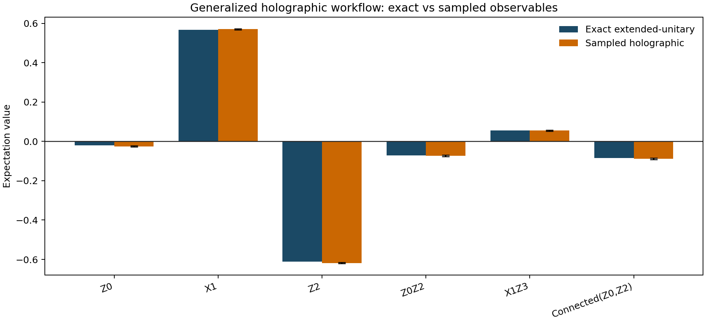
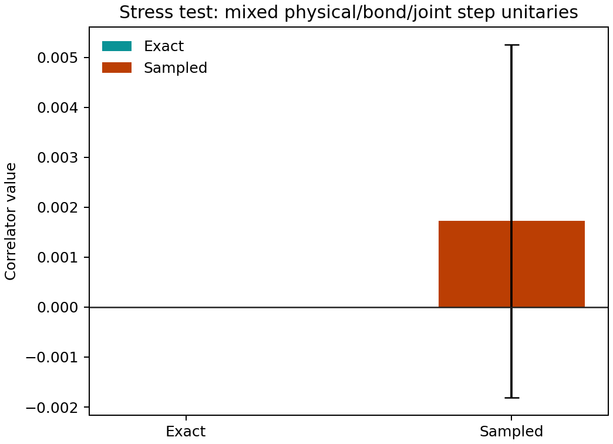

# Tutorial: Generalized Holographic Unitary Workflow

This page documents the fully worked generalized holographic example in:

- `examples/quantum_algorithms/holographic_generalized_unitary_workflow.py`

For a second concrete benchmark built from explicit GHZ and cluster-state
preparation circuits, see `holographic_ghz_cluster_workflow.md`.

The example exercises the new public finite-sequence interface:

- `StepUnitarySpec`
- `HolographicChannelSequence`
- `HolographicSampler.from_unitary_sequence(...)`
- `HolographicSampler.from_mps_sequence(...)`

It also writes the generated artifacts to:

- `outputs/holographic_generalized_unitary/summary.json`
- `outputs/holographic_generalized_unitary/observable_comparison.csv`
- `outputs/holographic_generalized_unitary/structural_checks.csv`
- `outputs/holographic_generalized_unitary/stress_test_comparison.csv`

## Interface Convention

The holographic package always uses the ordering

$$
|\sigma\rangle_{\mathrm{physical}} \otimes |b\rangle_{\mathrm{bond}}.
$$

The new per-step unitary interface makes the embedding rule explicit:

- `acts_on="joint"`: the provided unitary already acts on `physical ⊗ bond`.
- `acts_on="physical"`: the provided unitary is embedded as $U_{\mathrm{physical}} \otimes I_{\mathrm{bond}}$.
- `acts_on="bond"`: the provided unitary is embedded as $I_{\mathrm{physical}} \otimes U_{\mathrm{bond}}$.

Finite explicit sequences are represented by `HolographicChannelSequence`. The
sequence length is the physical step count, so measurement schedules for these
finite workflows use `total_steps = sequence.num_steps`.

## Example Construction

### Initial State

The exact seed state is the four-qubit computational-basis product state

$$
|1011\rangle.
$$

### Random MPS Construction

In this example, “random MPS” does not mean random measurement noise or random
gauge completion. The randomness enters the generated state structure itself:

1. Start from the seed state $|1011\rangle$.
2. Apply four site-local Haar-random $SU(2)$ rotations generated with seed `12345`.
3. Apply nearest-neighbor partial-swap entanglers with angles
   $\theta = (0.41, -0.33, 0.27)$.
4. Convert the resulting normalized dense state into a right-canonical MPS.
5. Complete each site tensor into the square right-isometry form used by the
   holographic sequence interface.

This keeps the starting point explicit while still producing a nontrivial state
with nonzero one-point functions and nontrivial connected correlations.

### Right-Isometry and Extended Unitaries

For the worked example, the completed site tensors all have shape `(4, 2, 4)`.
The corresponding dense Stinespring unitaries therefore have shape `(8, 8)` at
every step, matching `physical_dim = 2` and `bond_dim = 4`.

The maximum observed numerical violations were:

- right-isometry error: $1.0513 \times 10^{-15}$
- Kraus completeness error: $1.0513 \times 10^{-15}$
- dense unitary error: $1.1733 \times 10^{-15}$

Those values are at machine precision and confirm that the MPS-to-isometry and
isometry-to-unitary lifts are numerically consistent.

## Observable Validation

The example compares four equivalent representations:

1. direct dense-state expectation values,
2. MPS expectation values,
3. exact finite-sequence holographic expectations from the completed extended unitaries,
4. many-shot sampled holographic estimates.

The primary run uses `100000` shots. The observables are:

- `Z0`
- `X1`
- `Z2`
- `Z0Z2`
- `X1Z3`
- `Connected(Z0,Z2) = <Z0 Z2> - <Z0><Z2>`

The exact and sampled values are:

| Observable | Exact | Sampled | Sampled stderr | $|\Delta|$ |
|---|---:|---:|---:|---:|
| `Z0` | `-0.021091` | `-0.025180` | `0.003161` | `0.004089` |
| `X1` | `0.567432` | `0.570240` | `0.002598` | `0.002808` |
| `Z2` | `-0.610576` | `-0.618100` | `0.002486` | `0.007524` |
| `Z0Z2` | `-0.072077` | `-0.073260` | `0.003154` | `0.001183` |
| `X1Z3` | `0.054934` | `0.055300` | `0.003157` | `0.000366` |
| `Connected(Z0,Z2)` | `-0.084954` | `-0.088824` | `0.003711` | `0.003870` |

All dense, MPS, and exact extended-unitary values agree to numerical precision.
The sampled values remain within a few standard errors of the exact values, as
expected for finite-shot Monte Carlo estimation.

The generated comparison plot is shown below.

## Stress Test: Mixed Step-Unitary Embeddings

The example also includes a second finite-sequence stress test whose step
unitaries are not all identical and do not all live on the same subsystem:

1. `physical_rx`: `acts_on="physical"`
2. `bond_rz`: `acts_on="bond"`
3. `joint_partial_swap`: `acts_on="joint"`
4. `physical_rx_tail`: `acts_on="physical"`

This run uses `80000` shots and compares the new public sequence API against the
legacy exact branch table after explicitly resolving all joint unitaries.

The result is:

- exact public-sequence value: `1.4745e-17`
- exact legacy value: `1.4745e-17`
- sampled value: `0.001725 ± 0.003536`

That confirms the new embedding-aware public interface reduces to the same exact
physics as the older explicit-joint-unitary path when both are given the same
resolved step program.

## Practical Notes

- Use `HolographicSampler(channel, burn_in=...)` when the same channel is repeated.
- Use `HolographicSampler(sequence)` when the steps are explicitly different.
- Use `HolographicSampler.from_mps_sequence(...)` when the site-by-site sequence
  should come directly from a dense state or from an MPS-derived right-isometry chain.
- Use `StepUnitarySpec` when a step acts only on the physical register or only
  on the bond register and should be embedded automatically into the full
  `physical ⊗ bond` space.