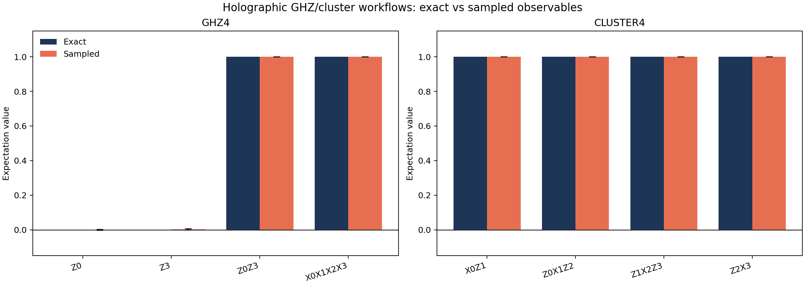
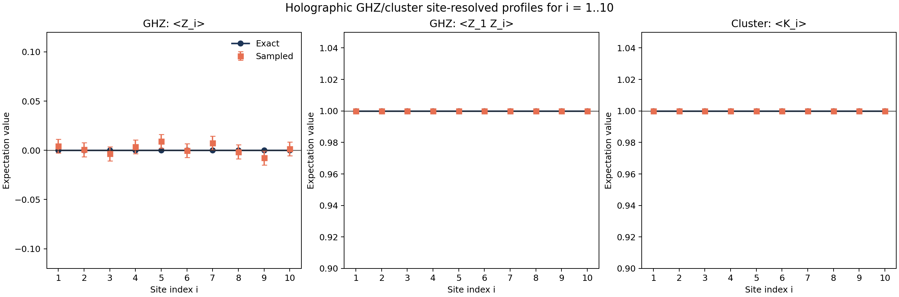

# Tutorial: Holographic GHZ and Cluster-State Workflow

This page documents the concrete entangled-state workflow in:

- `examples/quantum_algorithms/holographic_ghz_cluster_workflow.py`

Unlike the randomized generalized example, this workflow starts from two named
preparation circuits with analytically known correlators:

- a four-qubit GHZ state,
- a four-qubit linear cluster state.

The script converts each exact dense state into a right-canonical MPS, lifts the
completed site tensors into the public finite-sequence holographic interface,
runs exact and sampled correlator estimation, and writes the generated outputs
to:

- `outputs/holographic_ghz_cluster/summary.json`
- `outputs/holographic_ghz_cluster/observable_comparison.csv`
- `outputs/holographic_ghz_cluster/structural_checks.csv`
- `outputs/holographic_ghz_cluster/site_profile_observables.csv`

## GHZ State Example

The four-qubit GHZ target is prepared by the explicit circuit

$$
H_0 \; \mathrm{CNOT}_{0,1} \; \mathrm{CNOT}_{1,2} \; \mathrm{CNOT}_{2,3}
$$

acting on $|0000\rangle$, which yields

$$
|\mathrm{GHZ}_4\rangle = \frac{|0000\rangle + |1111\rangle}{\sqrt{2}}.
$$

The workflow checks the following exact expectations:

- `Z0 = 0`
- `Z3 = 0`
- `Z0Z3 = 1`
- `X0X1X2X3 = 1`

## Cluster-State Example

The four-qubit linear cluster target is prepared by

$$
\left(\prod_{j=0}^{3} H_j\right)
\; \mathrm{CZ}_{0,1}
\; \mathrm{CZ}_{1,2}
\; \mathrm{CZ}_{2,3}
$$

acting on $|0000\rangle$.

This state is characterized by the stabilizers

$$
K_0 = X_0 Z_1,
\qquad
K_1 = Z_0 X_1 Z_2,
\qquad
K_2 = Z_1 X_2 Z_3,
\qquad
K_3 = Z_2 X_3,
$$

and the script verifies that each of these has exact expectation value $+1$ in
the dense, MPS, and exact holographic representations.

## What the Script Validates

For both GHZ and cluster states, the script compares:

1. direct dense-state expectation values,
2. MPS expectation values,
3. exact finite-sequence holographic values,
4. many-shot sampled holographic values.

It also records per-site tensor and unitary diagnostics, including:

- Kraus completeness error,
- right-canonical error,
- dense-unitary error.

Because these target states are exact stabilizer-like constructions, they are a
useful complement to the seeded-random generalized workflow: the expected values
are transparent before any numerical run begins.

In addition to the four-site benchmark table, the script also runs a second
site-resolved benchmark on chains of length `10` and records the resulting
values as a function of site index $i = 1, \dots, 10$.

## Generated Plot

The script produces the following comparison plot.

The GHZ panel shows the expected vanishing one-point functions together with the
nontrivial long-range parity and global X-string expectation. The cluster panel
shows the four stabilizers grouped near $+1$, with sampled estimates tracking
the exact values within shot noise.

## Site-Resolved Profiles on 10 Sites

The same script also builds a ten-site GHZ chain and a ten-site linear cluster
chain and evaluates site-indexed observables for $i = 1, \dots, 10$.

For the GHZ chain, it records:

- the one-point profile $\langle Z_i \rangle$,
- the parity profile $\langle Z_1 Z_i \rangle$.

For the cluster chain, it records the stabilizer profile

$$
K_i = Z_{i-1} X_i Z_{i+1},
$$

with the standard boundary reductions $K_1 = X_1 Z_2$ and
$K_{10} = Z_9 X_{10}$.

The generated site-profile plot is shown below.

This run uses `20000` shots per ten-site state. In the checked-in benchmark,
the GHZ one-point profile stays close to zero across all sites, while the GHZ
parity profile $\langle Z_1 Z_i \rangle$ and the cluster stabilizer profile
$\langle K_i \rangle$ stay pinned at $+1$ for every site. The full site-by-site
values are written to `outputs/holographic_ghz_cluster/site_profile_observables.csv`.

The current checked-in site-profile run reports the following sampled values:

| Site $i$ | $\langle Z_i \rangle$ (GHZ) | $\langle Z_1 Z_i \rangle$ (GHZ) | $\langle K_i \rangle$ (cluster) |
|---:|---:|---:|---:|
| 1 | `0.0043` | `1.0` | `1.0` |
| 2 | `0.0007` | `1.0` | `1.0` |
| 3 | `-0.0035` | `1.0` | `1.0` |
| 4 | `0.0036` | `1.0` | `1.0` |
| 5 | `0.0091` | `1.0` | `1.0` |
| 6 | `-0.0003` | `1.0` | `1.0` |
| 7 | `0.0074` | `1.0` | `1.0` |
| 8 | `-0.0015` | `1.0` | `1.0` |
| 9 | `-0.0077` | `1.0` | `1.0` |
| 10 | `0.0014` | `1.0` | `1.0` |

The largest sampled GHZ one-point deviation is $|\langle Z_5 \rangle| \approx
9.1 \times 10^{-3}$, which is still consistent with the reported single-site
sampling uncertainty of about $7.1 \times 10^{-3}$.

## Observed Run Results

The current checked-in run uses `80000` shots per state. The generated summary in
`outputs/holographic_ghz_cluster/summary.json` reports:

| State | Observable | Exact | Sampled | Sampled stderr |
|---|---|---:|---:|---:|
| GHZ | `Z0` | `0.0` | `0.000325` | `0.003536` |
| GHZ | `Z3` | `0.0` | `0.003100` | `0.003536` |
| GHZ | `Z0Z3` | `1.0` | `1.0` | `0.0` |
| GHZ | `X0X1X2X3` | `1.0` | `1.0` | `0.0` |
| Cluster | `X0Z1` | `1.0` | `1.0` | `0.0` |
| Cluster | `Z0X1Z2` | `1.0` | `1.0` | `0.0` |
| Cluster | `Z1X2Z3` | `1.0` | `1.0` | `0.0` |
| Cluster | `Z2X3` | `1.0` | `1.0` | `0.0` |

The per-site structural checks stayed at machine precision. The largest reported
dense-unitary error in this run was about $7.92 \times 10^{-16}$ on the cluster
state, and the largest Kraus-completeness error was about $5.72 \times 10^{-16}$.

## Practical Use

- Use this workflow when you want a named, interpretable benchmark rather than a
  generic random target state.
- Use the GHZ section when testing long-range correlators.
- Use the cluster section when testing multi-site stabilizer structure and the
  per-step sequence lift for a nontrivial entangled graph state.