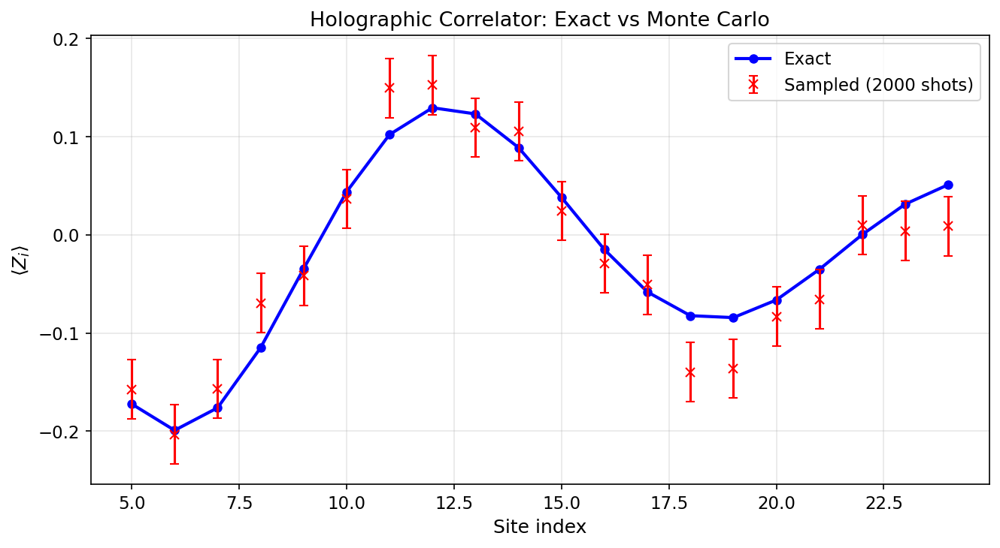

# Tutorial Guide: Holographic Quantum Algorithms

The reusable holographic workflow lives in:

- `cqed_sim.quantum_algorithms.holographic_sim`

Representative example scripts live in:

- `examples/quantum_algorithms/holographic_minimal_correlator.py`
- `examples/quantum_algorithms/holographic_burn_in_translation_invariant.py`
- `examples/quantum_algorithms/holographic_mps_dephasing_example.py`
- `examples/quantum_algorithms/holographic_spin_model_example.py`
- `examples/quantum_algorithms/holographic_generalized_unitary_workflow.py`
- `examples/quantum_algorithms/holographic_ghz_cluster_workflow.py`

---

## Conceptual Model

This package treats a many-body observable estimation problem as repeated action
of a channel on a small bond Hilbert space.

At each step:

1. prepare the physical register in a reference state
2. apply a joint unitary or equivalent Kraus update on `physical ⊗ bond`
3. optionally measure a physical observable
4. update the bond state
5. accumulate correlator weights across the schedule

`burn-in` means running the channel for several steps before starting the
observable insertions so that the bond state approaches a bulk or steady-state
regime.

---

## Minimal Usage

```python
from cqed_sim.quantum_algorithms.holographic_sim import (
    HolographicChannelSequence,
    BondNoiseChannel,
    BurnInConfig,
    HolographicChannel,
    HolographicSampler,
    ObservableSchedule,
    StepUnitarySpec,
    pauli_z,
)

channel = HolographicChannel.from_unitary(U, physical_dim=2, bond_dim=4)
sequence = HolographicChannelSequence.from_unitaries(
    [
        StepUnitarySpec(U_q, acts_on="physical"),
        StepUnitarySpec(U_b, acts_on="bond"),
        StepUnitarySpec(U_joint, acts_on="joint"),
    ],
    physical_dim=2,
    bond_dim=4,
)
noise = BondNoiseChannel.dephasing(bond_dim=channel.bond_dim, probability=0.05)
# Other built-ins are available when dephasing is not the right model:
# BondNoiseChannel.amplitude_damping(...)
# BondNoiseChannel.depolarizing(...)
schedule = ObservableSchedule(
    [
        {"step": 10, "operator": pauli_z()},
        {"step": 14, "operator": pauli_z()},
    ],
    total_steps=20,
)
sampler = HolographicSampler(channel, burn_in=BurnInConfig(steps=50), bond_noise=noise)
estimate = sampler.sample_correlator(schedule, shots=5000)
finite_exact = HolographicSampler(sequence).enumerate_correlator(
    ObservableSchedule([...], total_steps=sequence.num_steps)
)
```

Use `enumerate_correlator(...)` on small examples to cross-check Monte Carlo
estimates exactly.

## MPS Convenience Path

```python
from cqed_sim.quantum_algorithms.holographic_sim import (
    HolographicChannelSequence,
    HolographicSampler,
    right_canonical_tensor_to_stinespring_unitary,
)

sampler = HolographicSampler.from_mps_state(psi, site=0)
finite_sampler = HolographicSampler.from_mps_sequence(psi)
unitary = right_canonical_tensor_to_stinespring_unitary(sampler.channel.mps_matrices)
unitaries = MatrixProductState(psi).site_stinespring_unitaries()
```

`from_mps_state(...)` is the shortest route from a normalized dense state tensor
to a reusable holographic transfer channel. The public Stinespring helper
completes the same right-canonical tensor into the dense-unitary form expected
by the legacy `holographicSim.py` finite-sequence path.

---

## Included Workflows

`holographic_minimal_correlator.py`

- smallest ideal example
- compares Monte Carlo and exact branch enumeration

`holographic_burn_in_translation_invariant.py`

- translation-invariant channel
- nontrivial burn-in before bulk estimation

`holographic_mps_dephasing_example.py`

- builds a transfer channel directly from an MPS-compatible dense state
- compares ideal and dephased exact correlators
- demonstrates QuTiP-compatible bond-noise support through `BondNoiseChannel`
- the same API also exposes `BondNoiseChannel.amplitude_damping(...)` and
    `BondNoiseChannel.depolarizing(...)` for relaxation or isotropic mixing studies

`holographic_spin_model_example.py`

- spin-inspired transfer unitary
- demonstrates a model-flavored correlator schedule

`holographic_generalized_unitary_workflow.py`

- starts from the computational-basis seed `|1011>`
- builds a seeded random four-qubit target state and converts it into an MPS
- checks the completed right-isometry tensors and dense Stinespring unitaries
- runs the new finite public sequence API with many-shot sampling
- compares dense, MPS, exact extended-unitary, and sampled observables including a connected correlator
- includes a second stress test with mixed `physical`, `bond`, and `joint` step-unitary embeddings

`holographic_ghz_cluster_workflow.py`

- starts from explicit GHZ and linear-cluster preparation circuits rather than a random target state
- validates analytically known GHZ parity/string correlators and cluster stabilizers
- converts both named entangled states into public MPS-derived holographic step sequences
- plots exact-vs-sampled observable comparisons for both states in one figure



For the full walkthrough, figures, and exact numbers, see
`holographic_generalized_unitary_workflow.md` and
`holographic_ghz_cluster_workflow.md`.

---

## Current Limits

- finite per-step channel lists are supported, but `burn_in` remains a repeated-channel concept and is therefore only defined for translation-invariant single-channel workflows
- optional bond-space noise maps are supported, but full hardware-aware holographic backends are not implemented yet
- `HoloVQEObjective` and `HoloQUADSProgram` are intentionally lightweight scaffolds for future work

Those limits are deliberate: the current implementation focuses on a clean,
generic foundation rather than overcommitting to paper-specific code paths.
