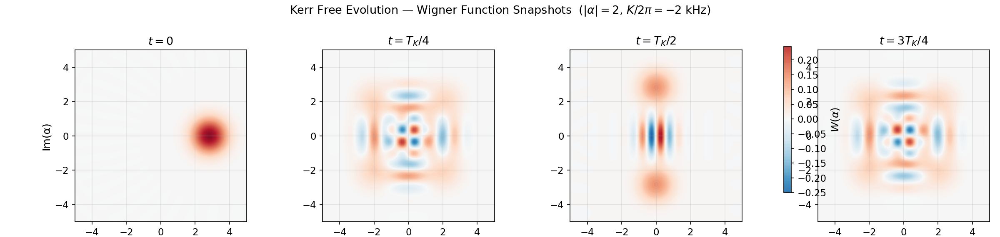

# Tutorial: Kerr Free Evolution

The primary guided workflow notebook for this topic is now `tutorials/10_core_workflows/02_kerr_free_evolution.ipynb`.

The earlier foundations notebook `tutorials/14_kerr_free_evolution.ipynb` still remains useful as a broader curriculum stop.

This page keeps a compact topical summary and points to the related standalone scripts.

---

## Workflow Location

Use the guided notebook and the related repo-side scripts:

- `tutorials/10_core_workflows/02_kerr_free_evolution.ipynb`
- `tutorials/40_validation_and_conventions/01_kerr_sign_and_frame_checks.ipynb`
- `examples/workflows/kerr_free_evolution.py`
- `examples/kerr_free_evolution.py`
- `examples/kerr_sign_verification.py`

Run the standalone scripts directly from the repository root:

```bash
python examples/kerr_free_evolution.py
python examples/kerr_sign_verification.py
```

---

## Library Building Blocks Used By The Workflow

The Kerr workflow is built from reusable library primitives:

- `DispersiveTransmonCavityModel` and `FrameSpec` from `cqed_sim.core`
- `StatePreparationSpec`, `coherent_state`, and `prepare_state(...)` from `cqed_sim.core`
- `reduced_cavity_state(...)` and `cavity_wigner(...)` from `cqed_sim.sim`

That means you can either:

1. run the repo example as-is, or
2. compose the same behavior manually from the stable low-level modules.

---

## Minimal Manual Pattern

```python
from cqed_sim.core import FrameSpec, StatePreparationSpec, coherent_state, prepare_state, qubit_state
from cqed_sim.sim import cavity_wigner, reduced_cavity_state

initial_state = prepare_state(
    model,
    StatePreparationSpec(
        qubit=qubit_state("g"),
        storage=coherent_state(2.0),
    ),
)

rho_c = reduced_cavity_state(initial_state)
xvec, yvec, wigner = cavity_wigner(rho_c)
```

---

## Wigner Function Snapshots

Evolving a coherent state $|\alpha=2\rangle$ under the Kerr Hamiltonian $H_K = \frac{K}{2} a^{\dagger 2} a^2$ produces characteristic phase-space deformations at fractions of the Kerr revival period $T_K = 2\pi / |K|$:



At $t = 0$ the state is a coherent blob; by $T_K/4$ it has stretched into a crescent; at $T_K/2$ it forms a Schrödinger-cat-like superposition; and at $3T_K/4$ the crescent appears on the opposite side.

---

For the full guided walkthrough, use `tutorials/10_core_workflows/02_kerr_free_evolution.ipynb`. For the sign-check companion, use `tutorials/40_validation_and_conventions/01_kerr_sign_and_frame_checks.ipynb`. For a compact executable script, use the example workflow module or standalone script.
