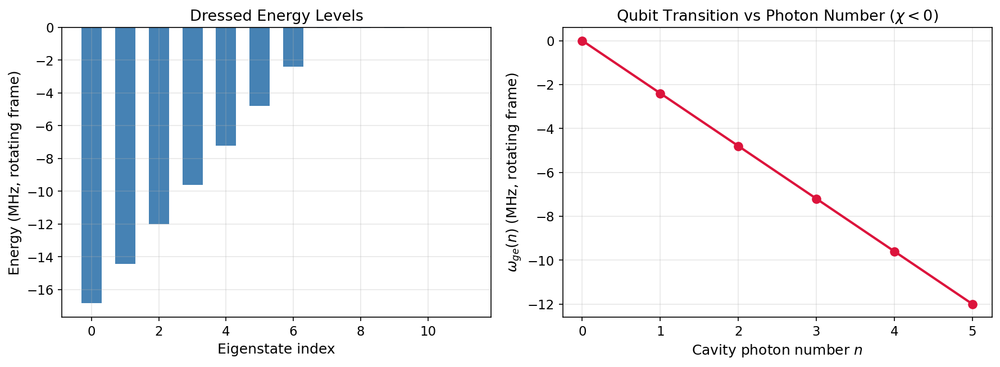

# Tutorial: Minimal Dispersive Model

Build a dispersive transmon-cavity model from scratch, inspect the dressed energy spectrum, and verify how the qubit transition depends on cavity photon number.

**Notebook:** `tutorials/01_getting_started_minimal_dispersive_model.ipynb`

---

## Physics Background

### The Dispersive Hamiltonian

The canonical cQED building block couples a transmon qubit ($\omega_q$, anharmonicity $\alpha$) to a microwave cavity ($\omega_c$) via vacuum Rabi coupling $g$. When the detuning $\Delta = \omega_q - \omega_c$ satisfies $g \ll |\Delta|$, a Schrieffer-Wolff transformation yields the dispersive Hamiltonian:

$$H_{\text{disp}} = \omega_c \, a^\dagger a + \frac{\omega_q + \chi\,a^\dagger a}{2}\,\sigma_z + \frac{K}{2}(a^\dagger)^2 a^2$$

The **dispersive shift** $\chi$ makes the qubit transition frequency depend on the cavity photon number:

$$\omega_{ge}(n) = \omega_{ge}(0) + n\chi$$

For a transmon with negative $\chi$, each additional cavity photon lowers the qubit frequency by $|\chi|$.

### Rotating Frame

To avoid resolving GHz-frequency oscillations, `cqed_sim` works in a rotating frame:

$$H_{\text{rot}} = H - \omega_c^{\text{frame}} a^\dagger a - \omega_q^{\text{frame}} |e\rangle\langle e|$$

Setting frame frequencies equal to the bare mode frequencies removes free precession, leaving only the physics of interest.

---

## Setup

```python
import numpy as np
from cqed_sim.core import DispersiveTransmonCavityModel, FrameSpec

model = DispersiveTransmonCavityModel(
    omega_c = 2 * np.pi * 5.15e9,    # Cavity frequency (rad/s)
    omega_q = 2 * np.pi * 6.35e9,    # Qubit frequency (rad/s)
    alpha   = 2 * np.pi * (-220e6),  # Transmon anharmonicity
    chi     = 2 * np.pi * (-2.4e6),  # Dispersive shift
    kerr    = 2 * np.pi * (-2e3),    # Cavity self-Kerr
    n_cav   = 8,                      # Cavity Fock-space truncation
    n_tr    = 2,                      # Transmon levels (2 = qubit)
)

frame = FrameSpec(
    omega_c_frame = model.omega_c,
    omega_q_frame = model.omega_q,
)
```

---

## Dressed Energy Spectrum

```python
from cqed_sim.core import compute_energy_spectrum

spec = compute_energy_spectrum(model, frame=frame, levels=12)
energies_mhz = np.array(spec.energies) / (2 * np.pi * 1e6)
```

## Photon-Number-Dependent Qubit Transition

```python
from cqed_sim.core import manifold_transition_frequency

for n in range(6):
    wge = manifold_transition_frequency(model, n=n, frame=frame)
    print(f"  n={n}: ω_ge = {wge / (2*np.pi*1e6):.3f} MHz (rotating frame)")
```

---

## Results



**Left panel:** Low-lying dressed energy levels in the rotating frame. The energy eigenstates are arranged by index, with clear manifold structure reflecting the qubit-cavity hybridisation.

**Right panel:** Qubit transition frequency $\omega_{ge}(n)$ as a function of cavity photon number. With $\chi/2\pi = -2.4$ MHz, each additional photon shifts the qubit transition downward by 2.4 MHz — the defining signature of the dispersive regime.

| Observable | Expected |
|---|---|
| $\omega_{ge}(0)$ | $\approx 0$ MHz (on resonance in rotating frame) |
| Slope $d\omega_{ge}/dn$ | $\chi/2\pi = -2.4$ MHz per photon |
| Level structure | Clear qubit-cavity manifolds |

---

## See Also

- [Units, Frames & Conventions](units_frames_conventions.md) — carrier signs, angular frequency units
- [Dispersive Shift & Dressed Frequencies](dispersive_shift_dressed.md) — higher-order corrections
- [Physics & Conventions](../physics_conventions.md) — full convention reference
