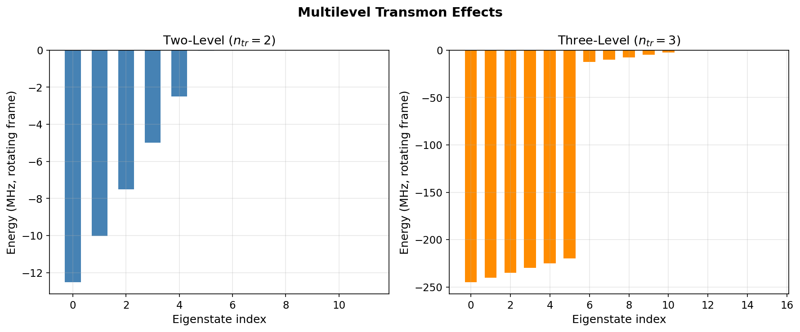

# Tutorial: Multilevel Transmon — Higher Levels & Leakage

Explore transmon energy levels beyond the computational subspace, visualize the anharmonic spectrum, and quantify leakage to higher states during strong drives.

**Notebooks:**

- `tutorials/18_multilevel_transmon_effects.ipynb` — higher-level energies, ef transitions
- `tutorials/19_multilevel_leakage_during_drive.ipynb` — leakage population during gates

---

## Physics Background

A transmon is an anharmonic oscillator. The lowest two levels $|g\rangle$, $|e\rangle$ form the qubit, but higher levels $|f\rangle$, $|h\rangle$, … are always present. The transition frequencies decrease with level:

$$\omega_{ef} = \omega_{ge} + \alpha, \quad \omega_{fh} = \omega_{ge} + 2\alpha$$

where $\alpha < 0$ is the anharmonicity (typically $-200$ to $-250$ MHz). Faster gates require stronger drives, which couple more strongly to nearby transitions — especially $|e\rangle \to |f\rangle$. Leakage to non-computational levels limits gate fidelity and is characterized by the leakage rate $L_1$:

$$L_1 = 1 - \text{Tr}(\Pi_\text{comp}\, \rho_\text{final})$$

where $\Pi_\text{comp} = |g\rangle\langle g| + |e\rangle\langle e|$ is the computational subspace projector.

### Why This Matters

- Too-fast gates accumulate leakage to $|f\rangle$ and beyond
- DRAG pulse shaping corrects leading-order leakage
- Accurate modeling requires $n_\text{tr} \geq 3$ (often 4–5) in the truncated Hilbert space

---

## Code Example: Spectrum

```python
import numpy as np
from cqed_sim.core import DispersiveTransmonCavityModel, compute_energy_spectrum

model = DispersiveTransmonCavityModel(
    omega_c=2*np.pi*5e9, omega_q=2*np.pi*6e9,
    alpha=2*np.pi*(-220e6), chi=2*np.pi*(-2.5e6),
    kerr=2*np.pi*(-2e3), n_cav=6, n_tr=5,
)

evals, _ = compute_energy_spectrum(model, levels=8)
evals_ghz = np.real(evals) / (2 * np.pi * 1e9)
transitions = np.diff(evals_ghz[:5])
print("Transition frequencies (GHz):", np.round(transitions, 4))
# Expect: ω_ge ≈ 6.0, ω_ef ≈ 5.78, ω_fh ≈ 5.56 ...
```

---

## Code Example: Leakage During a Fast Gate

```python
from cqed_sim.core import FrameSpec, StatePreparationSpec, qubit_state, fock_state, prepare_state
from cqed_sim.sim import SimulationConfig, simulate_sequence, reduced_qubit_state
from cqed_sim.sequence import SequenceCompiler
from cqed_sim.pulses import Pulse
from cqed_sim.pulses.envelopes import square_envelope

frame = FrameSpec(omega_c_frame=model.omega_c, omega_q_frame=model.omega_q)
psi_g = prepare_state(model, StatePreparationSpec(
    qubit=qubit_state("g"), storage=fock_state(0),
))

# Short, strong pi pulse — may leak to |f⟩
pi_pulse = Pulse(
    channel="qubit", t0=0.0, duration=10e-9,
    envelope=square_envelope,
    carrier=0.0, amp=2*np.pi*50e6, phase=0.0,
)
compiled = SequenceCompiler(dt=0.5e-9).compile([pi_pulse])
result = simulate_sequence(model, compiled, psi_g, {},
                           config=SimulationConfig(frame=frame))

rho = result.final_state
# Full transmon diagonal (multilevel)
diag = np.real(np.diag(rho.full()))
print(f"P(g)={diag[0]:.4f}, P(e)={diag[1]:.4f}, P(f+)={sum(diag[2:]):.4f}")
```

---

## Results



The plot shows the transmon energy levels and transition frequencies. The anharmonicity $\alpha$ causes successive transitions to shift lower in frequency. For $\alpha/2\pi = -220$ MHz, the $|e\rangle\to|f\rangle$ transition is well-resolved from $|g\rangle\to|e\rangle$, but a broadband or very fast pulse will still excite both.

---

## Key Parameters

| Parameter | Meaning | Typical Value |
|---|---|---|
| $\alpha/2\pi$ | Anharmonicity | $-200$ to $-250$ MHz |
| $n_\text{tr}$ | Transmon Hilbert-space truncation | 3–5 |
| Leakage $L_1$ | Population outside computational subspace | $< 10^{-3}$ target |
| DRAG coefficient | Derivative-removal pulse correction | 0.5–2.0 |

---

## See Also

- [Truncation Convergence](truncation_convergence.md) — choosing $n_\text{cav}$, $n_\text{tr}$
- [Qubit Drive & Rabi](qubit_drive_rabi.md) — single-level Rabi oscillations
- [Dispersive Shift & Dressed States](dispersive_shift_dressed.md) — photon-number dressing
