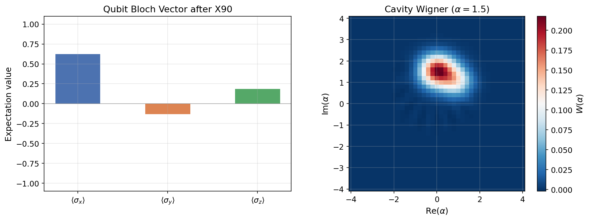

# Tutorial: Observables, States & Visualization

Extract reduced density matrices, compute Bloch vectors and cavity Wigner functions, and visualize quantum state information after a simulation.

**Notebook:** `tutorials/05_observables_states_and_visualization.ipynb`

---

## Physics Background

### Reduced Density Matrices

A joint qubit-cavity state $\rho$ encodes full bipartite information. Tracing over one subsystem yields the **reduced density matrix** of the other:

- **Qubit:** $\rho_q = \text{Tr}_{\text{cav}}(\rho)$ — a $2\times 2$ matrix
- **Cavity:** $\rho_c = \text{Tr}_q(\rho)$ — an $n_{\text{cav}} \times n_{\text{cav}}$ matrix

### Bloch Vector

The qubit state on the Bloch sphere is described by:

$$\vec{b} = (\langle\sigma_x\rangle, \langle\sigma_y\rangle, \langle\sigma_z\rangle)$$

For a pure state $|g\rangle$: $\vec{b} = (0, 0, -1)$. After a $\pi/2$ rotation about $x$: $\vec{b} \approx (0, -1, 0)$ or $(1, 0, 0)$ depending on the rotation axis and phase convention.

### Wigner Function

The cavity Wigner function $W(\alpha)$ is a quasi-probability distribution in phase space. For a coherent state $|\alpha_0\rangle$, it is a Gaussian centered at $\alpha_0$. Non-classical states (Fock states, cat states) exhibit negative Wigner values.

---

## Workflow

```python
import numpy as np
from cqed_sim.core import (
    DispersiveTransmonCavityModel, FrameSpec,
    StatePreparationSpec, qubit_state, coherent_state, prepare_state,
)
from cqed_sim.io import RotationGate
from cqed_sim.pulses import build_rotation_pulse
from cqed_sim.sequence import SequenceCompiler
from cqed_sim.sim import (
    SimulationConfig, simulate_sequence,
    reduced_qubit_state, reduced_cavity_state, cavity_wigner,
)

model = DispersiveTransmonCavityModel(
    omega_c=2*np.pi*5e9, omega_q=2*np.pi*6e9,
    alpha=2*np.pi*(-220e6), chi=2*np.pi*(-2.5e6),
    kerr=2*np.pi*(-2e3), n_cav=10, n_tr=2,
)
frame = FrameSpec(omega_c_frame=model.omega_c, omega_q_frame=model.omega_q)

# Start in |g⟩ ⊗ |α=1.5⟩, apply X90
psi0 = prepare_state(model, StatePreparationSpec(
    qubit=qubit_state("g"), storage=coherent_state(1.5),
))

gate = RotationGate(index=0, name="x90", theta=np.pi/2, phi=0.0)
pulses, drive_ops, _ = build_rotation_pulse(
    gate, {"duration_rotation_s": 64e-9, "rotation_sigma_fraction": 0.18},
)
compiled = SequenceCompiler(dt=1e-9).compile(pulses, t_end=70e-9)
result = simulate_sequence(model, compiled, psi0, drive_ops,
                           config=SimulationConfig(frame=frame))

# Extract Bloch vector
rho_q = reduced_qubit_state(result.final_state)

# Extract cavity Wigner function
rho_c = reduced_cavity_state(result.final_state)
xvec, yvec, W = cavity_wigner(rho_c, coordinate="alpha")
```

---

## Results



**Left panel — Bloch vector:** After the X90 pulse, the qubit is in a superposition state. The Bloch vector components $\langle\sigma_x\rangle$, $\langle\sigma_y\rangle$, $\langle\sigma_z\rangle$ show the qubit displaced from $|g\rangle$ toward the equator of the Bloch sphere.

**Right panel — Cavity Wigner function:** The coherent state $|\alpha = 1.5\rangle$ appears as a Gaussian blob centered at $\text{Re}(\alpha) = 1.5$ in alpha coordinates. The Wigner function is everywhere non-negative, confirming the classicality of the coherent state.

---

## Key Extractors

| Function | Returns |
|---|---|
| `reduced_qubit_state(rho)` | $2 \times 2$ qubit density matrix |
| `reduced_cavity_state(rho)` | $n_{\text{cav}} \times n_{\text{cav}}$ cavity density matrix |
| `cavity_wigner(rho_c, coordinate="alpha")` | Wigner function on an alpha-coordinate grid |
| `mode_moments(rho)` | $\langle a \rangle$, $\langle n \rangle$ for each mode |
| `conditioned_bloch_xyz(rho, n=k)` | Bloch vector conditioned on cavity Fock state $|k\rangle$ |

---

## See Also

- [Qubit Drive & Rabi](qubit_drive_rabi.md) — population dynamics
- [Phase Space Conventions](phase_space_conventions.md) — alpha vs quadrature coordinates
- [Kerr Free Evolution](kerr_free_evolution.md) — Wigner function evolution
