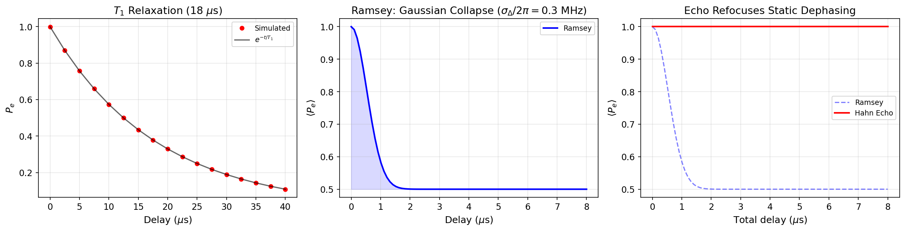

# Tutorial: Open System Dynamics — T1, Ramsey & Spin Echo

Simulate qubit energy relaxation, Ramsey dephasing fringes, and spin-echo refocusing using Lindblad open-system evolution.

**Notebooks:**

- `tutorials/11_qubit_T1_relaxation.ipynb` — exponential energy decay
- `tutorials/12_qubit_ramsey_T2star.ipynb` — Ramsey fringes with dephasing
- `tutorials/13_spin_echo_and_dephasing_mitigation.ipynb` — echo vs Ramsey comparison

---

## Physics Background

### T1: Energy Relaxation

A qubit prepared in $|e\rangle$ decays to $|g\rangle$ with rate $\Gamma_1 = 1/T_1$:

$$P_e(t) = e^{-t/T_1}$$

In `cqed_sim`, this is modeled by Lindblad collapse operators using `NoiseSpec(t1=...)`.

### T2*: Ramsey Dephasing

A Ramsey sequence (X90 — delay $\tau$ — X90) probes the qubit's phase coherence. With detuning $\Delta$ and dephasing time $T_2^*$:

$$P_e(\tau) = \frac{1}{2}\left(1 + e^{-\tau/T_2^*}\cos(\Delta\tau)\right)$$

The fringes oscillate at the detuning frequency with an exponentially decaying envelope set by $T_2^*$.

### Hahn Spin Echo

A Hahn echo sequence (X90 — $\tau/2$ — $\pi$ — $\tau/2$ — X90) inserts a refocusing $\pi$-pulse that cancels **static** frequency errors. Under quasi-static detuning with Gaussian distribution $\sigma_\Delta$:

- **Ramsey:** $\langle P_e(\tau)\rangle = \frac{1}{2}(1 + e^{-\sigma_\Delta^2 \tau^2/2})$ — Gaussian collapse to 0.5
- **Echo:** $\langle P_e(\tau)\rangle \approx 1.0$ — refocused, stays near unity

The echo demonstrates that static dephasing is fully reversible.

---

## T1 Relaxation

```python
import numpy as np
from cqed_sim.core import (
    DispersiveTransmonCavityModel, FrameSpec,
    StatePreparationSpec, qubit_state, fock_state, prepare_state,
)
from cqed_sim.sim import NoiseSpec, SimulationConfig, simulate_sequence, reduced_qubit_state
from cqed_sim.sequence import SequenceCompiler

model = DispersiveTransmonCavityModel(
    omega_c=2*np.pi*5e9, omega_q=2*np.pi*6e9,
    alpha=2*np.pi*(-220e6), chi=2*np.pi*(-2.5e6),
    kerr=2*np.pi*(-2e3), n_cav=4, n_tr=2,
)
frame = FrameSpec(omega_c_frame=model.omega_c, omega_q_frame=model.omega_q)

# Start in |e,0⟩ and let it decay
psi_e = prepare_state(model, StatePreparationSpec(
    qubit=qubit_state("e"), storage=fock_state(0),
))
noise = NoiseSpec(t1=18e-6)

delays = np.linspace(0, 40e-6, 17)
pe_values = []
for delay in delays:
    compiled = SequenceCompiler(dt=2e-9).compile([], t_end=max(delay, 4e-9))
    result = simulate_sequence(model, compiled, psi_e, {},
                               config=SimulationConfig(frame=frame), noise=noise)
    rho_q = reduced_qubit_state(result.final_state)
    pe_values.append(float(np.real(rho_q[1, 1])))
```

---

## Results



**Left panel — T1:** Red dots show simulated $P_e$ vs delay for a qubit starting in $|e\rangle$ with $T_1 = 18\,\mu$s. The black curve is the theoretical $e^{-t/T_1}$. Agreement validates the Lindblad noise model.

**Center panel — Ramsey:** A Ramsey fringe envelope under Gaussian quasi-static detuning ($\sigma_\Delta/2\pi = 0.3$ MHz) shows the characteristic Gaussian collapse of $P_e$ toward 0.5.

**Right panel — Echo vs Ramsey:** The dashed blue curve (Ramsey) collapses rapidly, while the solid red curve (Hahn echo) remains near $P_e = 1.0$, demonstrating that static phase errors are fully refocused by the $\pi$-pulse.

---

## Key Parameters

| Parameter | Physical Meaning | Typical Value |
|---|---|---|
| $T_1$ | Energy relaxation time | 10–100 $\mu$s |
| $T_2^*$ | Inhomogeneous dephasing time | 1–20 $\mu$s |
| $T_2$ | Hahn echo coherence time | $\leq 2T_1$ |
| $\sigma_\Delta$ | Quasi-static detuning width | 0.1–1 MHz |

---

## See Also

- [Qubit Drive & Rabi](qubit_drive_rabi.md) — pulse-level qubit control
- [Storage Cavity Dynamics](storage_cavity_dynamics.md) — bosonic open-system decay
- [Calibration Workflow](calibration_workflow.md) — complete calibration including T1, Ramsey, echo
