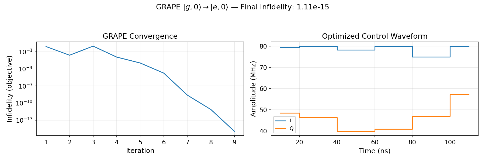

# GRAPE Optimal Control Tutorial

This page introduces `cqed_sim`'s model-backed GRAPE (Gradient Ascent Pulse Engineering) solver. For the full interactive walkthrough, open:

- `tutorials/30_advanced_protocols/06_grape_optimal_control_workflow.ipynb`

Companion scripts:

- `examples/grape_storage_subspace_gate_demo.py`
- `examples/hardware_constrained_grape_demo.py`

---

## What GRAPE Does

GRAPE finds piecewise-constant control waveforms that steer a quantum system toward a desired objective (target state, target unitary, or minimum cost). It:

1. Propagates the system forward slice-by-slice
2. Computes a gradient of the objective with respect to each control amplitude
3. Iterates until the objective converges

In `cqed_sim`, GRAPE works directly on the physical model Hamiltonian — it does not require an idealized qubit abstraction.

---

## Minimal Example

Prepare $|g,0\rangle \to |e,0\rangle$ (a qubit π-pulse) using GRAPE:

```python
import numpy as np
from cqed_sim import (
    DispersiveTransmonCavityModel, FrameSpec,
    PiecewiseConstantTimeGrid, ModelControlChannelSpec,
    build_control_problem_from_model, state_preparation_objective,
    GrapeSolver, GrapeConfig,
)

# 1. System and frame
model = DispersiveTransmonCavityModel(
    omega_c=2*np.pi*5e9, omega_q=2*np.pi*6e9,
    alpha=0.0, chi=0.0, kerr=0.0, n_cav=1, n_tr=2,
)
frame = FrameSpec(omega_c_frame=model.omega_c, omega_q_frame=model.omega_q)

# 2. Control problem
problem = build_control_problem_from_model(
    model, frame=frame,
    time_grid=PiecewiseConstantTimeGrid.uniform(steps=6, dt_s=20e-9),
    channel_specs=(ModelControlChannelSpec(
        name="qubit", target="qubit", quadratures=("I", "Q"),
        amplitude_bounds=(-8e7, 8e7), export_channel="qubit",
    ),),
    objectives=(state_preparation_objective(
        model.basis_state(0, 0),   # initial: |g,0⟩
        model.basis_state(1, 0),   # target:  |e,0⟩
    ),),
)

# 3. Solve
solver = GrapeSolver(GrapeConfig(maxiter=80, seed=42, random_scale=0.15))
result = solver.solve(problem)

print(f"Success: {result.success}")
print(f"Objective: {result.objective_value:.6e}")
```

---

## Example Output

Running the example above produces a converged solution (left: infidelity vs. iteration; right: optimized I/Q control amplitudes):



---

## Key Concepts

### Time Grid and Parameterization

The control problem operates on a discrete time grid. Each slice has a constant control amplitude:

```python
from cqed_sim import PiecewiseConstantTimeGrid

grid = PiecewiseConstantTimeGrid.uniform(steps=20, dt_s=5e-9)  # 100 ns total
```

For held-sample parameterization (each parameter value is held for multiple time slices):

```python
from cqed_sim import HeldSampleParameterization

problem = build_control_problem_from_model(
    ...,
    parameterization_cls=HeldSampleParameterization,
    parameterization_kwargs={"sample_period_s": 20e-9},
)
```

### Objectives

| Objective | Description |
|---|---|
| `state_preparation_objective(initial, target)` | Maximize overlap of evolved state with target |
| `UnitaryObjective(U_target, subspace)` | Match a unitary on a logical subspace |

### Hardware-Aware Mode

Attach a `HardwareModel` to optimize through realistic signal-chain effects:

```python
from cqed_sim import HardwareModel
from cqed_sim.optimal_control.hardware import (
    FirstOrderLowPassHardwareMap,
    SmoothIQRadiusLimitHardwareMap,
    BoundaryWindowHardwareMap,
)

problem = build_control_problem_from_model(
    ...,
    hardware_model=HardwareModel(maps=(
        FirstOrderLowPassHardwareMap(cutoff_hz=25e6, export_channels=("qubit",)),
        SmoothIQRadiusLimitHardwareMap(amplitude_max=6e7, export_channels=("qubit",)),
        BoundaryWindowHardwareMap(ramp_slices=1, export_channels=("qubit",)),
    )),
)
```

See the [Hardware-Aware Control](hardware_context.md) tutorial for details.

### Replay Through the Full Simulator

After optimization, verify the result against the time-domain ODE solver:

```python
replay = result.evaluate_with_simulator(
    problem, model=model, frame=frame,
    compiler_dt_s=1e-9, waveform_mode="physical",
)
print(f"Replay fidelity: {replay.metrics['aggregate_fidelity']:.6f}")
```

---

## See Also

- [Optimal Control API](../api/optimal_control.md) — full API reference
- [Hardware & Control API](../api/hardware.md) — `HardwareModel`, `HardwareMap` types
- [Hardware-Aware Control Tutorial](hardware_context.md) — signal-chain modeling and GRAPE integration