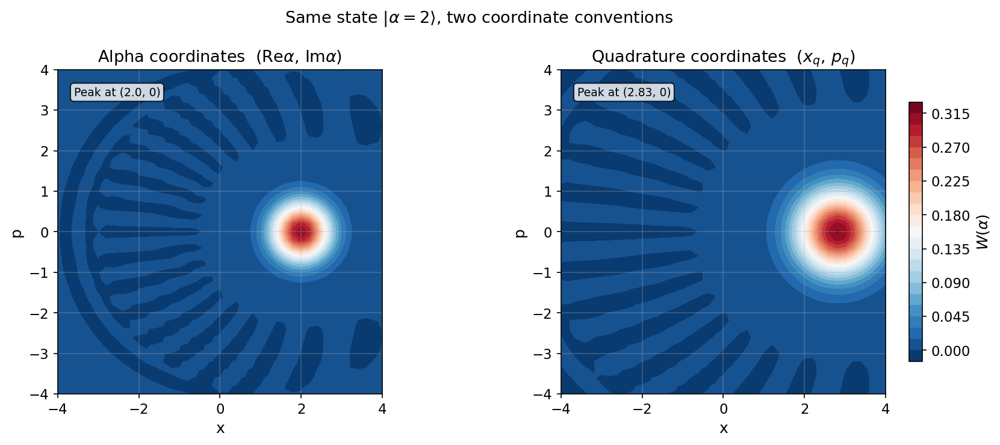

# Phase Space Coordinates and Wigner Conventions

This guide explains the two coordinate systems used for Wigner-function plots in `cqed_sim`. The relevant notebooks are:

- `tutorials/10_core_workflows/03_phase_space_coordinates_and_wigner_conventions.ipynb`
- `tutorials/40_validation_and_conventions/01_kerr_sign_and_frame_checks.ipynb`

---

## Physics Background

### The Wigner Function

The Wigner function is a quasi-probability distribution over phase space that completely represents the quantum state of a bosonic mode. For a density matrix $\rho$, it is defined via the parity-displaced expectation value:

$$W(\alpha) = \frac{2}{\pi} \operatorname{Tr}\!\left[\rho \, D(\alpha) \, (-1)^{\hat{n}} \, D^\dagger(\alpha)\right]$$

where $D(\alpha) = \exp(\alpha a^\dagger - \alpha^* a)$ is the displacement operator and $(-1)^{\hat{n}}$ is the photon-number parity operator.

Key properties:
- $W(\alpha)$ is real for any physical state
- $\int W(\alpha) \, d^2\alpha = 1$ (normalized)
- $W(\alpha) \geq -\frac{2}{\pi}$ — negative regions indicate genuine quantum non-classicality
- Coherent states $|\beta\rangle$ have Gaussian Wigner functions centered at $\alpha = \beta$

### Two Coordinate Conventions

The Wigner function can be plotted in two common coordinate systems:

#### Alpha Coordinates (coherent-state amplitude)

The horizontal and vertical axes are the real and imaginary parts of the coherent-state amplitude $\alpha$:

$$x_\alpha = \operatorname{Re}(\alpha), \qquad p_\alpha = \operatorname{Im}(\alpha)$$

A coherent state $|\beta\rangle$ appears centered at $(x_\alpha, p_\alpha) = (\operatorname{Re}(\beta), \operatorname{Im}(\beta))$.

#### Quadrature Coordinates (dimensionless position and momentum)

The canonical quadrature operators are:

$$\hat{x} = \frac{1}{\sqrt{2}}(a + a^\dagger), \qquad \hat{p} = \frac{i}{\sqrt{2}}(a^\dagger - a)$$

with $[\hat{x}, \hat{p}] = i$. A coherent state $|\beta\rangle$ is centered at:

$$x_q = \sqrt{2}\,\operatorname{Re}(\beta), \qquad p_q = \sqrt{2}\,\operatorname{Im}(\beta)$$

#### The √2 Relationship

The two conventions are related by a factor of $\sqrt{2}$:

$$x_q = \sqrt{2} \, x_\alpha, \qquad p_q = \sqrt{2} \, p_\alpha$$

This means that for a coherent state $|\alpha = 2\rangle$, the Wigner peak appears at:

- **Alpha coordinates:** $(x_\alpha, p_\alpha) = (2.0, 0)$
- **Quadrature coordinates:** $(x_q, p_q) = (2\sqrt{2}, 0) \approx (2.83, 0)$

The physical state is identical; only the axis labeling changes.

!!! warning "Common confusion"
    When comparing Wigner plots from different sources (papers, other simulators), always check which convention is used. A state that "looks" twice as far from the origin in one reference may simply be plotted in quadrature coordinates.

---

## Using `cavity_wigner`

The `cavity_wigner` function supports both conventions via the `coordinate` keyword:

```python
from cqed_sim.sim import cavity_wigner, reduced_cavity_state
from cqed_sim.core import (
    StatePreparationSpec, coherent_state, qubit_state,
    prepare_state, DispersiveTransmonCavityModel, FrameSpec,
)

model = DispersiveTransmonCavityModel(
    omega_c=2 * np.pi * 5.0e9,
    omega_q=2 * np.pi * 6.0e9,
    alpha=2 * np.pi * (-200e6),
    chi=2 * np.pi * (-2.84e6),
    kerr=2 * np.pi * (-2e3),
    n_cav=20,
    n_tr=2,
)

# Prepare |g⟩ ⊗ |α=2⟩
initial = prepare_state(
    model,
    StatePreparationSpec(
        qubit   = qubit_state("g"),
        storage = coherent_state(2.0),
    ),
)
rho_c = reduced_cavity_state(initial)

# Alpha coordinates — peak appears at (2.0, 0)
x_a, p_a, W_a = cavity_wigner(rho_c, coordinate="alpha")

# Quadrature coordinates — peak appears at (2√2, 0) ≈ (2.83, 0)
x_q, p_q, W_q = cavity_wigner(rho_c, coordinate="quadrature")
```

---

## Numerical Verification

The notebook verifies the √2 relationship by finding the numerical peak locations:

```python
import numpy as np

# Find peak in each convention
idx_a = np.unravel_index(np.argmax(W_a), W_a.shape)
peak_alpha = x_a[idx_a[1]]         # Should be ≈ 2.0

idx_q = np.unravel_index(np.argmax(W_q), W_q.shape)
peak_quad  = x_q[idx_q[1]]         # Should be ≈ 2√2 ≈ 2.83

print(f"Alpha peak:      {peak_alpha:.3f}  (expected {2.0:.3f})")
print(f"Quadrature peak: {peak_quad:.3f}  (expected {np.sqrt(2)*2:.3f})")
print(f"Ratio:           {peak_quad/peak_alpha:.4f}  (expected {np.sqrt(2):.4f})")
```

---

## Side-by-Side Comparison

```python
import matplotlib.pyplot as plt

fig, axes = plt.subplots(1, 2, figsize=(12, 5))

for ax, xv, pv, W, title in [
    (axes[0], x_a, p_a, W_a, "Alpha coordinates  $x_\\alpha = \\mathrm{Re}(\\alpha)$"),
    (axes[1], x_q, p_q, W_q, "Quadrature coordinates  $x_q = \\sqrt{2}\\,\\mathrm{Re}(\\alpha)$"),
]:
    ax.contourf(xv, pv, W, levels=30, cmap="RdBu_r")
    ax.set_xlabel("x")
    ax.set_ylabel("p")
    ax.set_title(title)
    ax.set_aspect("equal")

fig.suptitle("Same state, two coordinate conventions", fontsize=13)
plt.tight_layout()
```



The two panels show an identical Gaussian blob, but with the horizontal axis scaled by $\sqrt{2}$.

---

## Why Alpha Coordinates Are Often Preferred in cQED

Alpha coordinates have a direct physical interpretation: $\alpha$ is the displacement applied by the cavity drive. When we say "displace the cavity to $\alpha = 2$," the Wigner peak appears at $(2, 0)$ in alpha coordinates — numerically matching the displacement amplitude. This makes experimental calibration more transparent.

Quadrature coordinates are natural for squeezed states and are common in quantum optics literature, where the Heisenberg uncertainty principle takes the symmetric form $\Delta x \cdot \Delta p \geq 1/2$.

---

## Convention Used in cQED_sim

All Kerr evolution and cavity-state Wigner plots in this documentation use **alpha coordinates** unless explicitly stated otherwise. The axis labels always read $\mathrm{Re}(\alpha)$ and $\mathrm{Im}(\alpha)$.

---

## Related Notebooks

- `tutorials/10_core_workflows/02_kerr_free_evolution.ipynb` — Wigner snapshots in alpha coordinates
- `tutorials/10_core_workflows/03_phase_space_coordinates_and_wigner_conventions.ipynb` — interactive √2 verification
- `tutorials/40_validation_and_conventions/01_kerr_sign_and_frame_checks.ipynb` — sign convention checks

## See Also

- [Kerr Free Evolution](kerr_free_evolution.md) — phase-space deformation under self-Kerr
- [Extracting Observables](../user_guides/extracting_observables.md) — `cavity_wigner`, `reduced_cavity_state`
