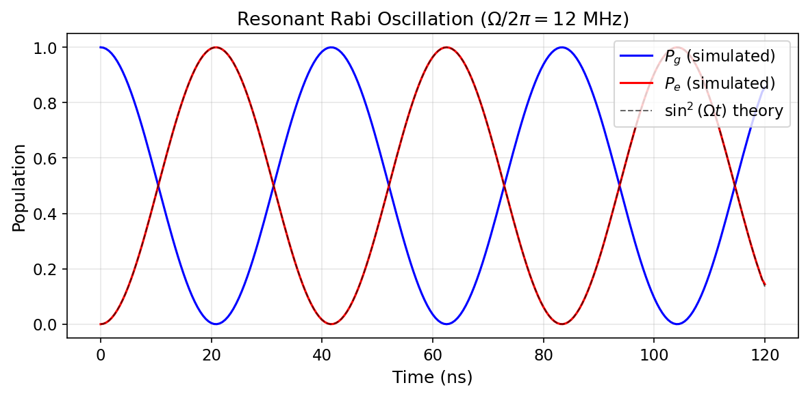
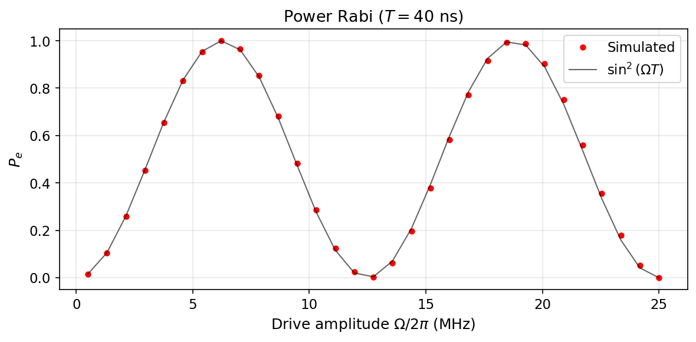

# Tutorial: Qubit Drive & Rabi Oscillations

Drive a transmon qubit with resonant pulses and observe Rabi oscillations in both the time and amplitude domains.

**Notebooks:**

- `tutorials/04_qubit_drive_and_basic_population_dynamics.ipynb` — resonant time-domain Rabi
- `tutorials/09_power_rabi.ipynb` — amplitude sweep at fixed duration
- `tutorials/10_time_rabi.ipynb` — duration sweep at fixed amplitude

---

## Physics Background

### Resonant Rabi Oscillations

A resonant drive on a two-level qubit in the rotating frame generates coherent population transfer. For a square pulse of Rabi rate $\Omega$ and duration $t$:

$$P_e(t) = \sin^2(\Omega\, t)$$

This applies exactly when the drive frequency matches the qubit transition ($\delta = 0$) and the two-level approximation is valid ($\Omega \ll |\alpha|$).

### Power Rabi

At **fixed duration** $T$, sweeping the drive amplitude gives:

$$P_e(\Omega) = \sin^2(\Omega\, T)$$

The oscillation period in amplitude space yields the $\pi$-pulse amplitude: $\Omega_\pi = \pi / (2T)$.

### Time Rabi

At **fixed amplitude** $\Omega$, sweeping the pulse duration gives:

$$P_e(t) = \sin^2(\Omega\, t)$$

The oscillation period in time yields the $\pi$-pulse duration: $t_\pi = \pi / (2\Omega)$.

---

## Time-Domain Rabi Oscillation

```python
import numpy as np
from cqed_sim.core import (
    DispersiveTransmonCavityModel, FrameSpec,
    StatePreparationSpec, qubit_state, fock_state, prepare_state,
)
from cqed_sim.pulses import Pulse, square_envelope
from cqed_sim.sequence import SequenceCompiler
from cqed_sim.sim import SimulationConfig, simulate_sequence

model = DispersiveTransmonCavityModel(
    omega_c=2*np.pi*5e9, omega_q=2*np.pi*6e9,
    alpha=2*np.pi*(-220e6), chi=2*np.pi*(-2.5e6),
    kerr=2*np.pi*(-2e3), n_cav=4, n_tr=2,
)
frame = FrameSpec(omega_c_frame=model.omega_c, omega_q_frame=model.omega_q)
psi0 = prepare_state(model, StatePreparationSpec(
    qubit=qubit_state("g"), storage=fock_state(0),
))

# Resonant square pulse: Ω/2π = 12 MHz for 120 ns
omega_rabi = 2 * np.pi * 12e6
pulse = Pulse("qubit", 0.0, 120e-9, square_envelope, carrier=0.0, amp=omega_rabi)
compiled = SequenceCompiler(dt=0.5e-9).compile([pulse], t_end=120e-9)

result = simulate_sequence(
    model, compiled, psi0, {"qubit": "qubit"},
    config=SimulationConfig(frame=frame, store_states=True),
)
```



The blue and red curves show the ground and excited state populations from the `cqed_sim` simulation. The dashed black line is the analytic $\sin^2(\Omega t)$ theory. Agreement is excellent, validating the pulse-level qubit drive.

---

## Power Rabi

```python
from cqed_sim.sim import reduced_qubit_state

duration = 40e-9  # Fixed pulse duration
amps_mhz = np.linspace(0.5, 25, 31)
pe_values = []

for amp_mhz in amps_mhz:
    omega = 2 * np.pi * amp_mhz * 1e6
    pulse = Pulse("qubit", 0.0, duration, square_envelope, carrier=0.0, amp=omega)
    compiled = SequenceCompiler(dt=0.5e-9).compile([pulse], t_end=duration)
    result = simulate_sequence(
        model, compiled, psi0, {"qubit": "qubit"},
        config=SimulationConfig(frame=frame),
    )
    rho_q = reduced_qubit_state(result.final_state)
    pe_values.append(float(np.real(rho_q[1, 1])))
```



The red dots show simulated $P_e$ at each drive amplitude. The black curve is $\sin^2(\Omega T)$. The oscillation allows calibration of the $\pi$-pulse and $\pi/2$-pulse amplitudes.

---

## Expected Outputs

| Measurement | Expected |
|---|---|
| Rabi oscillation period | $T_{\text{Rabi}} = \pi / \Omega$ |
| $\pi$-pulse time (12 MHz drive) | $\approx 42$ ns |
| Power Rabi: $P_e$ at $\Omega = 0$ | 0 |
| Power Rabi: first $P_e = 1$ | $\Omega_\pi = \pi/(2T)$ |

---

## See Also

- [Observables & Visualization](observables_visualization.md) — Bloch vectors, Wigner functions
- [Open System: T1, Ramsey & Echo](open_system_dynamics.md) — adding noise to qubit experiments
- [Calibration Workflow](calibration_workflow.md) — end-to-end calibration including Rabi
