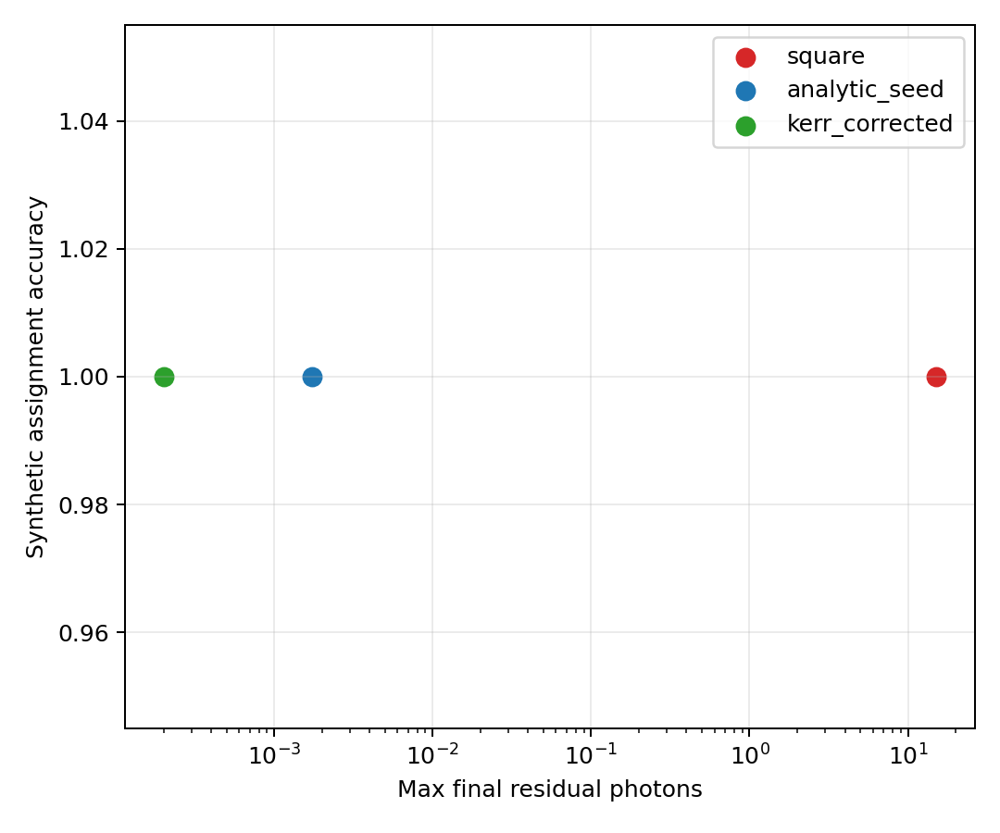

# Readout Emptying Qualification

This workflow shows how to move from an analytic segmented emptying pulse to a deployment-oriented study:

1. build the analytic seed with `synthesize_readout_emptying_pulse(...)`,
2. replay it under Kerr, measurement, Lindblad, and hardware models,
3. refine it with `refine_readout_emptying_pulse(...)`,
4. and compare it against a square pulse baseline with `verify_readout_emptying_pulse(...)`.

The implementation stays inside `cqed_sim.optimal_control`: the seed family remains the public construction layer, while the qualification and reduced-refinement path lives in `cqed_sim.optimal_control.readout_emptying_eval`.

## Source-of-truth scripts

- `examples/studies/readout_emptying/linear_seed_validation.py`
- `examples/studies/readout_emptying/kerr_replay_and_chirp.py`
- `examples/studies/readout_emptying/dispersive_lindblad_validation.py`
- `examples/studies/readout_emptying/reduced_refinement.py`
- `examples/studies/readout_emptying/hardware_sensitivity.py`
- `examples/studies/readout_emptying/summary_benchmark.py`

The scripts write their evidence package under `outputs/readout_emptying_qualification/`.

## Checked-in evidence

The summary benchmark script refreshes the tutorial-ready figures below:

Interpretation:

- the square pulse is the easy baseline but leaves the largest residual ringdown;
- the analytic seed removes the exact linear residual;
- the shared-chirp correction improves the nonlinear residual while keeping useful separation;
- the reduced refinement is the place where hardware and robustness tradeoffs are tuned, not the seed constructor.

## Nominal benchmark snapshot

The current checked-in summary run from `examples/studies/readout_emptying/summary_benchmark.py` reports:

- fast-model terminal residual photons drop from about `15.1` for the matched-energy square pulse to `1.7e-3` for the analytic seed, `2.0e-4` for the shared-chirp pulse, and `2.6e-4` after reduced refinement;
- in the dispersive Lindblad replay, the same ordering becomes about `2.62` for the square pulse, `1.07e-1` for the analytic seed, `1.04e-1` for the shared-chirp pulse, and `1.73e-2` for the refined waveform;
- measurement-chain separation improves from about `3.04e3` for the square pulse to `4.09e3` for the analytic and shared-chirp seeds, while the refined waveform trades some separation down to about `3.69e3` in exchange for lower residual energy and better robustness.

That tradeoff is the intended behavior of the qualification-first path: the seed constructor gives an interpretable physics-driven waveform family, while the refinement harness moves along the residual-versus-readout-utility frontier without changing the public construction API.

## Linear seed evidence

The qualification path starts by confirming that the segmented seed really matches the exact two-branch linear construction.

These are the direct simulation products of `linear_seed_validation.py`: the synthesized complex envelope and the \(g/e\) cavity trajectories returning to the origin.

## Kerr replay and chirp correction

The next stage measures how much Kerr breaks the nominal linear cancellation and how well a shared chirp restores it.

This is the main nonlinear caveat of the method: one physical chirped waveform serves both branches, so the correction is useful but not simultaneously exact.

## Dispersive Lindblad readout validation

The workflow then checks whether the pulse still behaves like a good readout pulse, not just a good cavity-emptying pulse.

These plots come from `dispersive_lindblad_validation.py` and show the emitted-field separation, single-shot proxy behavior, and the residual-versus-readout-performance frontier across pulse families.

## Hardware sensitivity

The final qualification pass asks whether the cancellation survives realistic waveform distortion.

Those figures come from `hardware_sensitivity.py` and are the deployment-facing part of the workflow: they show how quickly the pulse degrades under parameter mismatch and finite-bandwidth filtering.

## How the qualification layers map onto the code

- Model A: `replay_linear_readout_branches(...)`
- Model B: `replay_kerr_readout_branches(...)`
- Model C: `verify_readout_emptying_pulse(...)` with a `DispersiveReadoutTransmonStorageModel` plus `NoiseSpec`
- Hardware distortion: `verify_readout_emptying_pulse(...)` or `refine_readout_emptying_pulse(...)` with a `HardwareModel`

## Evidence package

The full artifact set is generated under `outputs/readout_emptying_qualification/`:

- `00_linear_seed_validation/`: segment waveform, phase-space trajectory, terminal zoom, and matrix-vs-ODE check
- `01_kerr_replay_and_chirp/`: residual-vs-Kerr, shared-vs-branch-specific chirp comparison, and chirp profile
- `02_dispersive_lindblad_validation/`: output-IQ trajectories, IQ clouds, assignment proxy, and residual-vs-fidelity tradeoff
- `03_reduced_refinement/`: leakage-vs-strength and refined comparison plots
- `04_hardware_sensitivity/`: mismatch heatmap, prefilter-vs-postfilter comparison, and performance-vs-max-photons plot
- `05_summary_benchmark/`: the summary comparison and waveform-family figures embedded above

## References

[1] D. T. McClure, H. Paik, L. S. Bishop, M. Steffen, J. M. Chow, and J. M. Gambetta, "Rapid Driven Reset of a Qubit Readout Resonator," Physical Review Applied 5, 011001 (2016). DOI: 10.1103/PhysRevApplied.5.011001

[2] M. Jerger, F. Motzoi, Y. Gao, C. Dickel, L. Buchmann, A. Bengtsson, G. Tancredi, C. W. Warren, J. Bylander, D. DiVincenzo, R. Barends, and P. A. Bushev, "Dispersive Qubit Readout with Intrinsic Resonator Reset," arXiv (2024). DOI: 10.48550/arXiv.2406.04891

[3] A. Blais, A. L. Grimsmo, S. M. Girvin, and A. Wallraff, "Circuit quantum electrodynamics," Reviews of Modern Physics 93, 025005 (2021). DOI: 10.1103/RevModPhys.93.025005
