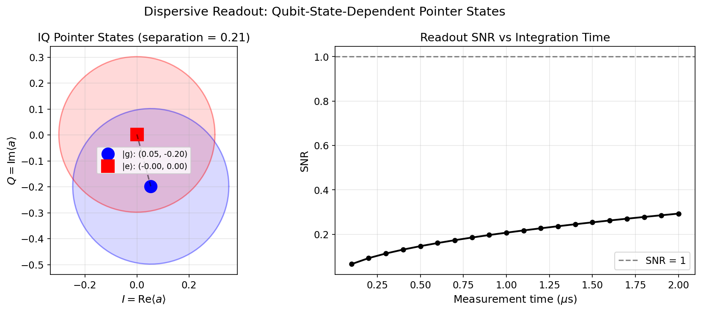

# Tutorial: Readout Resonator & Dispersive Measurement

Model the readout resonator coupled to a transmon, simulate dispersive readout, and visualize qubit-state-dependent IQ separation.

**Notebook:** `tutorials/17_readout_resonator_dispersive_coupling.ipynb`

---

## Physics Background

In dispersive readout, a readout resonator at frequency $\omega_r$ is driven while coupled to a transmon. The dispersive interaction shifts the resonator frequency conditioned on the qubit state:

$$\omega_r^{(g)} = \omega_r + \chi_r, \quad \omega_r^{(e)} = \omega_r - \chi_r$$

A coherent drive at $\omega_d \approx \omega_r$ creates qubit-state-dependent pointer states in the resonator:

$$|g\rangle \otimes |\alpha_g\rangle, \quad |e\rangle \otimes |\alpha_e\rangle$$

The separation $|\alpha_g - \alpha_e|$ in the IQ plane grows with drive power and measurement time until limited by qubit decay ($T_1$) and measurement-induced dephasing. The signal-to-noise ratio (SNR) of a single-shot readout is:

$$\text{SNR} = \frac{|\alpha_g - \alpha_e|}{\sigma_\text{noise}}$$

where $\sigma_\text{noise}$ includes vacuum fluctuations and amplifier noise.

---

## Code Example

```python
import numpy as np
from cqed_sim.core import (
    DispersiveTransmonCavityModel, FrameSpec,
    StatePreparationSpec, qubit_state, fock_state, prepare_state,
)
from cqed_sim.sim import SimulationConfig, simulate_sequence, reduced_cavity_state
from cqed_sim.sequence import SequenceCompiler
from cqed_sim.pulses import Pulse
from cqed_sim.pulses.envelopes import square_envelope

model = DispersiveTransmonCavityModel(
    omega_c=2*np.pi*7e9, omega_q=2*np.pi*6e9,
    alpha=2*np.pi*(-220e6), chi=2*np.pi*(-3e6),
    kerr=2*np.pi*(-2e3), n_cav=10, n_tr=2,
)
frame = FrameSpec(omega_c_frame=model.omega_c, omega_q_frame=model.omega_q)

# Readout pulse on the cavity
readout_pulse = Pulse(
    channel="cavity",
    t0=0.0, duration=1e-6,
    envelope=square_envelope,
    carrier=0.0, amp=2*np.pi*0.5e6, phase=0.0,
)

# Prepare |g,0⟩ and |e,0⟩, drive the cavity, compare IQ
psi_g = prepare_state(model, StatePreparationSpec(
    qubit=qubit_state("g"), storage=fock_state(0),
))
psi_e = prepare_state(model, StatePreparationSpec(
    qubit=qubit_state("e"), storage=fock_state(0),
))

compiled = SequenceCompiler(dt=2e-9).compile([readout_pulse])
config = SimulationConfig(frame=frame)

result_g = simulate_sequence(model, compiled, psi_g, {}, config=config)
result_e = simulate_sequence(model, compiled, psi_e, {}, config=config)

# Extract the cavity field ⟨a⟩ to get IQ coordinates
a_op = model.cavity_annihilation()
alpha_g = (a_op * result_g.final_state).tr()
alpha_e = (a_op * result_e.final_state).tr()
print(f"IQ_g = ({np.real(alpha_g):.3f}, {np.imag(alpha_g):.3f})")
print(f"IQ_e = ({np.real(alpha_e):.3f}, {np.imag(alpha_e):.3f})")
```

---

## Expected Behavior

- Driving the readout resonator produces two distinct pointer states in the IQ plane depending on whether the qubit is in $|g\rangle$ or $|e\rangle$.
- The separation $|\alpha_g - \alpha_e|$ is proportional to both the drive amplitude and the dispersive shift $\chi_r$.
- Increasing the measurement time increases the pointer-state separation until $T_1$-limited qubit decay degrades the signal.



---

## Key Parameters

| Parameter | Meaning | Typical Value |
|---|---|---|
| $\chi_r / 2\pi$ | Readout dispersive shift | 0.5–5 MHz |
| $\kappa_r / 2\pi$ | Readout resonator linewidth | 0.5–10 MHz |
| $T_\text{meas}$ | Measurement integration time | 0.3–2 $\mu$s |
| SNR | Single-shot SNR | 1–10 |

---

## See Also

- [Dispersive Shift & Dressed States](dispersive_shift_dressed.md) — number-dependent dispersive shift
- [Observables & Visualization](observables_visualization.md) — state visualization
- [Calibration Workflow](calibration_workflow.md) — full readout calibration
