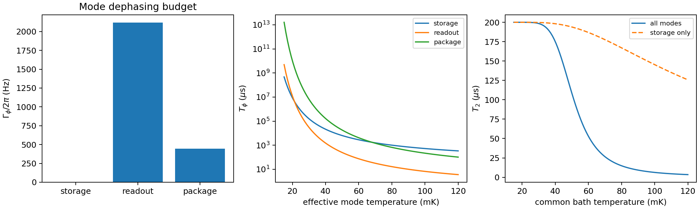
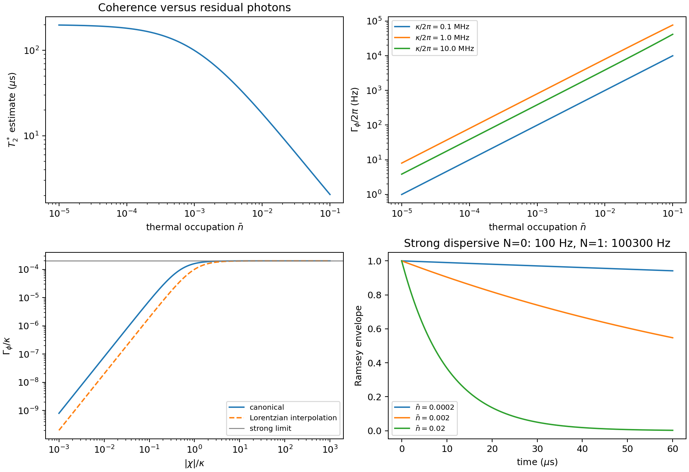
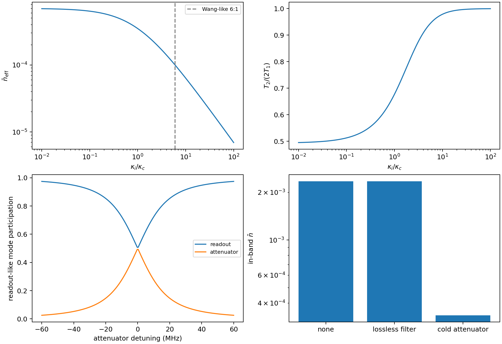
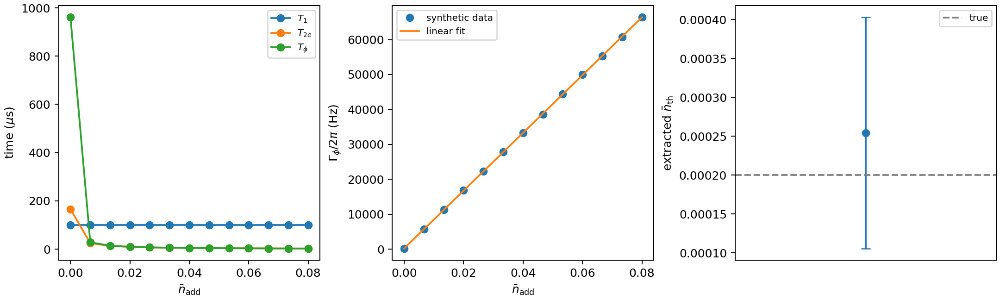

# Residual Thermal Photons and Cavity Attenuators

Residual thermal photons in a dispersively coupled storage or readout mode
randomly shift the qubit transition frequency. In `cqed_sim`, the same bath
occupation can be used in three linked ways:

- microwave noise budgets compute the normally ordered occupation `nbar`,
- `NoiseSpec` turns that occupation into Lindblad emission and absorption,
- photon-shot-noise helpers estimate the resulting pure dephasing.

The repository convention is angular rates in rad/s and times in seconds for
rate-level helpers. Frequencies passed to Bose occupation helpers are in Hz.

## From Ports to a Mode Occupation

For a mode coupled to multiple baths,

$$
\bar n_\mathrm{eff} =
\frac{\sum_j \kappa_j \bar n_j}{\sum_j \kappa_j}.
$$

`ModeBathModel` makes this weighting explicit:

```python
from cqed_sim.microwave_noise import BathSpec, ModeBathModel

mode = ModeBathModel(
    "readout",
    omega_rad_s=2.0 * 3.141592653589793 * 7.5e9,
    baths=[
        BathSpec("cold wall", 6.0e6, nbar=0.0, kind="cold_internal"),
        BathSpec("hot input", 1.0e6, nbar=7.0e-4, kind="hot_line"),
    ],
)
print(mode.effective_nbar())
```

The generated multimode example
`examples/noise/multimode_thermal_photons.py` computes per-mode dephasing
contributions for storage, readout, and package-like modes. In the checked
example run, the total contribution was `Gamma_phi/2pi = 2564.8 Hz`, dominated
by the readout-like mode.



## Photon-Shot-Noise Dephasing

The canonical helper is `gamma_phi_thermal(...)`, which wraps the same
Zhang/Clerk-Utami expression as `thermal_photon_dephasing(...)`. The compact
Lorentzian interpolation is intentionally exposed separately as
`gamma_phi_lorentzian_interpolation(...)` so callers can compare formulas
without changing the default physics convention.

The example `examples/noise/photon_shot_noise_dephasing.py` generates Ramsey
envelopes, dephasing versus `nbar`, dephasing versus `chi/kappa`, and
strong-dispersive photon-number-conditioned rates. In the checked example run,
`nbar = 2e-4`, `kappa/2pi = 1 MHz`, and `chi/2pi = 1 MHz` gave
`Gamma_phi/2pi = 163.7 Hz` and a relaxation-plus-dephasing estimate
`T2* = 165.9 us` for `T1 = 100 us`.



The time constants use

$$
\frac{1}{T_2}=\frac{1}{2T_1}+\frac{1}{T_\phi}.
$$

Thus `T2 ~= 2*T1` means the qubit is relaxation limited and has little
additional pure dephasing. Any residual-photon contribution lowers `T2/(2*T1)`.

## Cold Attenuators Are Not Lossless Filters

A dissipative attenuator acts as a thermal beam splitter:

$$
\bar n_\mathrm{out}
=
\eta \bar n_\mathrm{in}
+(1-\eta)\bar n_B(T_\mathrm{att}).
$$

It reduces in-band occupation only when its physical dissipative element is
cold. A lossless filter is different: it can reject out-of-band radiation, but
it does not attach the in-band readout mode to a cold bath.

`EffectiveCavityAttenuator` models a readout mode coupled to a cold internal
bath and a hot external line:

```python
from cqed_sim.microwave_noise import EffectiveCavityAttenuator

attenuator = EffectiveCavityAttenuator(
    omega_ro_rad_s=2.0 * 3.141592653589793 * 7.573e9,
    kappa_internal_rad_s=6.0,
    kappa_external_rad_s=1.0,
    internal_nbar=0.0,
    external_nbar=7.0e-4,
)
print(attenuator.effective_nbar())  # 1e-4
```

The example `examples/microwave/cavity_attenuator_design.py` sweeps
`kappa_internal/kappa_external`, compares cold attenuation against lossless
filtering, and plots readout-like hybridized-mode participation. The checked
run gives `nbar = 1.0e-4` at the Wang-style ratio of six.



## Added-Noise Extraction

The Wang-style measurement fits dephasing versus added photon number:

$$
\Gamma_\phi(\bar n_\mathrm{add})
=
(\bar n_\mathrm{add}+\bar n_\mathrm{th})S+\Gamma_{\phi,0}.
$$

`simulate_noise_induced_dephasing(...)` and
`fit_noise_induced_dephasing(...)` generate and fit synthetic `T1`, `T2e`, and
`Tphi` data. The example
`examples/noise/noise_induced_dephasing_extraction.py` recovers a known offset
from noisy synthetic data and reports a confidence interval.



## References

[1] A. P. Sears et al., "Photon shot noise dephasing in the strong-dispersive limit of circuit QED," Physical Review B 86, 180504(R), 2012. DOI: 10.1103/PhysRevB.86.180504.

[2] G. Zhang et al., "Suppression of photon shot noise dephasing in a tunable coupling superconducting qubit," npj Quantum Information 3, 1, 2017. DOI: 10.1038/s41534-016-0002-2.

[3] Z. Wang et al., "Cavity Attenuators for Superconducting Qubits," Physical Review Applied 11, 014031, 2019. DOI: 10.1103/PhysRevApplied.11.014031.

[4] A. A. Clerk and D. W. Utami, "Using a qubit to measure photon-number statistics of a driven thermal oscillator," Physical Review A 75, 042302, 2007. DOI: 10.1103/PhysRevA.75.042302.

[5] S. Krinner et al., "Engineering cryogenic setups for 100-qubit scale superconducting circuit systems," EPJ Quantum Technology 6, 2, 2019. DOI: 10.1140/epjqt/s40507-019-0072-0.
