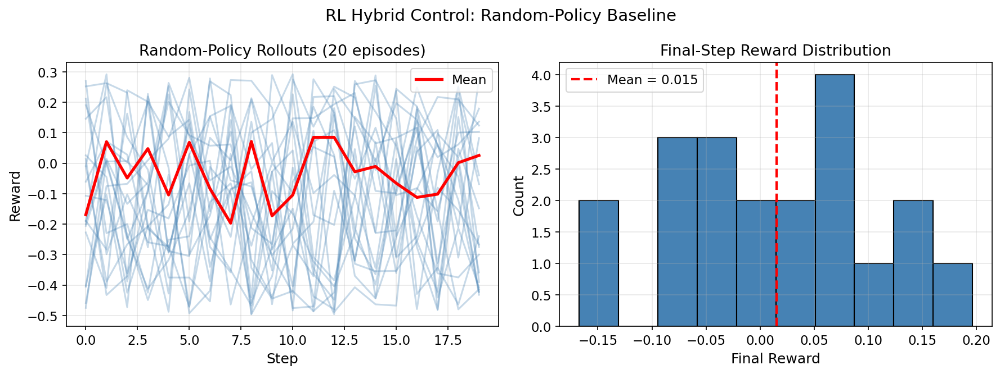

# RL Hybrid Control Tutorial

This page introduces `cqed_sim`'s Gym-compatible reinforcement learning environment for cQED pulse control. For the full interactive walkthrough, open:

- `tutorials/30_advanced_protocols/05_rl_hybrid_control_environment.ipynb`

Companion script:

- `examples/rl_hybrid_control_rollout.py`

---

## Motivation

RL-based control can discover pulse strategies that are difficult to find with GRAPE, especially for:

- **Measurement-conditioned control** — the agent observes intermediate measurement outcomes and adjusts
- **Domain-randomized robustness** — the training environment randomizes device parameters, producing controllers that transfer to real hardware
- **Long-horizon protocols** — multi-step sequences where each step depends on the current state

The `HybridCQEDEnv` wraps the full `cqed_sim` simulator into a standard Gym environment.

---

## Quick Start

```python
from cqed_sim.rl_control import HybridCQEDEnv, HybridEnvConfig

config = HybridEnvConfig(
    task="qubit_pi_pulse",              # Built-in benchmark task
    dt_s=2e-9,
    n_steps=20,
    seed=42,
)

env = HybridCQEDEnv(config)
obs, info = env.reset()

for step in range(config.n_steps):
    action = env.action_space.sample()  # Random policy
    obs, reward, terminated, truncated, info = env.step(action)
    if terminated or truncated:
        break

print(f"Final reward: {reward:.4f}")
print(f"Fidelity: {info.get('fidelity', 'N/A')}")
```

---

## Key Concepts

### Benchmark Tasks

Built-in tasks define the physical goal and evaluation metric:

```python
from cqed_sim.rl_control.tasks import benchmark_task_suite

suite = benchmark_task_suite()
print(list(suite.keys()))
# e.g., ["qubit_pi_pulse", "cavity_displacement", "conditional_phase", ...]
```

Each task specifies the model, initial state, target state or unitary, and the reward function.

### Observations

Observations are measurement-like signals that an RL agent might have access to in an experiment. Options include:

- **Qubit population** — synthetic measurement of $\langle \sigma_z \rangle$
- **IQ signal** — simulated readout quadrature values
- **History stacking** — concatenated observations from the last $k$ steps

Configure via `HybridEnvConfig`:

```python
config = HybridEnvConfig(
    ...,
    observation_type="measurement_proxy",
    observation_history_length=3,
)
```

### Action Spaces

Actions map to pulse parameters applied at each step:

| Action type | Description |
|---|---|
| `"amplitude_phase"` | Drive amplitude and phase per channel |
| `"iq_quadratures"` | I and Q quadrature values per channel |
| `"discrete_gate"` | Select from a discrete gate set |

### Rewards

Rewards guide the RL agent. Built-in options include:

- **Fidelity reward** — overlap with the target state (only at the final step or at every step)
- **Measurement-proxy reward** — based on synthetic measurement outcomes without access to the full quantum state
- **Penalty terms** — leakage, amplitude smoothness, or protocol duration

### Domain Randomization

Randomize device parameters during training so the learned policy is robust:

```python
from cqed_sim.rl_control import DomainRandomizationConfig

config = HybridEnvConfig(
    ...,
    domain_randomization=DomainRandomizationConfig(
        chi_std=50e3,       # Randomize χ ± 50 kHz
        t1_std=0.5e-6,      # Randomize T₁ ± 0.5 μs
    ),
)
```

### Diagnostics

After a rollout, extract simulator-side diagnostics:

```python
from cqed_sim.rl_control.diagnostics import build_rollout_diagnostics

diag = build_rollout_diagnostics(env)
# Contains: state trajectory, Bloch vectors, photon numbers, fidelity curve
```



---

## Integration with RL Libraries

`HybridCQEDEnv` follows the Gymnasium API:

```python
# Stable-Baselines3 example (requires sb3 installed)
from stable_baselines3 import PPO

env = HybridCQEDEnv(config)
model = PPO("MlpPolicy", env, verbose=1)
model.learn(total_timesteps=50000)
```

Any library that supports the Gymnasium `Env` interface (SB3, RLlib, CleanRL, etc.) can be used.

---

## See Also

- [RL Control API](../api/rl_control.md) — full API reference for environments, tasks, observations, and rewards
- [System Identification API](../api/system_id.md) — converting calibration posteriors to domain randomization priors
- [GRAPE Tutorial](optimal_control.md) — for deterministic optimal control without RL