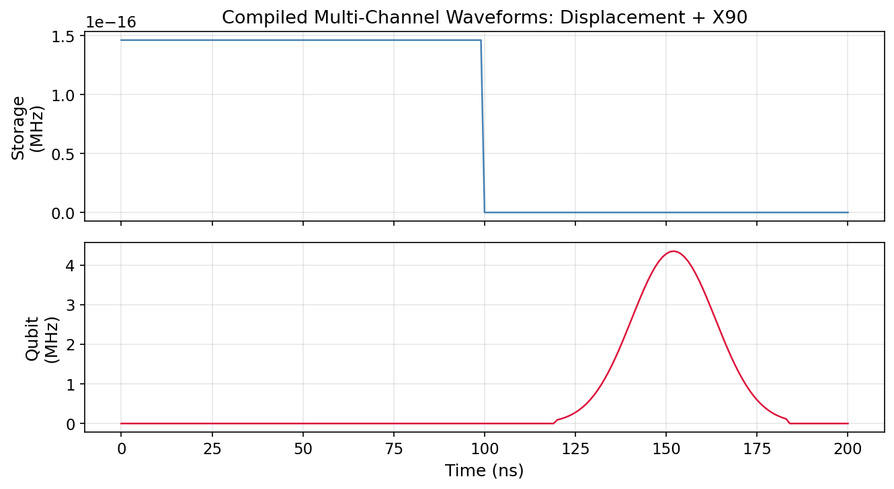

# Tutorial: Sequence Building & Compilation

Construct pulse sequences from elementary operations, compile them into time-discretized waveforms, and visualize the compiled channels.

**Notebooks:**

- `tutorials/21_sequence_compilation.ipynb` — building and compiling sequences
- `tutorials/22_batch_simulation.ipynb` — running parameter sweeps over compiled sequences

---

## Physics Background

A quantum experiment consists of a **sequence** of operations — pulses, delays, gates — applied to one or more drive channels (qubit, cavity, readout). Before simulation, the sequence must be **compiled** into a set of time-discretized baseband waveforms at the simulation time step $dt$.

### Sequence → Compiled Channels

```
Pulse objects          SequenceCompiler          CompiledSequence
[P1, P2, P3, …]  ──→  .compile(pulses)  ──→  {channel: baseband array}
```

Each `Pulse` specifies:

- `channel` — which port (`"qubit"`, `"cavity"`, …)
- `t0`, `duration` — timing in seconds
- `frequency`, `amplitude`, `phase` — the carrier parameters
- Optional envelope (Gaussian, DRAG, flat-top, etc.)

The `SequenceCompiler` stacks all pulses per channel, handles overlaps, and produces discretized baseband envelopes.

---

## Code Example: Building a Ramsey Sequence

```python
import numpy as np
from cqed_sim.core import DispersiveTransmonCavityModel
from cqed_sim.sequence import SequenceCompiler
from cqed_sim.pulses import Pulse
from cqed_sim.pulses.envelopes import square_envelope

model = DispersiveTransmonCavityModel(
    omega_c=2*np.pi*5e9, omega_q=2*np.pi*6e9,
    alpha=2*np.pi*(-220e6), chi=2*np.pi*(-2.5e6),
    kerr=2*np.pi*(-2e3), n_cav=4, n_tr=2,
)

# X/2 – delay – X/2 Ramsey sequence
pi2_dur = 20e-9
delay = 500e-9
amp = 2*np.pi*12.5e6  # calibrated π/2 amplitude

pulse_1 = Pulse(
    channel="qubit", t0=0.0, duration=pi2_dur,
    envelope=square_envelope,
    carrier=0.0, amp=amp, phase=0.0,
)
pulse_2 = Pulse(
    channel="qubit", t0=pi2_dur + delay, duration=pi2_dur,
    envelope=square_envelope,
    carrier=0.0, amp=amp, phase=0.0,
)

compiler = SequenceCompiler(dt=2e-9)
compiled = compiler.compile([pulse_1, pulse_2])
print(f"Compiled duration: {compiled.duration*1e6:.2f} µs")
print(f"Channels: {list(compiled.channels.keys())}")
```

---

## Inspecting Compiled Waveforms

```python
import matplotlib.pyplot as plt

ch = compiled.channels["qubit"]
t_ns = np.arange(len(ch.baseband)) * compiler.dt * 1e9

fig, ax = plt.subplots(figsize=(8, 3))
ax.plot(t_ns, np.real(ch.baseband), label="I (real)")
ax.plot(t_ns, np.imag(ch.baseband), label="Q (imag)", ls="--")
ax.set_xlabel("Time (ns)")
ax.set_ylabel("Amplitude (rad/s)")
ax.set_title("Compiled Ramsey waveform")
ax.legend()
plt.tight_layout()
plt.show()
```

---

## Batch Simulation: Parameter Sweeps

```python
from cqed_sim.core import FrameSpec, StatePreparationSpec, qubit_state, fock_state, prepare_state
from cqed_sim.sim import SimulationConfig, simulate_sequence, reduced_qubit_state

frame = FrameSpec(omega_c_frame=model.omega_c, omega_q_frame=model.omega_q)
psi0 = prepare_state(model, StatePreparationSpec(
    qubit=qubit_state("g"), storage=fock_state(0),
))
config = SimulationConfig(frame=frame)

delays_ns = np.arange(10, 1000, 50)
pe_sweep = []

for d in delays_ns:
    d_sec = d * 1e-9
    p1 = Pulse(channel="qubit", t0=0.0, duration=pi2_dur,
               envelope=square_envelope, carrier=0.0, amp=amp, phase=0.0)
    p2 = Pulse(channel="qubit", t0=pi2_dur + d_sec, duration=pi2_dur,
               envelope=square_envelope, carrier=0.0, amp=amp, phase=0.0)
    comp = compiler.compile([p1, p2])
    result = simulate_sequence(model, comp, psi0, {}, config=config)
    rho_q = reduced_qubit_state(result.final_state)
    pe_sweep.append(float(np.real(rho_q[1, 1])))
```

---

## Results



The plot shows compiled baseband waveforms for qubit and cavity channels. Each pulse appears as a localized envelope at its programmed time. Overlapping pulses on the same channel are summed by the compiler.

---

## See Also

- [Qubit Drive & Rabi](qubit_drive_rabi.md) — single-pulse qubit control
- [Open System Dynamics](open_system_dynamics.md) — Ramsey and echo sequences
- [Calibration Workflow](calibration_workflow.md) — fitting sweeps to extract parameters
