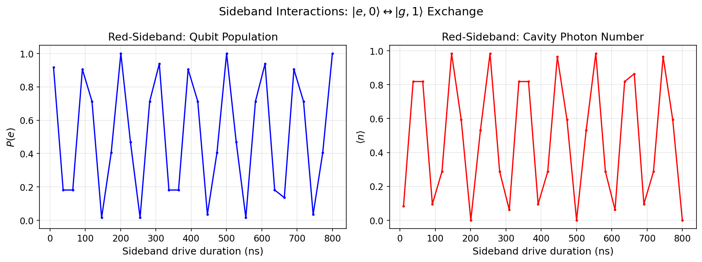

# Tutorial: Sideband Interactions

Explore effective sideband interactions between the transmon and cavity — blue-sideband, red-sideband, and cross-Kerr-mediated state transfer.

**Notebook:** `tutorials/24_sideband_interactions.ipynb`

---

## Physics Background

In a dispersive transmon–cavity system, off-resonant drives can mediate **sideband transitions** that swap excitations between the qubit and cavity. These are enabled by the residual coupling even in the dispersive regime.

### Red Sideband (Jaynes–Cummings)

A drive at $\omega_d = \omega_q - \omega_c + \chi$ mediates the transition:

$$|e, n\rangle \leftrightarrow |g, n+1\rangle$$

This transfers one qubit excitation into one cavity photon. The effective Rabi rate is:

$$\Omega_\text{red} \propto g\, \Omega_d / \Delta$$

### Blue Sideband (Anti-Jaynes–Cummings)

A drive at $\omega_d = \omega_q + \omega_c$ mediates:

$$|g, n\rangle \leftrightarrow |e, n+1\rangle$$

This simultaneously creates (or destroys) excitations in both qubit and cavity.

### Applications

- **State preparation:** Red sideband from $|e, 0\rangle$ can prepare $|g, 1\rangle$
- **Photon-number-selective pulses:** Number-dependent χ-shift can be used to address specific Fock states (SNAP gates)
- **Bosonic error correction:** Sideband operations are building blocks for cat-code and binomial-code protocols

---

## Code Example

```python
import numpy as np
from cqed_sim.core import (
    DispersiveTransmonCavityModel, FrameSpec, SidebandDriveSpec,
    StatePreparationSpec, qubit_state, fock_state, prepare_state,
    carrier_for_transition_frequency,
)
from cqed_sim.sim import SimulationConfig, simulate_sequence, reduced_qubit_state
from cqed_sim.sequence import SequenceCompiler
from cqed_sim.pulses import build_sideband_pulse

model = DispersiveTransmonCavityModel(
    omega_c=2*np.pi*5e9, omega_q=2*np.pi*6e9,
    alpha=2*np.pi*(-220e6), chi=2*np.pi*(-2.5e6),
    kerr=2*np.pi*(-2e3), n_cav=6, n_tr=3,
)
frame = FrameSpec(omega_c_frame=model.omega_c, omega_q_frame=model.omega_q)

# Prepare |e, 0⟩ then apply a red-sideband drive
psi_e0 = prepare_state(model, StatePreparationSpec(
    qubit=qubit_state("e"), storage=fock_state(0),
))

omega_red = model.sideband_transition_frequency(
    cavity_level=0,
    lower_level=0,
    upper_level=1,
    sideband="red",
    frame=frame,
)

pulses, drive_ops, _ = build_sideband_pulse(
    SidebandDriveSpec(mode="storage", lower_level=0, upper_level=1, sideband="red"),
    duration_s=500e-9,
    amplitude_rad_s=2*np.pi*5e6,
    channel="sideband",
    carrier=carrier_for_transition_frequency(omega_red),
    label="red_sideband",
)

compiler = SequenceCompiler(dt=2e-9)
compiled = compiler.compile(pulses)
config = SimulationConfig(frame=frame)

result = simulate_sequence(model, compiled, psi_e0, drive_ops, config=config)
a = model.cavity_annihilation()
nbar = float(np.real((a.dag() * a * result.final_state).tr()))
rho_q = reduced_qubit_state(result.final_state)
pe = float(np.real(rho_q[1, 1]))
print(f"⟨n⟩ = {nbar:.3f}, P(e) = {pe:.3f}")
# If red sideband works: P(e) decreases, ⟨n⟩ increases
```

This example intentionally stays in the effective sideband-transition language. Because that boundary is already an effective rotating-frame sideband API rather than an ordinary single-mode physical-tone API, `carrier_for_transition_frequency(...)` remains the correct helper here.

---

## Expected Behavior

- Under a red-sideband drive, the population oscillates between $|e,0\rangle$ and $|g,1\rangle$.
- The oscillation period depends on drive amplitude, dispersive shift, and detuning accuracy.
- The contrast is reduced by higher-order nonlinear terms (Kerr, anharmonicity).



---

## Key Parameters

| Parameter | Meaning | Typical Value |
|---|---|---|
| $\omega_\text{red}/2\pi$ | Red-sideband frequency | $\omega_q - \omega_c \pm \chi$ |
| $\Omega_d/2\pi$ | Drive amplitude | 1–10 MHz |
| Sideband Rabi rate | Effective coupling strength | 0.1–1 MHz |

---

## See Also

- [Dispersive Shift & Dressed States](dispersive_shift_dressed.md) — number-dependent frequency shifts
- [Qubit Drive & Rabi](qubit_drive_rabi.md) — resonant drive comparison
- [Multilevel Transmon](multilevel_transmon.md) — higher-level corrections
