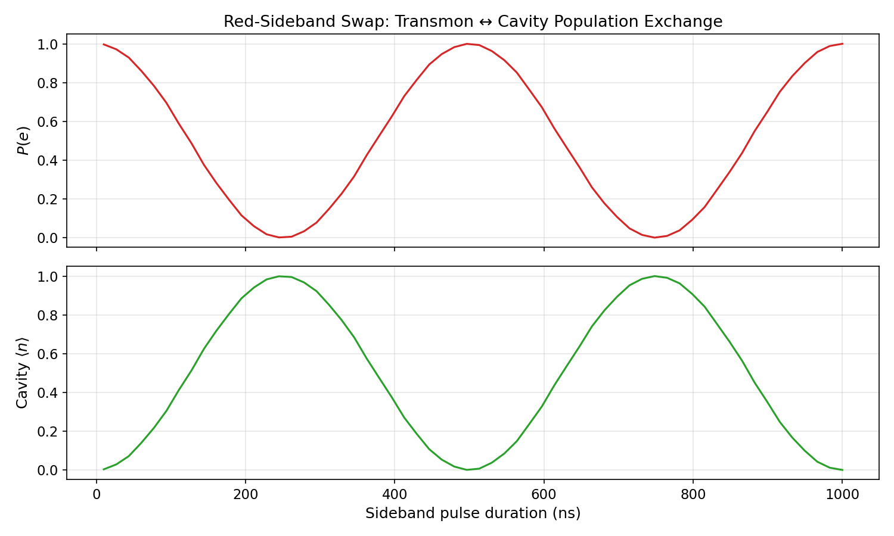

# Tutorial: Sideband Swap and Bosonic Protocols

This tutorial demonstrates how sideband drives transfer excitations between a transmon qubit and a bosonic storage mode — the fundamental primitive for qubit-to-cavity state transfer in cQED.

Primary workflow notebooks (start here):

- `tutorials/20_bosonic_and_sideband/01_sideband_swap.ipynb`
- `tutorials/20_bosonic_and_sideband/02_detuned_sideband_synchronization.ipynb`
- `tutorials/20_bosonic_and_sideband/03_sequential_sideband_reset.ipynb`
- `tutorials/20_bosonic_and_sideband/04_shelving_isolation.ipynb`

Foundational background:

- `tutorials/24_sideband_like_interactions.ipynb`

---

## Physics Background

### Energy-Matching: The Sideband Condition

The transmon-cavity system has two independent degrees of freedom — the transmon and the storage cavity — each with their own energy ladder. A **sideband drive** couples different rungs of these two ladders simultaneously.

The photon energy of the drive must match the net energy exchange:

- **Red sideband** (lower transmon, remove photon): $\omega_{\text{drive}} = \omega_{ge} - \omega_c$
  The drive excites the transmon from $|g\rangle$ to $|e\rangle$ while *removing* a photon from the cavity
- **Blue sideband** (excite both): $\omega_{\text{drive}} = \omega_{ge} + \omega_c$
  The drive excites the transmon *and* adds a photon to the cavity simultaneously

In the rotating frame matched to both $\omega_q$ and $\omega_c$, the red-sideband drive at $\omega_{\text{drive}} = \omega_{ge} - \omega_c$ becomes resonant with the $|g, n+1\rangle \leftrightarrow |e, n\rangle$ manifold.

### Sideband Hamiltonian

In the rotating frame, the effective sideband coupling is:

$$H_{\text{sb}} = \varepsilon(t) \, |u\rangle\langle \ell| \, a_m + \varepsilon^*(t) \, a_m^\dagger \, |\ell\rangle\langle u|$$

where $|\ell\rangle$ and $|u\rangle$ are the lower and upper transmon levels, $a_m$ is the bosonic mode annihilation operator, and $\varepsilon(t)$ is the slowly-varying drive envelope. This Hamiltonian directly couples the state $|\ell, n+1\rangle$ to $|u, n\rangle$ — a resonant exchange between transmon excitation and a single cavity photon.

### Two-Level Rabi Oscillation

In the $\{|e, 0\rangle, |g, 1\rangle\}$ subspace (simplest case), the Hamiltonian reduces to:

$$H_{\text{2-level}} = \varepsilon \begin{pmatrix} 0 & 1 \\ 1 & 0 \end{pmatrix}$$

This is a resonant two-level system with Rabi frequency $\Omega_{\text{sb}} = |\varepsilon|$. The populations oscillate as:

$$P_{|e,0\rangle}(t) = \cos^2(\Omega_{\text{sb}} t), \qquad P_{|g,1\rangle}(t) = \sin^2(\Omega_{\text{sb}} t)$$

A complete swap ($|e,0\rangle \to |g,1\rangle$) occurs at $t_{\text{swap}} = \pi / (2\Omega_{\text{sb}})$.

### Multi-Level Extensions: $|f, 0\rangle \leftrightarrow |g, 1\rangle$

In the three-level transmon ($|g\rangle, |e\rangle, |f\rangle$), the red sideband can couple the $f$-state:

$$\omega_{\text{drive}} = \omega_{fe} - \omega_c \implies |f, n\rangle \leftrightarrow |g, n+1\rangle$$

This is often more useful than the $g$–$e$ sideband because:

1. The $f$ level is at a distinct frequency, reducing drive crosstalk
2. Storage of $|f\rangle$ into the cavity leaves the qubit in $|g\rangle$, which can then be re-used
3. Sequential $|e\rangle \to |f\rangle$ + sideband can create arbitrary cavity Fock states

---

## Setup

```python
import numpy as np
from cqed_sim.core import (
    DispersiveTransmonCavityModel,
    FrameSpec,
    SidebandDriveSpec,
    carrier_for_transition_frequency,
)

model = DispersiveTransmonCavityModel(
    omega_c = 2 * np.pi * 5.0e9,
    omega_q = 2 * np.pi * 6.0e9,
    alpha   = 2 * np.pi * (-200e6),
    chi     = 2 * np.pi * (-2.84e6),
    n_cav   = 8,
    n_tr    = 3,   # Need ≥ 3 levels for f-g sideband
)

frame = FrameSpec(
    omega_c_frame = model.omega_c,
    omega_q_frame = model.omega_q,
)
```

---

## Building a Sideband Pulse

```python
from cqed_sim.pulses import build_sideband_pulse

target = SidebandDriveSpec(
    mode        = "storage",
    lower_level = 0,     # g
    upper_level = 1,     # e
    sideband    = "red",
)

# Get the sideband transition frequency in the rotating frame
omega_sb = model.sideband_transition_frequency(
    cavity_level = 0,
    lower_level  = 0,
    upper_level  = 1,
    sideband     = "red",
    frame        = frame,
)

pulses, drive_ops, meta = build_sideband_pulse(
    target,
    duration_s        = 500e-9,
    amplitude_rad_s   = 2 * np.pi * 1e6,
    channel           = "sideband",
    carrier           = carrier_for_transition_frequency(omega_sb),
)
```

Here the tutorial stays in the effective rotating-frame sideband language and converts the already-reduced sideband transition frequency directly into the raw low-level carrier. For qubit-only or cavity-only public tone frequencies, prefer the positive `drive_frequency_for_transition_frequency(...)` helper layer.

---

## Running the Simulation

```python
from cqed_sim.core import (
    StatePreparationSpec, qubit_state, fock_state, prepare_state,
)
from cqed_sim.sequence import SequenceCompiler
from cqed_sim.sim import SimulationConfig, simulate_sequence

# Start with qubit excited, cavity empty: |e, 0⟩
initial = prepare_state(
    model,
    StatePreparationSpec(qubit=qubit_state("e"), storage=fock_state(0)),
)

compiled = SequenceCompiler(dt=2e-9).compile(pulses, t_end=550e-9)

result = simulate_sequence(
    model, compiled, initial, drive_ops,
    config=SimulationConfig(frame=frame, store_states=True),
)
```

---

## Observing the Swap

```python
from cqed_sim.sim import reduced_qubit_state, reduced_cavity_state
import numpy as np

rho_q = reduced_qubit_state(result.final_state)
rho_c = reduced_cavity_state(result.final_state)

pe = float(np.real(rho_q[1, 1]))
n_s = float(np.real(np.trace(
    np.diag(np.arange(model.n_cav, dtype=float)) @ np.array(rho_c)
)))

print(f"Transmon P(e): {pe:.3f}")
print(f"Storage ⟨n⟩: {n_s:.3f}")
```

A successful red sideband swap: $P(e) \to 0$, cavity $\langle n\rangle \to 1$.

### Population Dynamics vs. Pulse Duration

Sweeping the sideband pulse duration reveals the Rabi oscillation:



The qubit excited-state probability $P(e)$ (top panel) drops as the cavity photon number $\langle n \rangle$ (bottom panel) rises. At the half-period $t_{\text{swap}} = \pi/(2\Omega_{\text{sb}})$ the transfer is complete; continued driving reverses it.

---

## Extended Sideband Tutorials

### Detuned Sideband Synchronization
`tutorials/20_bosonic_and_sideband/02_detuned_sideband_synchronization.ipynb`

When the sideband drive is off-resonance by detuning $\delta$, the effective Rabi frequency becomes $\tilde{\Omega} = \sqrt{\Omega_{\text{sb}}^2 + \delta^2}$ and the maximum transfer is reduced to $P_{\text{max}} = \Omega_{\text{sb}}^2 / \tilde{\Omega}^2 < 1$. The notebook explores the **synchronization conditions** under which multi-tone drives at different detunings can be made to constructively interfere, restoring full transfer fidelity.

### Sequential Sideband Reset
`tutorials/20_bosonic_and_sideband/03_sequential_sideband_reset.ipynb`

A storage cavity initially in an unknown state can be reset to vacuum by a sequential protocol:

1. Drive the $|e, n\rangle \to |g, n+1\rangle$ red sideband (transfers cavity photons to transmon)
2. Apply a $\pi$-pulse on the qubit ($|e\rangle \to |g\rangle$) to remove the transmon excitation
3. Repeat for decreasing $n$

Each cycle reduces the mean photon number. The notebook demonstrates the protocol with and without cavity ringdown, and compares the reset fidelity as a function of the number of cycles.

### Shelving Isolation
`tutorials/20_bosonic_and_sideband/04_shelving_isolation.ipynb`

In a three-level transmon, it is possible to selectively couple one transmon branch while **shelving** another:

1. Excite the $|e\rangle \to |f\rangle$ transition
2. Drive the $|f, n\rangle \to |g, n+1\rangle$ sideband: only the $f$-branch transfers into the cavity
3. The $|g\rangle$ branch remains undisturbed

This allows selective state transfer that is insensitive to the $|g\rangle$ population — important for protocols where the $|g\rangle$ and $|e\rangle$ branches must be treated independently.

### Open-System Degradation
`tutorials/30_advanced_protocols/02_open_system_sideband_degradation.ipynb`

Real sideband operations are degraded by:

- **Transmon $T_1$**: spontaneous emission during the sideband pulse
- **Transmon $T_2$**: pure dephasing reduces coherence of the transferred state
- **Cavity photon loss**: cavity decay rate $\kappa$ reduces occupation during the swap
- **Thermal excitations**: finite temperature causes unwanted re-excitation

The notebook compares closed-system (ideal) vs. open-system (Lindblad) sideband dynamics and quantifies the degradation as a function of each noise parameter.

---

## Existing Examples

- `tutorials/20_bosonic_and_sideband/01_sideband_swap.ipynb` — basic sideband swap ($|f,0\rangle \leftrightarrow |g,1\rangle$)
- `tutorials/20_bosonic_and_sideband/02_detuned_sideband_synchronization.ipynb` — detuned sideband synchronization
- `tutorials/20_bosonic_and_sideband/03_sequential_sideband_reset.ipynb` — sequential storage reset
- `tutorials/20_bosonic_and_sideband/04_shelving_isolation.ipynb` — shelving with a multilevel sideband
- `tutorials/30_advanced_protocols/02_open_system_sideband_degradation.ipynb` — sideband with open-system noise
- `examples/sideband_swap.py` — compact standalone sideband swap script

## See Also

- [Cross-Kerr Interaction](cross_kerr.md) — conditional phase accumulation without photon transfer
- [Floquet Driven Systems](floquet_driven_systems.md) — periodic-drive perspective on sideband transitions
- [Open System Dynamics](../user_guides/open_system_dynamics.md) — Lindblad dissipators for noise modeling
