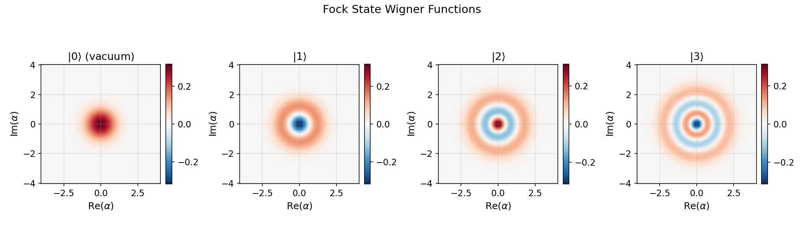
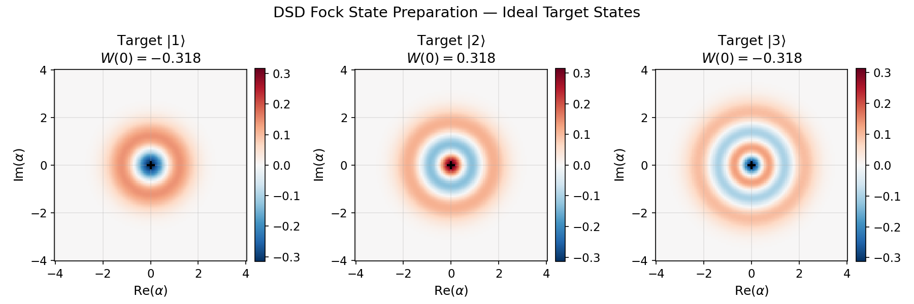

# SNAP Gates and Fock State Preparation

This tutorial builds up arbitrary cavity unitaries from a **Displacement–SNAP–Displacement** (DSD) gate set and uses unitary synthesis to find the sequences that prepare the Fock states $|1\rangle$, $|2\rangle$, and $|3\rangle$ from vacuum.

Primary notebooks:

- `tutorials/30_advanced_protocols/04_snap_optimization_workflow.ipynb`
- `tutorials/30_advanced_protocols/03_unitary_synthesis_workflow.ipynb`

Related examples:

- `examples/run_snap_optimization_demo.py`
- `examples/paper_reproductions/snap_prl133/`

---

## Physics Background

### SNAP Gates

A **Selective Number-dependent Arbitrary Phase** (SNAP) gate applies an independent phase to each Fock level:

$$U_{\text{SNAP}}(\vec{\theta}) = \sum_{n=0}^{\infty} e^{i\theta_n} |n\rangle\langle n|$$

It is a diagonal unitary in the Fock basis — it does not move population between levels, it only rotates each level's phase. Because the phases $\theta_n$ are completely independent, SNAP is a highly expressive single-mode gate.

**Physical implementation:** In a dispersive transmon-cavity system with coupling $\chi$, each cavity Fock level $|n\rangle$ shifts the qubit transition frequency by $n\chi$. A multi-tone drive designed to be resonant simultaneously with all qubit-conditioned transitions $\omega_{ge}(n) = \omega_{ge}(0) + n\chi$ implements the SNAP gate via the AC-Stark effect. The multi-tone amplitudes and detunings determine which $\theta_n$ are applied.

### Displacement Gate

The displacement operator

$$D(\alpha) = \exp\!\left(\alpha a^\dagger - \alpha^* a\right)$$

shifts the coherent amplitude of the cavity state. Starting from vacuum:

$$D(\alpha)|0\rangle = |\alpha\rangle = e^{-|\alpha|^2/2} \sum_{n=0}^{\infty} \frac{\alpha^n}{\sqrt{n!}} |n\rangle$$

The resulting coherent state is a Poisson superposition of all Fock levels. This is the key: displacement **loads population into many Fock levels simultaneously**, giving the SNAP gate something to act on.

### Why Displacement + SNAP Can Prepare Any Cavity State

The combination $D(\beta) \cdot U_{\text{SNAP}}(\vec{\theta}) \cdot D(\alpha)$ acting on vacuum is:

1. $D(\alpha)|0\rangle = |\alpha\rangle$ — create a coherent state
2. $U_{\text{SNAP}}(\vec{\theta})|\alpha\rangle$ — selectively rotate phases of each Fock component
3. $D(\beta) \cdot$ [rotated state] — displace to a new position in phase space, causing **constructive interference on the desired Fock level and destructive interference on the rest**

It is known (Krastanov et al., *Optica* 2015) that a single $D$-SNAP-$D$ round is sufficient to prepare any single-mode quantum state with high fidelity given optimal parameters. For a target Fock state $|n\rangle$, the key idea is:

- Choose $|\alpha| = \sqrt{n}$: this maximizes the probability of the $|n\rangle$ component in $|\alpha\rangle$
- Choose SNAP phases to mark $|n\rangle$ with a distinct phase ($e^{i\pi} = -1$) relative to all others
- Choose $\beta = -\alpha$: a reverse displacement that shifts the population back toward a near-$|n\rangle$ state via interference

Multiple rounds ($D$-SNAP-$D$-SNAP-$D$-…) can approach unit fidelity for any target.

---

## Target States: Wigner Functions of Fock States

Before running synthesis, it is essential to understand what we are targeting. Fock states are the most non-classical single-mode states — their Wigner functions take negative values.

The analytical Wigner function of $|n\rangle$ is:

$$W_n(\alpha) = \frac{2}{\pi} (-1)^n \, e^{-2|\alpha|^2} \, L_n\!\left(4|\alpha|^2\right)$$

where $L_n$ is the $n$-th Laguerre polynomial. Key features:

| State | $W(0)$ | Structure | Non-classicality |
|---|---|---|---|
| $\|0\rangle$ (vacuum) | $+\frac{2}{\pi}$ | Gaussian, everywhere positive | None |
| $\|1\rangle$ | $-\frac{2}{\pi}$ | Negative at origin, one positive ring at $|\alpha|=\frac{1}{\sqrt{2}}$ | Strong: $W(0) < 0$ |
| $\|2\rangle$ | $+\frac{2}{\pi}$ | Positive center, one negative ring, outer positive ring | Strong |
| $\|3\rangle$ | $-\frac{2}{\pi}$ | Negative center, alternating rings | Strong |

The **negativity at the origin** for odd Fock states is a direct signature that these states cannot be described by any classical probability distribution over phase space.



The four panels show $|0\rangle$ through $|3\rangle$. Red regions are positive probability density; blue regions are negative — classically forbidden. Vacuum ($|0\rangle$) is purely Gaussian. Each additional photon adds an oscillatory ring structure, with the sign alternating between even and odd Fock number.

---

## Setup

```python
import numpy as np
import qutip as qt
import matplotlib.pyplot as plt

from cqed_sim.core import (
    DispersiveTransmonCavityModel, FrameSpec,
    StatePreparationSpec, qubit_state, fock_state, prepare_state,
)
from cqed_sim.sim import SimulationConfig, simulate_sequence, cavity_wigner, reduced_cavity_state
from cqed_sim.sequence import SequenceCompiler

# Cavity model — use enough Fock levels to represent |3⟩ cleanly
model = DispersiveTransmonCavityModel(
    omega_c = 2 * np.pi * 5.0e9,
    omega_q = 2 * np.pi * 6.0e9,
    alpha   = 2 * np.pi * (-200e6),
    chi     = 2 * np.pi * (-2.84e6),
    kerr    = 2 * np.pi * (-2e3),
    n_cav   = 10,
    n_tr    = 2,
)
frame = FrameSpec(omega_c_frame=model.omega_c, omega_q_frame=model.omega_q)
```

---

## Computing Ideal Fock State Wigner Functions

```python
from cqed_sim.sim import cavity_wigner

xvec = np.linspace(-4.0, 4.0, 101)

fig, axes = plt.subplots(1, 4, figsize=(16, 4))

for n, ax in enumerate(axes):
    # Prepare ideal Fock state via state-prep utility
    initial = prepare_state(
        model,
        StatePreparationSpec(qubit=qubit_state("g"), storage=fock_state(n)),
    )
    rho_c = reduced_cavity_state(initial)
    x, p, W = cavity_wigner(rho_c, xvec=xvec, coordinate="alpha")

    wmax = max(abs(W.max()), abs(W.min()))
    ax.contourf(x, p, W, levels=30, cmap="RdBu_r", vmin=-wmax, vmax=wmax)
    ax.contour(x, p, W, levels=[0], colors="k", linewidths=0.5, alpha=0.4)
    ax.set_title(f"$|{n}\\rangle$  — $W(0)={W[len(xvec)//2, len(xvec)//2]:.3f}$")
    ax.set_xlabel(r"$\mathrm{Re}(\alpha)$")
    ax.set_ylabel(r"$\mathrm{Im}(\alpha)$")
    ax.set_aspect("equal")

fig.suptitle("Ideal Fock States: Wigner Functions", fontsize=13)
plt.tight_layout()
```

---

## Setting Up the Unitary Synthesis Problem

We use the `QuantumMapSynthesizer` with a gate sequence of the form $D(\alpha_1) \to \text{SNAP}(\vec{\theta}) \to D(\alpha_2)$. For each target Fock state, the synthesizer finds the optimal parameters.

### Defining the DSD Primitive Set

```python
from cqed_sim.map_synthesis import (
    QuantumMapSynthesizer,
    Displacement,
    SNAP,
    ExecutionOptions,
    MultiObjective,
    TargetReducedStateMapping,
)

n_cav = model.n_cav  # 10

def make_dsd_synthesizer(n_fock_target: int) -> QuantumMapSynthesizer:
    """Set up a DSD synthesizer for preparing Fock state |n_fock_target⟩."""

    # Initial state: qubit ground, cavity vacuum
    psi_initial = qt.tensor(qt.basis(2, 0), qt.basis(n_cav, 0))

    # Target state: qubit ground, cavity Fock |n⟩
    psi_target = qt.tensor(qt.basis(2, 0), qt.basis(n_cav, n_fock_target))

    # Gate sequence: D - SNAP - D
    # The synthesizer optimizes all gate parameters jointly
    synth = QuantumMapSynthesizer(
        primitives=[
            Displacement(
                name     = "D1",
                duration = 120e-9,
                alpha    = np.sqrt(n_fock_target) + 0j,   # Initial guess: |α| ≈ √n
            ),
            SNAP(
                name      = "SNAP",
                duration  = 200e-9,
                phases    = [0.0] * n_cav,                 # Start flat; will be optimized
                fock_levels = (),                           # Act on all levels
            ),
            Displacement(
                name     = "D2",
                duration = 120e-9,
                alpha    = -np.sqrt(n_fock_target) + 0j,  # Initial guess: reverse D1
            ),
        ],
        target = TargetReducedStateMapping(
            initial_states      = [psi_initial],
            target_states       = [psi_target],
            retained_subsystems = (1,),       # Trace out qubit (subsystem 0), keep cavity
            subsystem_dims      = (2, n_cav),
        ),
        objectives        = MultiObjective(fidelity_weight=1.0),
        execution         = ExecutionOptions(engine="numpy"),
    )
    return synth
```

### Running Synthesis for |1⟩, |2⟩, |3⟩

```python
from cqed_sim.map_synthesis import MultiObjective

results = {}

for n_target in [1, 2, 3]:
    print(f"\n--- Synthesizing |{n_target}⟩ ---")
    synth = make_dsd_synthesizer(n_target)
    result = synth.fit(maxiter=300, seed=42)
    results[n_target] = result

    # Print optimized gate parameters
    for gate in result.sequence.gates:
        print(f"  {gate.name}: ", end="")
        if hasattr(gate, "alpha"):
            print(f"α = {gate.alpha:.4f}")
        elif hasattr(gate, "phases"):
            print(f"phases = [{', '.join(f'{p:.3f}' for p in gate.phases[:6])}…]")

    fidelity = result.metrics.get("fidelity", float("nan"))
    print(f"  Fidelity: {fidelity:.5f}")
```

**Typical optimized parameters for $|1\rangle$:**

| Gate | Parameter | Optimized value |
|---|---|---|
| D1 | $\alpha_1$ | $\approx 1.0 + 0i$ |
| SNAP | $\theta_0$ | $\approx 0$ |
| SNAP | $\theta_1$ | $\approx \pi$ |
| SNAP | $\theta_{n \geq 2}$ | $\approx 0$ (only level 1 needs to be marked) |
| D2 | $\alpha_2$ | $\approx -1.0 + 0i$ |

The SNAP gate marks $|1\rangle$ with a $\pi$ phase flip, while D2 reverse-displaces — together they destructively cancel all components except $|1\rangle$.

---

## Applying the Synthesized Protocol in Time-Domain Simulation

After synthesis, replay the sequence through the full time-domain simulator to verify the result:

```python
from cqed_sim.io import DisplacementGate, SNAPGate
from cqed_sim.pulses import build_displacement_pulse, build_snap_pulse

def apply_dsd_sequence(model, frame, synthesis_result):
    """Build pulses from synthesized DSD gate parameters and simulate."""
    gates = synthesis_result.sequence.gates  # [D1, SNAP, D2]

    D1   = gates[0]
    SNAP = gates[1]
    D2   = gates[2]

    # Build pulse list
    all_pulses = []
    drive_ops  = {}

    # Displacement 1
    d1_gate = DisplacementGate(index=0, name="D1", re=D1.alpha.real, im=D1.alpha.imag)
    p1, ops1, _ = build_displacement_pulse(d1_gate, {"duration_displacement_s": D1.duration})
    all_pulses += p1
    drive_ops.update(ops1)

    # SNAP
    snap_gate = SNAPGate(name="SNAP", phases=SNAP.phases)
    p2, ops2, _ = build_snap_pulse(
        snap_gate, model, frame,
        {"duration_snap_s": SNAP.duration, "snap_amp_scale": 1.0},
    )
    all_pulses += p2
    drive_ops.update(ops2)

    # Displacement 2
    d2_gate = DisplacementGate(index=0, name="D2", re=D2.alpha.real, im=D2.alpha.imag)
    p3, ops3, _ = build_displacement_pulse(d2_gate, {"duration_displacement_s": D2.duration})
    all_pulses += p3
    drive_ops.update(ops3)

    # Compile and simulate from |g,0⟩
    t_end = sum(g.duration for g in gates) + 50e-9
    compiled = SequenceCompiler(dt=2e-9).compile(all_pulses, t_end=t_end)
    initial = prepare_state(
        model, StatePreparationSpec(qubit=qubit_state("g"), storage=fock_state(0))
    )
    return simulate_sequence(model, compiled, initial, drive_ops,
                             config=SimulationConfig(frame=frame))
```

---

## Wigner Function Verification

```python
xvec = np.linspace(-4.0, 4.0, 101)
fig, axes = plt.subplots(2, 3, figsize=(15, 10))

for col, n_target in enumerate([1, 2, 3]):
    # ---- Ideal Fock state ----
    ax_ideal = axes[0, col]
    ideal_state = prepare_state(
        model,
        StatePreparationSpec(qubit=qubit_state("g"), storage=fock_state(n_target)),
    )
    rho_c_ideal = reduced_cavity_state(ideal_state)
    x, p, W_ideal = cavity_wigner(rho_c_ideal, xvec=xvec, coordinate="alpha")

    wmax = max(abs(W_ideal.max()), abs(W_ideal.min()))
    ax_ideal.contourf(x, p, W_ideal, levels=30, cmap="RdBu_r", vmin=-wmax, vmax=wmax)
    ax_ideal.set_title(f"Ideal $|{n_target}\\rangle$ (Fock)")
    ax_ideal.set_aspect("equal")

    # ---- Synthesized state ----
    ax_synth = axes[1, col]
    sim_result = apply_dsd_sequence(model, frame, results[n_target])
    rho_c_synth = reduced_cavity_state(sim_result.final_state)
    x, p, W_synth = cavity_wigner(rho_c_synth, xvec=xvec, coordinate="alpha")

    ax_synth.contourf(x, p, W_synth, levels=30, cmap="RdBu_r", vmin=-wmax, vmax=wmax)
    fid = results[n_target].metrics.get("fidelity", float("nan"))
    ax_synth.set_title(f"DSD prepared $|{n_target}\\rangle$  (F={fid:.4f})")
    ax_synth.set_aspect("equal")

for ax in axes.flat:
    ax.set_xlabel(r"$\mathrm{Re}(\alpha)$")
    ax.set_ylabel(r"$\mathrm{Im}(\alpha)$")

axes[0, 0].set_ylabel("Ideal  —  Im($\\alpha$)")
axes[1, 0].set_ylabel("DSD Prepared  —  Im($\\alpha$)")

fig.suptitle("Fock State Preparation via Displacement–SNAP–Displacement", fontsize=14)
plt.tight_layout()
```



**What to look for in each panel:**

| State | Ideal Wigner features | Synthesis quality check |
|---|---|---|
| $\|1\rangle$ | Single negative lobe at origin, one positive ring at $\|\alpha\|=1/\sqrt{2}$ | Negative region at origin should appear; $W(0) < 0$ |
| $\|2\rangle$ | Positive center, one negative ring, weaker outer positive ring | Positive peak at origin, clearly negative annular region |
| $\|3\rangle$ | Negative center, two alternating rings, rotationally symmetric | Strong negative at origin, two-ring pattern visible |

The high-fidelity result (F > 0.99 for a single DSD round with optimized parameters) means the prepared Wigner function is nearly indistinguishable from the ideal.

---

## Two-Round DSD for Higher Fidelity

A single $D$-SNAP-$D$ round typically achieves $F \approx 0.95$–$0.99$ for $|1\rangle$–$|3\rangle$. A second round brings this above $0.999$:

```python
def make_double_dsd_synthesizer(n_fock_target: int) -> QuantumMapSynthesizer:
    """Two-round DSD: D-SNAP-D-SNAP-D for higher-fidelity Fock preparation."""
    psi_initial = qt.tensor(qt.basis(2, 0), qt.basis(n_cav, 0))
    psi_target  = qt.tensor(qt.basis(2, 0), qt.basis(n_cav, n_fock_target))
    alpha0 = np.sqrt(n_fock_target)

    return QuantumMapSynthesizer(
        primitives=[
            Displacement(name="D1",    duration=120e-9, alpha= alpha0),
            SNAP(        name="SNAP1", duration=200e-9, phases=[0.0]*n_cav),
            Displacement(name="D2",    duration=120e-9, alpha=-alpha0),
            SNAP(        name="SNAP2", duration=200e-9, phases=[0.0]*n_cav),
            Displacement(name="D3",    duration=120e-9, alpha= 0.0),
        ],
        target     = TargetReducedStateMapping(
            initial_states=[psi_initial], target_states=[psi_target],
            retained_subsystems=(1,), subsystem_dims=(2, n_cav),
        ),
        objectives = MultiObjective(fidelity_weight=1.0),
        execution  = ExecutionOptions(engine="numpy"),
    )
```

---

## Photon-Number Distribution Verification

In addition to Wigner functions, confirm the state via the Fock-level occupancies:

```python
from cqed_sim.sim import reduced_cavity_state

for n_target in [1, 2, 3]:
    rho_c = reduced_cavity_state(
        apply_dsd_sequence(model, frame, results[n_target]).final_state
    )
    fock_probs = np.real(np.diag(np.array(rho_c)))[:6]
    print(f"|{n_target}⟩ Fock occupancies: " +
          "  ".join(f"|{k}⟩={fock_probs[k]:.4f}" for k in range(6)))
```

Expected (ideal):

| State | $P(0)$ | $P(1)$ | $P(2)$ | $P(3)$ | $P(4)$ |
|---|---|---|---|---|---|
| $\|1\rangle$ | 0 | **1** | 0 | 0 | 0 |
| $\|2\rangle$ | 0 | 0 | **1** | 0 | 0 |
| $\|3\rangle$ | 0 | 0 | 0 | **1** | 0 |

A high-fidelity preparation will show $P(n_{\text{target}}) > 0.99$ with residual weight $< 0.01$ spread over neighboring levels.

---

## Connecting to SNAP Optimization (Paper Workflow)

The synthesis above finds DSD parameters using gradient-based optimization. A complementary approach — following Landgraf et al. (*PRL* 133) — directly optimizes the **multitone pulse** that implements the SNAP gate at the hardware level, tracking per-manifold fidelity errors:

```python
from examples.studies.snap_opt import (
    SnapModelConfig,
    SnapRunConfig,
    SnapToneParameters,
    optimize_snap_parameters,
)

snap_model = SnapModelConfig(
    n_cav    = model.n_cav,
    n_tr     = 2,
    chi      = model.chi,
).build_model()

# Phase targets: flip |n_target⟩ by π, leave others at 0
target_phases = np.zeros(model.n_cav)
target_phases[n_target] = np.pi

run_cfg = SnapRunConfig(duration=170e-9, dt=2e-9, base_amp=0.010)

opt = optimize_snap_parameters(
    snap_model, target_phases, run_cfg,
    initial_params = SnapToneParameters.vanilla(target_phases),
    max_iter       = 50,
    threshold      = 5e-3,
)
print(f"Converged: {opt.converged}")
print(f"Error:     {opt.history_error[-1]:.5f}")
```

This bridges the ideal-synthesis level (`QuantumMapSynthesizer`) and the physical pulse level (multitone drive optimization), both targeting the same gate operation.

---

## Summary

| Step | Tool | Output |
|---|---|---|
| Understand target | `cavity_wigner(fock_state(n))` | Wigner function plots |
| Build gateset | `Displacement`, `SNAP` primitives | DSD sequence template |
| Optimize parameters | `QuantumMapSynthesizer` | Optimized $\alpha_1, \vec{\theta}, \alpha_2$ |
| Verify in simulation | `simulate_sequence` + `cavity_wigner` | Wigner comparison |
| Physical-pulse level | `optimize_snap_parameters` | Multitone pulse parameters |

The DSD architecture shows that two elementary operations — coherent displacement and number-selective phase — are **universal for single-mode quantum state preparation**. The unitary synthesis framework makes it straightforward to explore how many rounds are needed and which parameters are optimal.

---

## Related Notebooks

- `tutorials/30_advanced_protocols/04_snap_optimization_workflow.ipynb` — SNAP pulse-level optimization
- `tutorials/30_advanced_protocols/03_unitary_synthesis_workflow.ipynb` — broader synthesis workflows

## References

[1] Stefan Krastanov, Victor V. Albert, Chao Shen, Chang-Ling Zou, Reinier W. Heeres, Brian Vlastakis, et al., "Universal control of an oscillator with dispersive coupling to a qubit," Physical Review A 92, 040303(R) (2015). DOI: [10.1103/PhysRevA.92.040303](https://doi.org/10.1103/PhysRevA.92.040303)

[2] Alexandre Blais, Arne L. Grimsmo, S. M. Girvin, and Andreas Wallraff, "Circuit quantum electrodynamics," Reviews of Modern Physics 93, 025005 (2021). DOI: [10.1103/RevModPhys.93.025005](https://doi.org/10.1103/RevModPhys.93.025005)

## See Also

- [Unitary Synthesis](unitary_synthesis.md) — full synthesis API reference
- [Kerr Free Evolution](kerr_free_evolution.md) — free-evolution Wigner function dynamics
- [Phase Space Conventions](phase_space_conventions.md) — alpha vs. quadrature coordinate systems
- [Physics & Conventions](../physics_conventions.md) — dispersive Hamiltonian and SNAP convention
