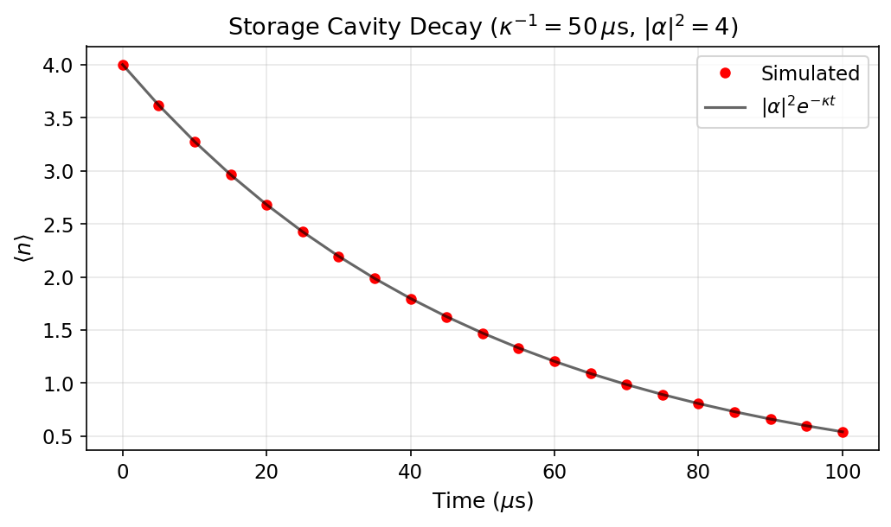

# Tutorial: Storage Cavity Dynamics — Coherent State Decay

Simulate the evolution of a coherent state in a lossy storage cavity and observe photon-number decay and Wigner-function deformation.

**Notebook:** `tutorials/16_storage_cavity_photon_decay.ipynb`

---

## Physics Background

A coherent state $|\alpha\rangle$ in a cavity with single-photon loss rate $\kappa$ evolves as:

$$\alpha(t) = \alpha_0\, e^{-\kappa t / 2}$$

The mean photon number decays exponentially:

$$\langle \hat{n}(t) \rangle = |\alpha_0|^2\, e^{-\kappa t}$$

While the coherent state remains coherent under pure loss, the Kerr self-interaction in a real cavity introduces amplitude-dependent phase rotation:

$$\hat{H}_\text{Kerr} = \frac{K}{2}\,\hat{a}^\dagger\hat{a}(\hat{a}^\dagger\hat{a} - 1)$$

This Kerr effect shears the Wigner function in phase space — the hallmark of a non-linear cavity.

---

## Code Example

```python
import numpy as np
from cqed_sim.core import (
    DispersiveTransmonCavityModel, FrameSpec,
    StatePreparationSpec, qubit_state, coherent_state, prepare_state,
)
from cqed_sim.sim import NoiseSpec, SimulationConfig, simulate_sequence
from cqed_sim.sequence import SequenceCompiler

model = DispersiveTransmonCavityModel(
    omega_c=2*np.pi*5e9, omega_q=2*np.pi*6e9,
    alpha=2*np.pi*(-220e6), chi=2*np.pi*(-2.5e6),
    kerr=2*np.pi*(-2e3), n_cav=12, n_tr=2,
)
frame = FrameSpec(omega_c_frame=model.omega_c, omega_q_frame=model.omega_q)

# Start in |g, α=2⟩
psi0 = prepare_state(model, StatePreparationSpec(
    qubit=qubit_state("g"), storage=coherent_state(alpha=2.0),
))
noise = NoiseSpec(kappa=2*np.pi*5e3)

# Simulate free decay over 50 µs
delays = np.linspace(0, 50e-6, 20)
nbar = []
for t in delays:
    compiled = SequenceCompiler(dt=2e-9).compile([], t_end=max(t, 4e-9))
    result = simulate_sequence(model, compiled, psi0, {},
                               config=SimulationConfig(frame=frame), noise=noise)
    rho_final = result.final_state
    a = model.a()
    nbar.append(float(np.real((a.dag() * a * rho_final).tr())))
```

---

## Results



The plot shows the mean photon number $\langle\hat{n}\rangle$ vs time for a cavity initially in $|\alpha = 2\rangle$ (4 photons). The solid curve is the theoretical $|\alpha_0|^2 e^{-\kappa t}$ decay; the dots are simulated points. The close agreement confirms that the Lindblad cavity loss model is correctly calibrated.

---

## Key Parameters

| Parameter | Symbol | Typical Value |
|---|---|---|
| Initial amplitude | $\alpha_0$ | 1–5 |
| Cavity loss rate | $\kappa/2\pi$ | 1–50 kHz |
| Cavity lifetime | $T_\text{cav} = 1/\kappa$ | 20–1000 $\mu$s |
| Kerr nonlinearity | $K/2\pi$ | 1–10 kHz |

---

## See Also

- [Open System Dynamics](open_system_dynamics.md) — qubit T1, Ramsey, echo
- [Observables & Visualization](observables_visualization.md) — Wigner functions
- [Minimal Dispersive Model](minimal_dispersive_model.md) — model construction
