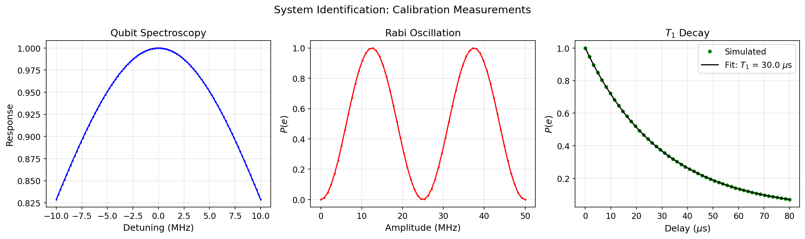

# System Identification & Domain Randomization

This tutorial set explains how `cqed_sim` connects calibration measurements to robust-control workflows. The emphasis is not on fitting in isolation but on the complete pipeline: experimental data → fitted model parameters → uncertainty distribution → domain-randomized controller training.

Notebooks:

- `tutorials/31_system_identification_and_domain_randomization/01_calibration_targets_and_fitting.ipynb`
- `tutorials/31_system_identification_and_domain_randomization/02_evidence_to_randomizer_and_env.ipynb`

---

## Physics Background

### What We Measure and Why

A real cQED experiment doesn't give us Hamiltonian parameters directly. Instead we observe indirect signatures:

| Measurement | Physical observable | Parameters constrained |
|---|---|---|
| **Qubit spectroscopy** | Lorentzian peak in $P(e)$ vs. frequency | $\omega_q$, linewidth $\Gamma_2 = 1/T_2^*$ |
| **Cavity spectroscopy** | Cavity transmission vs. frequency, dispersive shift from qubit state | $\omega_c$, $\chi$ |
| **Rabi chevron** | Oscillation of $P(e)$ vs. drive frequency and duration | Drive coupling, $\omega_q$, pulse calibration |
| **$T_1$ decay** | Exponential decay of $P(e)$ after $\pi$-pulse | Qubit energy relaxation rate $\Gamma_1 = 1/T_1$ |
| **Ramsey fringe** | Oscillation of $P(e)$ vs. free-evolution time | Qubit detuning, $T_2^* = 1/\Gamma_2^*$ |

Each measurement provides a likelihood $p(\text{data} | \theta)$ for the model parameters $\theta = (\omega_q, \omega_c, \chi, T_1, T_2, \ldots)$.

### Calibration Fitting as Bayesian Inference

System identification in `cqed_sim` is framed as a Bayesian inverse problem:

1. **Prior** — physical bounds on parameters (e.g., $\omega_q / 2\pi \in [4, 8]$ GHz)
2. **Likelihood** — the model prediction for each calibration trace given $\theta$
3. **Posterior** — the updated distribution over $\theta$ given the calibration data

In practice, the fitting uses maximum-a-posteriori (MAP) estimation or maximum-likelihood estimation (MLE) for each trace independently, then combines the fitted summaries into a joint uncertainty estimate.

### Why Uncertainty Quantification Matters

The fitted parameters have uncertainty arising from:

- **Finite measurement shots** — statistical noise in the measured probabilities
- **Spectral crowding** — nearby transitions that shift apparent peak positions
- **Drift** — slow time variation of device parameters between calibration runs
- **Model error** — the dispersive model is an approximation; higher-order corrections are always present

This uncertainty must be propagated into controller design. A controller trained on the nominal (best-fit) parameters will fail on a device whose actual parameters lie even slightly away from the nominal.

### Domain Randomization

**Domain randomization** addresses this by training the controller under a distribution of models. At each training episode, a new set of parameters $\theta \sim p(\theta | \text{data})$ is sampled from the calibration posterior and the controller is trained to perform well across all of them.

If the training distribution covers the actual device distribution, the learned policy transfers to the real hardware without fine-tuning. The width of the training distribution directly controls the robustness–performance tradeoff: wider distribution → more robust but lower peak performance.

---

## Included Notebooks

### `01_calibration_targets_and_fitting.ipynb`

This notebook generates synthetic spectroscopy, Rabi, Ramsey, and T1 targets, then re-fits the resulting traces with `cqed_sim.system_id`.

**What it teaches:**

- How `cqed_sim.calibration_targets` packages synthetic calibration traces
- How `fit_spectroscopy_trace(...)`, `fit_rabi_trace(...)`, `fit_ramsey_trace(...)`, and `fit_t1_trace(...)` recover the relevant physical summaries from those traces
- How to treat those fit outputs as inputs for later uncertainty-propagation stages

**Running calibration targets:**

```python
import numpy as np

from cqed_sim.calibration_targets import run_rabi, run_ramsey, run_spectroscopy, run_t1
from cqed_sim.system_id import (
    fit_rabi_trace,
    fit_ramsey_trace,
    fit_spectroscopy_trace,
    fit_t1_trace,
)

drive_frequencies = np.linspace(model.omega_q - 2.0e7, model.omega_q + 2.0e7, 401)
rabi_amplitudes = np.linspace(0.0, 2.0, 201)
delays = np.linspace(0.0, 60.0e-6, 201)

spectroscopy_target = run_spectroscopy(model, drive_frequencies)
rabi_target = run_rabi(model, rabi_amplitudes, duration=40.0e-9, omega_scale=2.0 * np.pi * 12.0e6)
ramsey_target = run_ramsey(model, delays, detuning=2.0 * np.pi * 0.6e6, t2_star=9.0e-6)
t1_target = run_t1(model, delays, t1=24.0e-6)

spectroscopy_fit = fit_spectroscopy_trace(
    spectroscopy_target.raw_data["drive_frequencies"],
    spectroscopy_target.raw_data["ground_response"],
)
rabi_fit = fit_rabi_trace(
    rabi_target.raw_data["amplitudes"],
    rabi_target.raw_data["excited_population"],
    duration=rabi_target.fitted_parameters["duration"],
)
ramsey_fit = fit_ramsey_trace(
    ramsey_target.raw_data["delays"],
    ramsey_target.raw_data["excited_population"],
)
t1_fit = fit_t1_trace(
    t1_target.raw_data["delays"],
    t1_target.raw_data["excited_population"],
)

print(f"Fitted omega_q: {spectroscopy_fit.fitted_parameters['omega_peak']:.3e}")
print(f"Fitted omega_scale: {rabi_fit.fitted_parameters['omega_scale']:.3e}")
print(f"Fitted delta_omega: {ramsey_fit.fitted_parameters['delta_omega']:.3e}")
print(f"Fitted T1: {t1_fit.fitted_parameters['t1']:.2e} s")
```

**Interpreting the fits:**

Each fit returns point estimates and uncertainty bounds in a `CalibrationResult`. The spectroscopy fit gives the dominant peak frequency and linewidth, the Rabi fit gives the effective drive scale, the Ramsey fit gives detuning plus `T2*`, and the T1 fit gives the energy-relaxation time.



---

### `02_evidence_to_randomizer_and_env.ipynb`

This notebook packages fitted summaries into `CalibrationEvidence`, converts them into a `DomainRandomizer`, and then mirrors the environment-wiring pattern used in `examples/calibration_systemid_rl_pipeline.py`.

**What it teaches:**

- How fitted calibration summaries become train-time randomization priors
- How `randomizer_from_calibration(...)` bridges the calibration and control subsystems
- How merged evidence blocks keep manual priors and fit-derived priors in one transport object

**Creating calibration evidence:**

```python
from cqed_sim import CalibrationEvidence, NormalPrior
from cqed_sim.system_id import evidence_from_fit, merge_calibration_evidence

evidence = merge_calibration_evidence(
    evidence_from_fit(
        spectroscopy_fit,
        category="model",
        parameter_map={"omega_peak": "omega_q"},
        bounds={"omega_q": (0.0, None)},
    ),
    evidence_from_fit(
        t1_fit,
        category="noise",
        bounds={"t1": (0.0, None)},
        min_sigma={"t1": 0.5e-6},
    ),
    CalibrationEvidence(
        model_posteriors={
            "chi": NormalPrior(mean=2.0 * np.pi * (-2.25e6), sigma=2.0 * np.pi * 0.08e6),
        },
    ),
)

print(sorted(evidence.model_posteriors.keys()))
```

**Converting to domain randomizer:**

```python
from cqed_sim.system_id import randomizer_from_calibration

randomizer = randomizer_from_calibration(evidence)

for param, prior in randomizer.model_priors_train.items():
    print(f"  model {param}: {prior}")
for param, prior in randomizer.noise_priors_train.items():
    print(f"  noise {param}: {prior}")
```

**Wiring into an RL environment:**

The full end-to-end environment wiring now lives in `examples/calibration_systemid_rl_pipeline.py`. That example shows the current `HybridEnvConfig` shape and demonstrates that `env.reset(...)` surfaces the sampled overrides under `info["randomization"]`.

---

## Why This Set Exists

Robust control should not be disconnected from calibration. If the device characterization changes, the uncertainty model used for controller training should change with it. These notebooks make that dependency explicit.

They also provide a stable workflow surface for understanding the repository's system-identification abstractions before moving on to policy training or more hardware-aware control studies.

---

## Related References

- [System Identification API](../api/system_id.md)
- [Calibration Targets API](../api/calibration_targets.md)
- [RL Hybrid Control](rl_hybrid_control.md) — using calibration priors in RL training
- [GRAPE Optimal Control](optimal_control.md) — deterministic optimal control without RL
