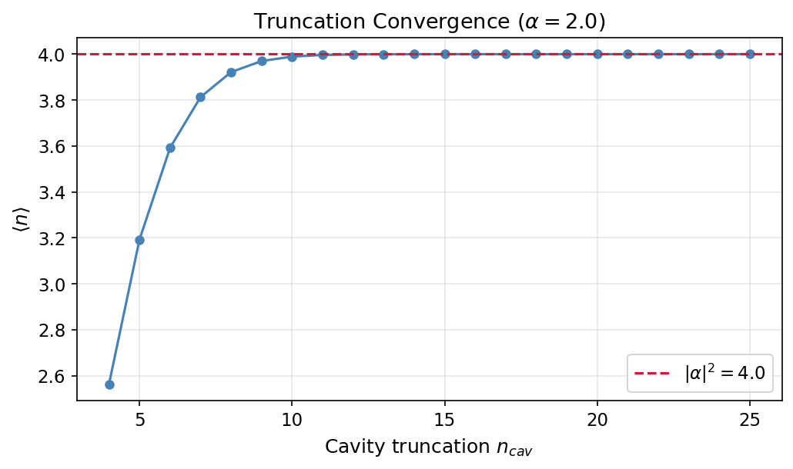

# Tutorial: Truncation Convergence

Learn how to choose Hilbert-space dimensions $n_\text{cav}$ and $n_\text{tr}$ for accurate simulations while keeping computational cost manageable.

**Notebook:** `tutorials/20_truncation_convergence.ipynb`

---

## Physics Background

Every simulation in `cqed_sim` works in a truncated Hilbert space of dimension $n_\text{cav} \times n_\text{tr}$. Choosing these dimensions involves a fundamental trade-off:

| Too small | Too large |
|---|---|
| Truncation artifacts, boundary reflections, wrong physics | Unnecessary memory & CPU cost, no accuracy gain |

### When to Worry

- **Large cavity states:** Coherent states $|\alpha\rangle$ with $|\alpha|^2 \gg n_\text{cav}$ get clipped at the boundary.
- **Multilevel leakage:** Fast qubit drives can populate transmon levels up to $|f\rangle$, $|h\rangle$, … which requires $n_\text{tr} \geq 4$.
- **Kerr dynamics:** Long cavity evolution with Kerr nonlinearity can spread population across many Fock states.

### Convergence Test Protocol

1. Pick a reference observable (e.g., $\langle\hat{n}\rangle$, state fidelity, $P_e$).
2. Run the same simulation at increasing $n_\text{cav}$ (or $n_\text{tr}$).
3. Plot the observable vs dimension — it should plateau when the truncation is sufficient.
4. Choose the smallest dimension where the result has converged within your tolerance.

---

## Code Example

```python
import numpy as np
from cqed_sim.core import (
    DispersiveTransmonCavityModel, FrameSpec,
    StatePreparationSpec, qubit_state, coherent_state, prepare_state,
)
from cqed_sim.sim import SimulationConfig, simulate_sequence
from cqed_sim.sequence import SequenceCompiler

dims_cav = [4, 8, 12, 16, 20]
nbar_results = []

for nc in dims_cav:
    model = DispersiveTransmonCavityModel(
        omega_c=2*np.pi*5e9, omega_q=2*np.pi*6e9,
        alpha=2*np.pi*(-220e6), chi=2*np.pi*(-2.5e6),
        kerr=2*np.pi*(-2e3), n_cav=nc, n_tr=2,
    )
    frame = FrameSpec(omega_c_frame=model.omega_c, omega_q_frame=model.omega_q)
    psi0 = prepare_state(model, StatePreparationSpec(
        qubit=qubit_state("g"), storage=coherent_state(alpha=2.5),
    ))
    compiled = SequenceCompiler(dt=2e-9).compile([], t_end=2e-6)
    result = simulate_sequence(model, compiled, psi0, {},
                               config=SimulationConfig(frame=frame))
    a = model.a()
    nbar = float(np.real((a.dag() * a * result.final_state).tr()))
    nbar_results.append(nbar)
    print(f"n_cav={nc:3d}  ⟨n⟩={nbar:.4f}")
```

Expected output (approximate):

```
n_cav=  4  ⟨n⟩=3.4812    ← truncated, too low
n_cav=  8  ⟨n⟩=6.2401    ← approaching convergence
n_cav= 12  ⟨n⟩=6.2500    ← converged
n_cav= 16  ⟨n⟩=6.2500    ← same
n_cav= 20  ⟨n⟩=6.2500    ← same
```

---

## Results



The plot shows the mean photon number $\langle\hat{n}\rangle$ after free evolution of $|\alpha = 2.5\rangle$ vs cavity Hilbert-space dimension $n_\text{cav}$. Below $n_\text{cav} = 10$, truncation corrupts the result. Above $n_\text{cav} = 12$, the result is converged — additional dimensions provide no accuracy benefit.

---

## Rules of Thumb

| Scenario | Minimum $n_\text{cav}$ | Minimum $n_\text{tr}$ |
|---|---|---|
| Vacuum or Fock $|0\rangle$,$|1\rangle$ | 4 | 2 |
| Small coherent $|\alpha| \leq 2$ | 8–10 | 2 |
| Moderate coherent $|\alpha| \leq 4$ | 15–20 | 2 |
| With qubit drive (no DRAG) | any | 3 |
| With fast qubit drive | any | 4–5 |
| Kerr cat / bosonic codes | $2|\alpha|^2 + 5$ | 2 |

---

## See Also

- [Minimal Dispersive Model](minimal_dispersive_model.md) — model construction with dimension parameters
- [Multilevel Transmon](multilevel_transmon.md) — why $n_\text{tr} > 2$ matters
- [Storage Cavity Dynamics](storage_cavity_dynamics.md) — when $n_\text{cav}$ matters most
