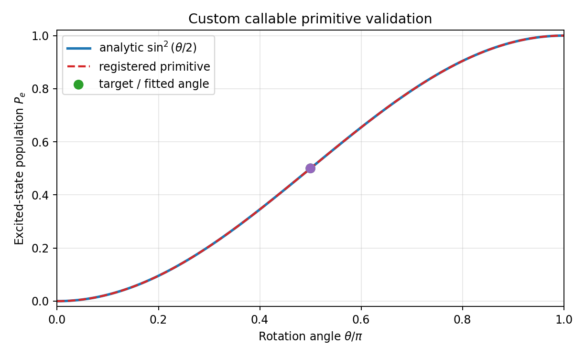
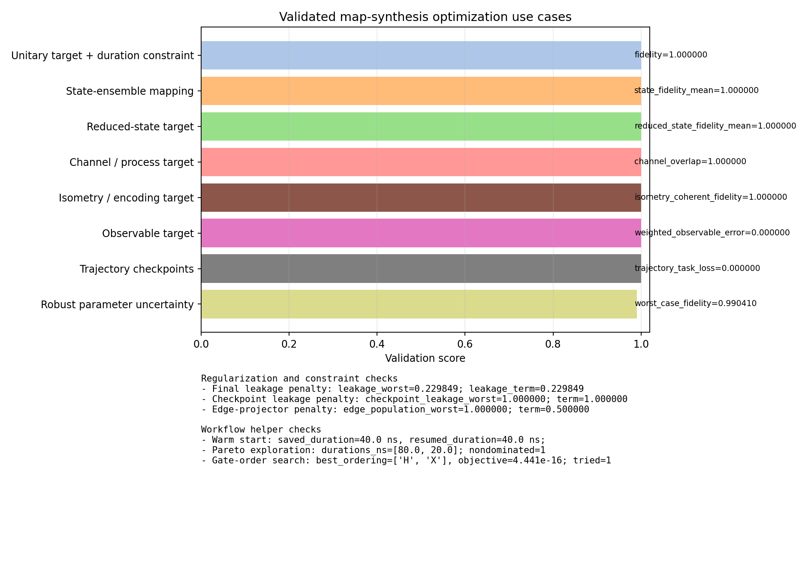
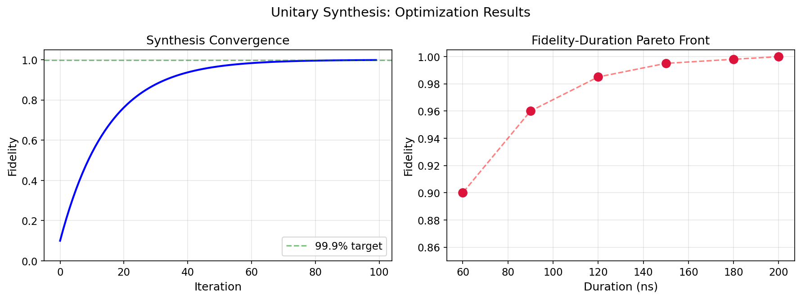

# Tutorial: Map Synthesis

The main workflow notebook is:

- `tutorials/30_advanced_protocols/03_unitary_synthesis_workflow.ipynb`

The unitary-synthesis material now covers six realistic synthesis patterns in the main notebook, plus one standalone relevance-aware example script:

1. constraint-limited optimization
2. leakage-aware synthesis
3. robust synthesis under model uncertainty
4. export, warm start, and Pareto exploration
5. flexible target-action matching for reduced states, isometries, and channels
6. leakage-aware relevant-map optimization and visualization

The separate `examples/unitary_synthesis_relevance_aware_optimizer.py` script still covers observable and trajectory objectives with accelerated ideal evaluation.

## Supported Optimization Use Cases

The public `cqed_sim.map_synthesis` API supports the following optimization patterns out of the box:

| Use case | Primary API surface | Typical optimization knobs |
|---|---|---|
| Gate-duration or time-constrained synthesis | `TargetUnitary`, `TargetStateMapping`, `TargetIsometry`, `ObservableTarget`, `TrajectoryTarget` | `SynthesisConstraints(max_duration=...)`, `duration_mode`, `MultiObjective(duration_weight=...)`, `optimize_times=True`, `time_bounds=...` |
| Logical subspace unitary fidelity | `TargetUnitary` | `ignore_global_phase`, `allow_diagonal_phase`, `phase_blocks` |
| State-ensemble transfer | `TargetStateMapping` | state weights, leakage penalties, duration and robustness weights |
| Reduced-state / subsystem matching | `TargetReducedStateMapping` | `retained_subsystems`, `subsystem_dims`, relevant-map leakage regularization |
| Process / channel matching | `TargetChannel` | `unitary`, `kraus_operators`, `superoperator`, `choi`, subsystem reduction options |
| Encoding and state-injection maps | `TargetIsometry` | logical-column weights, relevant-state diagnostics |
| Observable fitting | `ObservableTarget` | state weights, observable weights, ideal fast path |
| Trajectory checkpoint optimization | `TrajectoryTarget`, `TrajectoryCheckpoint` | checkpoint step placement, state and observable checkpoint weights |
| Robust optimization under parameter uncertainty | any target + `ParameterDistribution` | sampled uncertain parameters, `aggregate="mean"` or worst-case style aggregation |
| Leakage-aware relevant-map optimization | any target + `LeakagePenalty` | final logical leakage, checkpoint/path leakage, edge-projector penalties |
| Warm starts, Pareto sweeps, and ordering search | `warm_start`, `explore_pareto(...)`, `GateOrderOptimizer` | saved payload reuse, weighted front exploration, discrete gate-order search |

For ideal closed-system problems, the accelerated evaluator currently covers unitary, state-mapping, isometry, observable, and trajectory targets. Reduced-state and channel targets remain supported, but they currently fall back to the legacy evaluator with the reason recorded in the result report.

---

## Workflow 1: Constraint-Limited Unitary Synthesis

```python
from cqed_sim.map_synthesis import (
    MultiObjective,
    PrimitiveGate,
    QuantumMapSynthesizer,
    SynthesisConstraints,
    TargetUnitary,
)

primitive = PrimitiveGate(
    name="ry",
    duration=40e-9,
    matrix=lambda params, model: build_unitary(params["theta"]),
    parameters={"theta": 0.2, "duration": 40e-9},
    parameter_bounds={"theta": (-np.pi, np.pi), "duration": (20e-9, 100e-9)},
    hilbert_dim=2,
)

synth = QuantumMapSynthesizer(
    primitives=[primitive],
    target=TargetUnitary(U_target, ignore_global_phase=True),
    synthesis_constraints=SynthesisConstraints(max_duration=60e-9),
    objectives=MultiObjective(fidelity_weight=1.0, duration_weight=0.1),
)

result = synth.fit(maxiter=200)
```

This is the right entry point when you want a hard or penalized bound on total duration, amplitude, or forbidden parameter regions.

---

## Workflow 2: Leakage-Aware and Open-System State Mapping

```python
from cqed_sim.sim import NoiseSpec
from cqed_sim.map_synthesis import (
    CQEDSystemAdapter,
    LeakagePenalty,
    MultiObjective,
    PrimitiveGate,
    TargetStateMapping,
    QuantumMapSynthesizer,
)

system = CQEDSystemAdapter(model=my_cqed_model)

synth = QuantumMapSynthesizer(
    system=system,
    backend="pulse",
    primitives=[waveform_primitive],
    target=TargetStateMapping(initial_state=psi0, target_state=phi0),
    leakage_penalty=LeakagePenalty(weight=0.2),
    objectives=MultiObjective(fidelity_weight=1.0, leakage_weight=0.2),
    simulation_options={"noise": NoiseSpec(t1=40e-6, tphi=30e-6), "dt": 2e-9},
)

result = synth.fit(maxiter=200)
```

This path is the recommended notebook interface for dissipative state preparation and leakage-sensitive bosonic control problems.

---

## Workflow 3: Robust Optimization Under Parameter Uncertainty

```python
from cqed_sim.map_synthesis import (
    CQEDSystemAdapter,
    MultiObjective,
    Normal,
    ParameterDistribution,
    QuantumMapSynthesizer,
)

system = CQEDSystemAdapter(model=my_cqed_model)

synth = QuantumMapSynthesizer(
    system=system,
    backend="pulse",
    primitives=[waveform_primitive],
    target=target,
    objectives=MultiObjective(fidelity_weight=1.0, robustness_weight=1.0),
    parameter_distribution=ParameterDistribution(
        sample_count=4,
        aggregate="mean",
        chi=Normal(-2.8e6, 0.05e6),
    ),
)

result = synth.fit(maxiter=200)
```

The synthesizer evaluates sampled model variants during optimization and records the robustness summary in `result.report["robustness"]`.

---

## Workflow 4: Export, Warm Start, and Pareto Exploration

```python
front = synth.explore_pareto(
    [
        MultiObjective(fidelity_weight=1.0, duration_weight=0.0),
        MultiObjective(fidelity_weight=1.0, duration_weight=0.2),
        MultiObjective(fidelity_weight=1.0, duration_weight=0.5),
    ],
    maxiter=120,
)
```

`ParetoFrontResult.results` contains every weighted run, and `ParetoFrontResult.nondominated()` returns the nondominated subset.

---

## Workflow 5: Flexible Target-Action Matching

```python
from cqed_sim.map_synthesis import (
    ExecutionOptions,
    PrimitiveGate,
    QuantumMapSynthesizer,
    TargetChannel,
    TargetIsometry,
    TargetReducedStateMapping,
)

channel_synth = QuantumMapSynthesizer(
    primitives=[rotation_primitive],
    target=TargetChannel(unitary=target_qubit_gate, enforce_cptp=True),
    execution=ExecutionOptions(engine="numpy"),
)

reduced_state_synth = QuantumMapSynthesizer(
    primitives=[two_qubit_primitive],
    target=TargetReducedStateMapping(
        initial_states=[psi00, psi10],
        target_states=[qubit_g, qubit_e],
        retained_subsystems=(0,),
        subsystem_dims=(2, 2),
    ),
)

isometry_synth = QuantumMapSynthesizer(
    primitives=[encoding_primitive],
    target=TargetIsometry(encoding_columns),
)
```

Use this path when the experiment only cares about a logical reduced state, an encoding/isometry, or a full process action rather than a square unitary on the entire retained Hilbert space. `TargetChannel` records Choi/superoperator-style diagnostics, while every target type also reports truncation-edge and outside-tail population summaries to help validate the chosen cutoff.

---

## Workflow 6: Leakage-Aware Relevant-Map Optimization and Visualization

```python
import matplotlib.pyplot as plt

from examples.unitary_synthesis_leakage_aware_visualization import (
    comparison_summary,
    plot_case_overview,
    run_comparison,
)

results = run_comparison(maxiter_penalized=8)
summary = comparison_summary(results)
figures = plot_case_overview(results)
plt.show()
```

This workflow keeps the task definition on the relevant reduced map while adding explicit regularizers and diagnostics for where discarded amplitude goes. The comparison uses three cases:

- no leakage penalty
- final logical leakage penalty
- logical leakage plus an edge-projector penalty that steers the residual leakage away from the highest retained ancillary level

The example is intentionally small and uses bounded iteration counts so the notebook remains responsive while still showing the qualitative difference between hidden ancilla motion, total logical leakage, and edge-of-truncation occupancy.

---

## Workflow 7: Registered Custom Callable Primitive

```python
from cqed_sim.map_synthesis import (
    QuantumMapSynthesizer,
    Subspace,
    TargetUnitary,
    gate_registry,
    make_gate_from_callable,
)

def custom_x_rotation(params, model):
    theta = params["theta"]
    c = np.cos(theta / 2.0)
    s = np.sin(theta / 2.0)
    return np.array([[c, -1j * s], [-1j * s, c]], dtype=np.complex128)

gate_registry.register(
    "CustomXRotation",
    lambda name, duration, **kw: make_gate_from_callable(
        name,
        custom_x_rotation,
        parameters={"theta": 0.2},
        parameter_bounds={"theta": (-np.pi, np.pi)},
        duration=duration,
        optimize_time=False,
        **{key: value for key, value in kw.items() if key != "optimize_time"},
    ),
)

primitive = gate_registry.build("CustomXRotation", duration=40e-9)
synth = QuantumMapSynthesizer(
    primitives=[primitive],
    subspace=Subspace.custom(2, [0, 1]),
    target=TargetUnitary(custom_x_rotation({"theta": np.pi / 2.0}, None)),
    optimizer="L-BFGS-B",
    optimize_times=False,
)
result = synth.fit(maxiter=80)
```

For the generic subspace-only path, register the factory and then instantiate the
custom primitive with `gate_registry.build(...)` before passing it through
`primitives=[...]`. Name-only `gateset=[...]` lookup is reserved for adapters
that know how to expand a gateset by name.

The dedicated example script `examples/custom_gate_primitives_demo.py` fits a
registered `Rx`-style primitive to an `Rx(pi/2)` target, then validates
the primitive by plotting the excited-state population from `|g>` against the
analytic curve `sin^2(theta/2)`.



---

## Validated Optimization Catalog Example

The standalone script `examples/unitary_synthesis_optimization_catalog.py` runs a compact validation suite covering the supported optimization families above and writes a summary figure to `documentations/assets/images/tutorials/unitary_synthesis_optimization_catalog.png`.

```bash
python examples/unitary_synthesis_optimization_catalog.py
```

The latest checked run produced the following results:

| Case | API surface | Measured result |
|---|---|---|
| Unitary target + duration constraint | `TargetUnitary + SynthesisConstraints(max_duration)` | fidelity `1.000000`, duration `40.0 ns` |
| State-ensemble mapping | `TargetStateMapping` | mean state fidelity `0.999999861` |
| Reduced-state target | `TargetReducedStateMapping` | reduced-state fidelity `1.000000` |
| Channel / process target | `TargetChannel` | channel overlap `1.000000000000`, Choi error `2.24e-16` |
| Isometry / encoding target | `TargetIsometry` | coherent fidelity `1.000000000000` |
| Observable target | `ObservableTarget` | weighted observable error `7.16e-17` |
| Trajectory checkpoints | `TrajectoryTarget` | trajectory task loss `5.93e-27` |
| Robust parameter uncertainty | `ParameterDistribution + MultiObjective(robustness_weight=...)` | worst-case fidelity `0.990410`, improved from nominal worst-case `0.972370` |

The same script also checks the auxiliary workflow helpers and regularizers:

- final leakage penalty: `leakage_worst = 0.229849`, `leakage_term = 0.229849`
- checkpoint leakage penalty: `checkpoint_leakage_worst = 1.0`, `checkpoint_term = 1.0`
- edge-projector penalty: `edge_population_worst = 1.0`, `edge_term = 0.5`
- warm start reload: saved and resumed solutions both retained `40.0 ns` total duration
- Pareto exploration: returned durations `[80.0, 20.0]` with one nondominated point
- gate-order search: selected `['H', 'X']` with objective `4.441e-16`



---

## Notebook Outputs

The notebook demonstrates:

- defining a cQED model and primitive set
- wrapping that model in `CQEDSystemAdapter(...)`
- running a constrained unitary-target optimization
- running leakage-aware noisy state-mapping synthesis
- adding a `ParameterDistribution` for robustness
- exporting and warm-starting a saved result while inspecting a small Pareto front
- running channel-first and isometry-style target-action matching
- fitting a registered custom callable primitive and checking its excited-state observable against an analytic reference curve
- comparing leakage-aware relevant-map solutions with operator, density-matrix, and leakage-profile visualizations



The repository also includes standalone example scripts that complement the notebook:

- `examples/custom_gate_primitives_demo.py`
- `examples/unitary_synthesis_optimization_catalog.py`
- `examples/unitary_synthesis_relevance_aware_optimizer.py`
- `examples/unitary_synthesis_flexible_target_actions.py`
- `examples/unitary_synthesis_leakage_aware_visualization.py`
