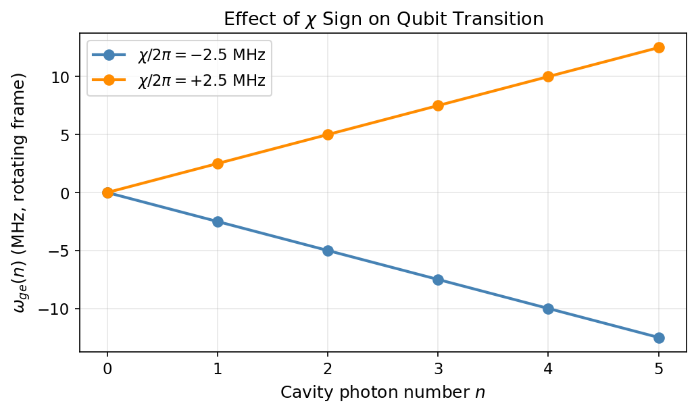

# Tutorial: Units, Frames & Conventions

Verify the three core conventions used throughout `cqed_sim`: angular-frequency units, rotating-frame interpretation, and carrier-sign convention.

**Notebook:** `tutorials/02_units_frames_and_conventions.ipynb`

---

## Physics Background

### Convention Summary

| Convention | Rule |
|---|---|
| Internal frequencies | Angular frequency $\omega$ in rad/s |
| Time | Seconds |
| Rotating frame | Defined by `FrameSpec(omega_c_frame, omega_q_frame)` |
| Pulse carrier | Negative of the rotating-frame transition frequency |
| Dispersive shift $\chi$ | Negative $\chi$ lowers qubit frequency with photon number |

### The $\chi$ Sign Convention

With $\chi < 0$ (the standard transmon-cavity convention), the qubit transition frequency **decreases** as cavity photon number grows:

$$\omega_{ge}(n) = \omega_{ge}(0) + n\chi, \qquad \chi < 0$$

With $\chi > 0$ (which can arise in certain coupling configurations), the qubit frequency **increases** with photon number.

### Carrier Sign Convention

A drive pulse targeting a transition at angular frequency $\omega_{\text{trans}}$ in the rotating frame uses:

$$\text{carrier} = -\omega_{\text{trans}}$$

For on-resonance qubit drives in a matched rotating frame ($\omega_q^{\text{frame}} = \omega_q$), the residual transition frequency is zero, so `carrier = 0`.

---

## Verifying the $\chi$ Sign

```python
import numpy as np
from cqed_sim.core import DispersiveTransmonCavityModel, FrameSpec, manifold_transition_frequency

# Negative chi: qubit frequency decreases with n
model_neg = DispersiveTransmonCavityModel(
    omega_c=2*np.pi*5e9, omega_q=2*np.pi*6e9,
    alpha=2*np.pi*(-220e6), chi=2*np.pi*(-2.5e6),
    kerr=2*np.pi*(-2e3), n_cav=8, n_tr=2,
)

# Positive chi: qubit frequency increases with n
model_pos = DispersiveTransmonCavityModel(
    omega_c=2*np.pi*5e9, omega_q=2*np.pi*6e9,
    alpha=2*np.pi*(-220e6), chi=2*np.pi*(+2.5e6),
    kerr=2*np.pi*(-2e3), n_cav=8, n_tr=2,
)

frame = FrameSpec(omega_c_frame=2*np.pi*5e9, omega_q_frame=2*np.pi*6e9)

for model, label in [(model_neg, "χ < 0"), (model_pos, "χ > 0")]:
    print(f"\n{label}:")
    for n in range(4):
        wge = manifold_transition_frequency(model, n=n, frame=frame)
        print(f"  n={n}: ω_ge = {wge/(2*np.pi*1e6):+.2f} MHz")
```

---

## Results



The plot shows the qubit transition frequency as a function of cavity photon number for both $\chi$ signs:

- **Blue ($\chi/2\pi = -2.5$ MHz):** The qubit frequency **decreases** by 2.5 MHz per photon — the standard transmon convention.
- **Orange ($\chi/2\pi = +2.5$ MHz):** The qubit frequency **increases** by 2.5 MHz per photon — the reversed case.

This directly validates the dispersive shift sign convention used throughout the library.

---

## Key Conventions

!!! warning "Common Mistakes"
    - Confusing $f$ (Hz) with $\omega$ (rad/s) — all internal frequencies use rad/s
    - Setting carrier to $+\omega_{\text{trans}}$ instead of $-\omega_{\text{trans}}$
    - Assuming $\chi > 0$ when the transmon convention gives $\chi < 0$

See [Frame Sanity Checks](frame_sanity_checks.md) for a tutorial on debugging convention errors.

---

## See Also

- [Minimal Dispersive Model](minimal_dispersive_model.md) — first model construction
- [Dispersive Shift & Dressed Frequencies](dispersive_shift_dressed.md) — connecting $\chi$ to the spectrum
- [Frame Sanity Checks](frame_sanity_checks.md) — debugging common convention mistakes
- [Physics & Conventions](../physics_conventions.md) — full reference
