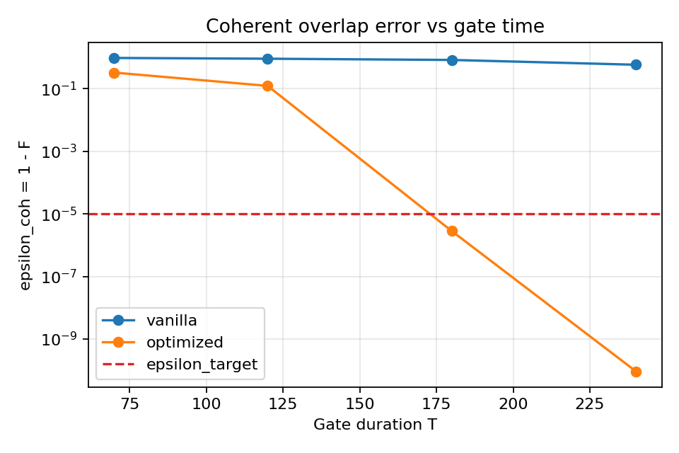
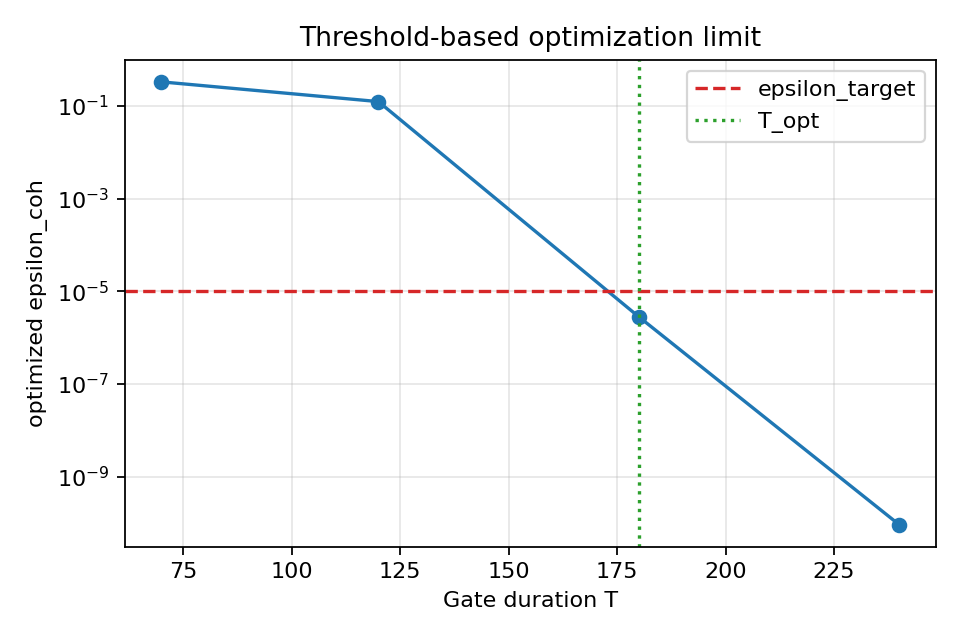
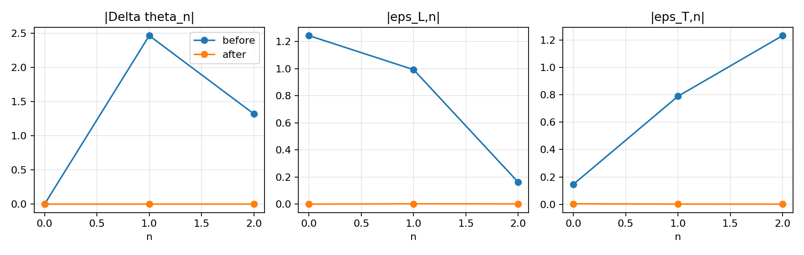
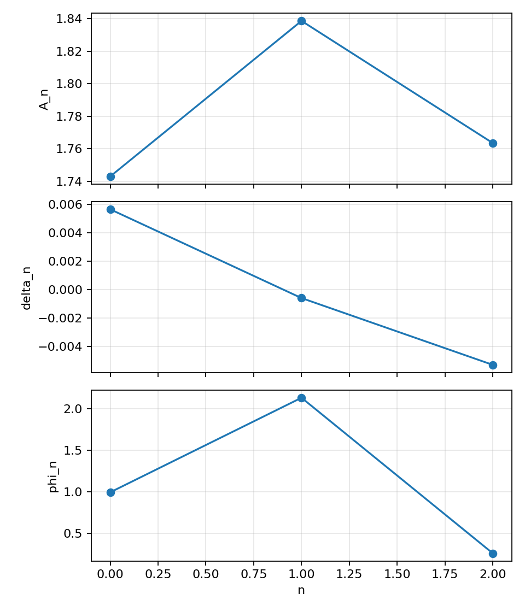
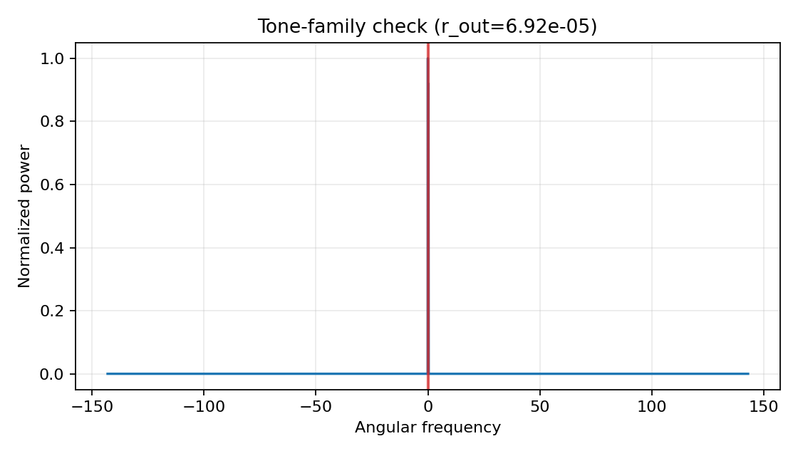
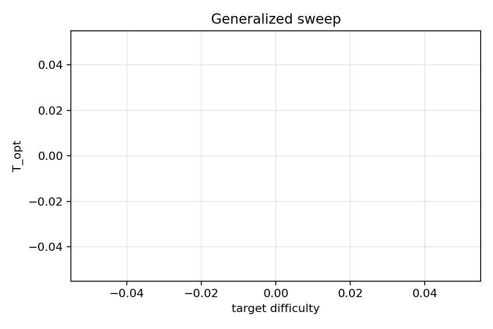
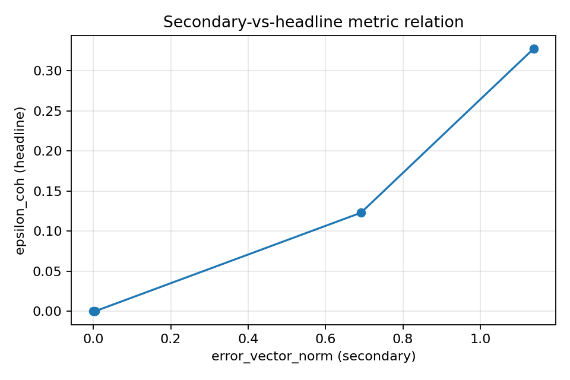

# Reproduction Report: Landgraf et al. (PRL 133, 260802)

## Executive Summary
- Headline metric uses supplement definition: `F in [0,1]`, `epsilon_coh = 1 - F in [0,1]`.
- Baseline `T_opt` (threshold-based): `180.0` with `epsilon_target=1e-05`.
- Spectrum leakage ratio: `r_out=6.919e-05` (threshold `1.0e-03`).
- Metric boundedness checks passed: `True`.

## What Was Wrong Before
- The previous report used an unbounded surrogate (`sqrt(mean(dtheta^2 + dlambda^2 + dalpha^2))`) as the headline coherent error.
- That surrogate can exceed 1 and is not the paper's primary performance metric.
- This invalidated direct claims about "numerical zero coherent error" and optimization-limit detection.
- Fix applied: bounded mean-squared-overlap fidelity from the supplement, with fail-fast invariant checks.

## Paper Metric Definitions (Main + Supplement)
- Supplement fidelity definition quote: `F = avg_{||c||=1} <psi_target(c)| rho_out(c) |psi_target(c)>`.
- Coherent headline error in this report: `epsilon_coh = 1 - F`.
- Main-text coherent-state parameterization implemented:
  - `|psi_out(c)> = sum_n c_n ( sqrt(1-|eps_n|^2/4) e^{i(theta_n+Delta theta_n)} |e n> - (eps_n/2)|g n> )`
  - `eps_n = (eps_n^(L) + i eps_n^(T)) e^{i Delta theta_n}`

## Paper-to-Code Mapping
| Paper symbol | Code | Notes |
|---|---|---|
| `F` | `CoherentMetricResult.fidelity` | bounded primary metric |
| `epsilon_coh` | `1 - fidelity` | bounded headline error |
| `Delta theta_n` | `CoherentMetricResult.dtheta[n]` | phase component |
| `epsilon_n^(L)` | `CoherentMetricResult.eps_l[n]` | longitudinal component |
| `epsilon_n^(T)` | `CoherentMetricResult.eps_t[n]` | transversal component |
| `Delta lambda_n` | optimizer amplitude update | mapped with `base_amp` scaling |
| `Delta omega_n` | optimizer detuning update | `pi*eps_t/(2T)` |
| `Delta alpha_n` | optimizer phase update | `-Delta theta_n` |

## Optimization Limit Definition
- Definition used: `T_opt = min { T : epsilon_coh(T) < epsilon_target within iteration_cap }`.
- `epsilon_target = 1e-05`.
- `iteration_cap = 60`.

## Threshold Evidence (Below vs Above T_opt)
- Below `T_opt` (`T=120.0`): `epsilon_coh=1.2308e-01`, hit=`False`.
- At/above `T_opt` (`T=180.0`): `epsilon_coh=2.8117e-06`, hit=`True`.
- Max component below: `7.6888e-01`; above: `4.0303e-03`.

## Per-Manifold Diagnostics at T_opt
| n | |Delta theta_n| | |Delta lambda_n| | |Delta alpha_n| | overlap_n |
|---:|---:|---:|---:|---:|
| 0 | 0.0000e+00 | 3.2255e-04 | 4.0303e-03 | 0.999996 |
| 1 | 3.0927e-04 | 2.5371e-03 | 1.8805e-03 | 0.999998 |
| 2 | 8.9447e-04 | 1.9330e-03 | 1.5640e-03 | 0.999998 |

## Reproduction Plots

## Baseline Table
| T | epsilon_vanilla | epsilon_optimized | F_optimized | threshold_hit |
|---:|---:|---:|---:|:---:|
| 70.0 | 9.6214e-01 | 3.2787e-01 | 0.672134 | False |
| 120.0 | 9.0940e-01 | 1.2308e-01 | 0.876917 | False |
| 180.0 | 8.3055e-01 | 2.8117e-06 | 0.999997 | True |
| 240.0 | 5.8371e-01 | 9.2395e-11 | 1.000000 | True |

## Paper-Comparison Metric
- RMSE against digitized paper curve is not reported because no official numeric trace was available locally.
- This report therefore compares qualitative trends and threshold behavior (vanilla decay vs optimized threshold crossing).

## FFT Leakage Details
- `r_out = 6.919e-05`
- `df (Hz-equivalent in simulation units) = 5.5556e-03`
- `n_bins = 8192`
- neighborhood rule: `+/-2 FFT bins around each allowed tone and mirror (Hann-window main-lobe capture)`

## Secondary Diagnostic (Not Paper Headline Metric)
- `error_vector_norm` is retained as a secondary diagnostic only.
- Relationship to headline metric is shown in `error_norm_vs_epsilon.png`.

## Convergence Check
- coarse dt epsilon: `2.811749e-06`
- fine dt epsilon: `1.331982e-04`
- coarse dt fidelity: `0.999997`
- fine dt fidelity: `0.999867`
- relative fidelity difference: `1.304e-04`

## Citations
- J. Landgraf et al., Phys. Rev. Lett. 133, 260802 (2024), DOI: 10.1103/PhysRevLett.133.260802.
- arXiv:2310.10498.
- APS supplemental material (metric and geometric decomposition definitions).
