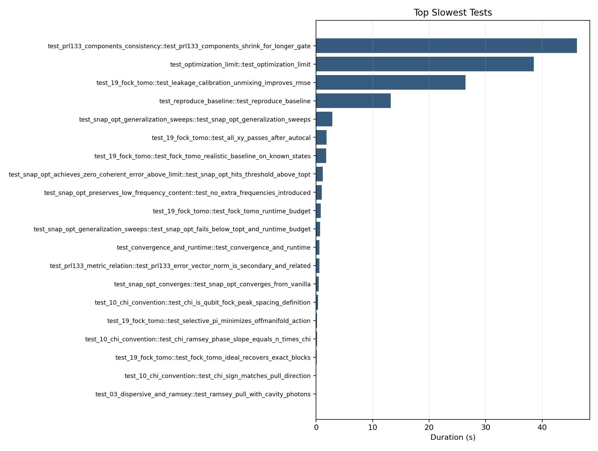
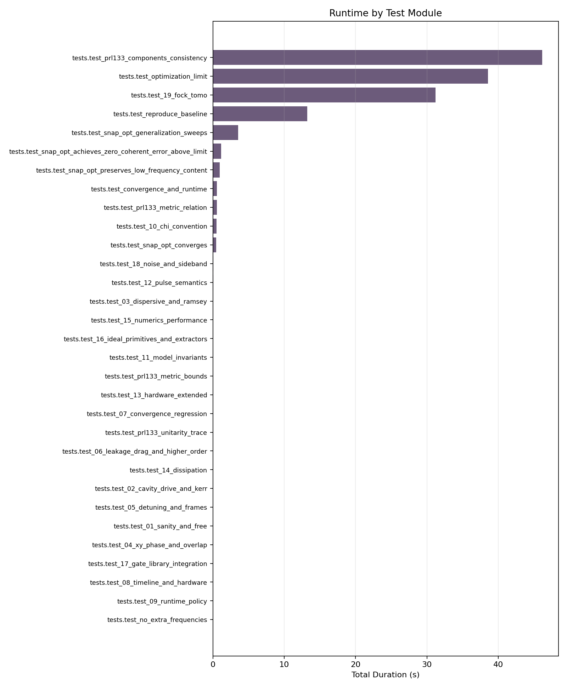
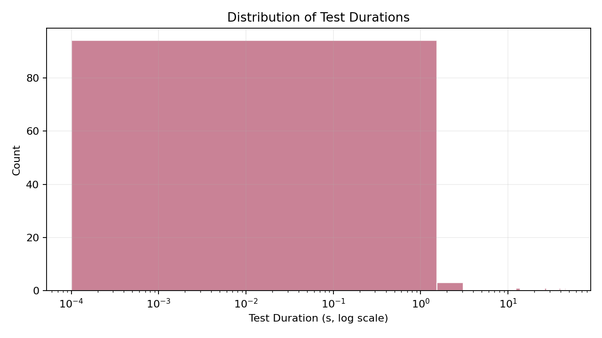

# Test Execution Report

## Run Metadata
- Generated: `2026-03-01T14:23:26-06:00`
- Pytest timestamp: `2026-03-01T14:20:08.651665-06:00`
- Hostname: `ChocolateApples`
- Command: `python -m pytest -q --junitxml outputs/test_results.xml`

## Overall Summary
| Metric | Value |
|---|---:|
| Total tests | 101 |
| Passed | 101 |
| Failed | 0 |
| Errors | 0 |
| Skipped | 0 |
| Pass rate | 100.00% |
| Suite runtime (pytest reported) | 138.136 s |
| Sum of testcase durations | 137.360 s |

## Runtime Statistics
| Statistic | Value (s) |
|---|---:|
| Mean | 1.3600 |
| Median | 0.0040 |
| p90 | 0.7060 |
| p95 | 1.8450 |
| p99 | 38.5390 |
| Min | 0.0000 |
| Max | 46.1250 |

## Slowest Tests
| Rank | Test | Duration (s) | Share of suite (%) |
|---:|---|---:|---:|
| 1 | `tests.test_prl133_components_consistency::test_prl133_components_shrink_for_longer_gate` | 46.125 | 33.39 |
| 2 | `tests.test_optimization_limit::test_optimization_limit` | 38.539 | 27.90 |
| 3 | `tests.test_19_fock_tomo::test_leakage_calibration_unmixing_improves_rmse` | 26.441 | 19.14 |
| 4 | `tests.test_reproduce_baseline::test_reproduce_baseline` | 13.219 | 9.57 |
| 5 | `tests.test_snap_opt_generalization_sweeps::test_snap_opt_generalization_sweeps` | 2.842 | 2.06 |
| 6 | `tests.test_19_fock_tomo::test_all_xy_passes_after_autocal` | 1.845 | 1.34 |
| 7 | `tests.test_19_fock_tomo::test_fock_tomo_realistic_baseline_on_known_states` | 1.794 | 1.30 |
| 8 | `tests.test_snap_opt_achieves_zero_coherent_error_above_limit::test_snap_opt_hits_threshold_above_topt` | 1.159 | 0.84 |
| 9 | `tests.test_snap_opt_preserves_low_frequency_content::test_no_extra_frequencies_introduced` | 0.979 | 0.71 |
| 10 | `tests.test_19_fock_tomo::test_fock_tomo_runtime_budget` | 0.841 | 0.61 |
| 11 | `tests.test_snap_opt_generalization_sweeps::test_snap_opt_fails_below_topt_and_runtime_budget` | 0.706 | 0.51 |
| 12 | `tests.test_convergence_and_runtime::test_convergence_and_runtime` | 0.583 | 0.42 |
| 13 | `tests.test_prl133_metric_relation::test_prl133_error_vector_norm_is_secondary_and_related` | 0.554 | 0.40 |
| 14 | `tests.test_snap_opt_converges::test_snap_opt_converges_from_vanilla` | 0.453 | 0.33 |
| 15 | `tests.test_10_chi_convention::test_chi_is_qubit_fock_peak_spacing_definition` | 0.320 | 0.23 |
| 16 | `tests.test_19_fock_tomo::test_selective_pi_minimizes_offmanifold_action` | 0.168 | 0.12 |
| 17 | `tests.test_10_chi_convention::test_chi_ramsey_phase_slope_equals_n_times_chi` | 0.149 | 0.11 |
| 18 | `tests.test_19_fock_tomo::test_fock_tomo_ideal_recovers_exact_blocks` | 0.103 | 0.07 |
| 19 | `tests.test_10_chi_convention::test_chi_sign_matches_pull_direction` | 0.065 | 0.05 |
| 20 | `tests.test_03_dispersive_and_ramsey::test_ramsey_pull_with_cavity_photons` | 0.042 | 0.03 |

## Runtime by Module
| Rank | Module | Tests | Duration (s) | Failed | Errors | Skipped |
|---:|---|---:|---:|---:|---:|---:|
| 1 | `tests.test_prl133_components_consistency` | 1 | 46.125 | 0 | 0 | 0 |
| 2 | `tests.test_optimization_limit` | 1 | 38.539 | 0 | 0 | 0 |
| 3 | `tests.test_19_fock_tomo` | 7 | 31.192 | 0 | 0 | 0 |
| 4 | `tests.test_reproduce_baseline` | 1 | 13.219 | 0 | 0 | 0 |
| 5 | `tests.test_snap_opt_generalization_sweeps` | 2 | 3.548 | 0 | 0 | 0 |
| 6 | `tests.test_snap_opt_achieves_zero_coherent_error_above_limit` | 1 | 1.159 | 0 | 0 | 0 |
| 7 | `tests.test_snap_opt_preserves_low_frequency_content` | 1 | 0.979 | 0 | 0 | 0 |
| 8 | `tests.test_convergence_and_runtime` | 1 | 0.583 | 0 | 0 | 0 |
| 9 | `tests.test_prl133_metric_relation` | 1 | 0.554 | 0 | 0 | 0 |
| 10 | `tests.test_10_chi_convention` | 4 | 0.536 | 0 | 0 | 0 |
| 11 | `tests.test_snap_opt_converges` | 1 | 0.453 | 0 | 0 | 0 |
| 12 | `tests.test_18_noise_and_sideband` | 10 | 0.096 | 0 | 0 | 0 |
| 13 | `tests.test_12_pulse_semantics` | 7 | 0.065 | 0 | 0 | 0 |
| 14 | `tests.test_03_dispersive_and_ramsey` | 2 | 0.046 | 0 | 0 | 0 |
| 15 | `tests.test_15_numerics_performance` | 3 | 0.032 | 0 | 0 | 0 |
| 16 | `tests.test_16_ideal_primitives_and_extractors` | 20 | 0.027 | 0 | 0 | 0 |
| 17 | `tests.test_11_model_invariants` | 5 | 0.027 | 0 | 0 | 0 |
| 18 | `tests.test_prl133_metric_bounds` | 2 | 0.026 | 0 | 0 | 0 |
| 19 | `tests.test_13_hardware_extended` | 6 | 0.025 | 0 | 0 | 0 |
| 20 | `tests.test_07_convergence_regression` | 1 | 0.021 | 0 | 0 | 0 |
| 21 | `tests.test_prl133_unitarity_trace` | 1 | 0.018 | 0 | 0 | 0 |
| 22 | `tests.test_06_leakage_drag_and_higher_order` | 2 | 0.016 | 0 | 0 | 0 |
| 23 | `tests.test_14_dissipation` | 3 | 0.016 | 0 | 0 | 0 |
| 24 | `tests.test_02_cavity_drive_and_kerr` | 2 | 0.013 | 0 | 0 | 0 |
| 25 | `tests.test_05_detuning_and_frames` | 2 | 0.012 | 0 | 0 | 0 |
| 26 | `tests.test_01_sanity_and_free` | 4 | 0.008 | 0 | 0 | 0 |
| 27 | `tests.test_04_xy_phase_and_overlap` | 3 | 0.008 | 0 | 0 | 0 |
| 28 | `tests.test_17_gate_library_integration` | 2 | 0.007 | 0 | 0 | 0 |
| 29 | `tests.test_08_timeline_and_hardware` | 3 | 0.004 | 0 | 0 | 0 |
| 30 | `tests.test_09_runtime_policy` | 1 | 0.003 | 0 | 0 | 0 |
| 31 | `tests.test_no_extra_frequencies` | 1 | 0.003 | 0 | 0 | 0 |

## Plots

## Failure and Error Details
- None. All tests passed.

## Notes
- Long-running tests (>=5s): `tests.test_prl133_components_consistency::test_prl133_components_shrink_for_longer_gate`, `tests.test_optimization_limit::test_optimization_limit`, `tests.test_19_fock_tomo::test_leakage_calibration_unmixing_improves_rmse`, `tests.test_reproduce_baseline::test_reproduce_baseline`.
- The largest runtime concentration is visible in optimization/tomography heavy modules (see module plot/table).
